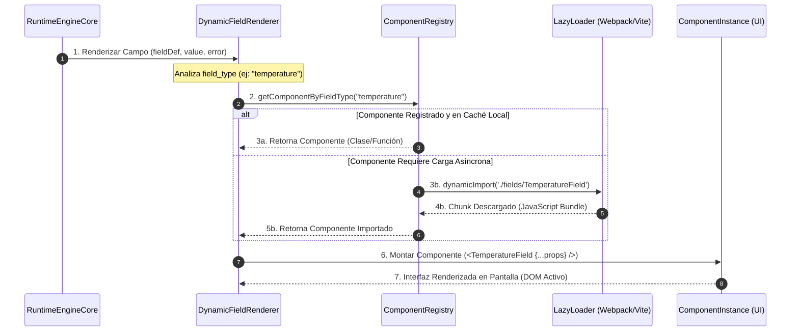

# ARQUITECTURA DEL REGISTRO DE COMPONENTES (COMPONENT REGISTRY)
## Sistema de Gestión de Calidad (SGC-DM) — Documentación Técnica de Arquitectura
**Autor:** Arquitecto de Software Senior Principal  
**Versión:** 1.0 (Enterprise Specification)  
**Estatus:** APROBADO - ESTÁNDAR DE RENDERIZADO DINÁMICO  
**Clasificación:** Confidencial / Propiedad Técnica Integradora  

---

## 1. COMPONENT REGISTRY OVERVIEW

### 1.1 Propósito
El **Registro de Componentes (Component Registry)** es la capa del *runtime* que actúa como el puente de acoplamiento flojo entre la metadata parametrizada en base de datos (`sgc_form_fields.field_type`) y los elementos visuales interactivos de la interfaz en React. 

Su propósito central es **eliminar la codificación rígida de formularios**. En lugar de inyectar componentes condicionales manuales que requieran compilar de nuevo la aplicación al añadir un formato en planta, el Component Registry actúa como un directorio dinámico centralizado. Declara de forma contractual cómo resolver, instanciar y conectar componentes atómicos reutilizables de entrada de datos, evidencias, workflows e indicadores de analítica bajo una misma firma unificada.

```
┌────────────────────────────────────────────────────────────────────────┐
│                        METADATA CONTRACT JSON                          │
│                  { field_type: "temperature", ... }                    │
└───────────────────────────────────┬────────────────────────────────────┘
                                    │
                                    ▼
┌────────────────────────────────────────────────────────────────────────┐
│                           COMPONENT REGISTRY                           │
│               [ Resuelve la clave en el directorio ]                   │
└───────────────────────────────────┬────────────────────────────────────┘
                                    │
            ┌───────────────────────┼───────────────────────┐
            ▼                       ▼                       ▼
 ┌─────────────────────┐ ┌─────────────────────┐ ┌─────────────────────┐
 │  TemperatureField   │ │   SignatureField    │ │  EvidenceUploader   │
 │ (Input Component)   │ │ (Evidence Component)│ │ (Storage Component) │
 └─────────────────────┘ └─────────────────────┘ └─────────────────────┘
```

### 1.2 Responsabilidades
* **Resolución e Instanciación:** Traducir los tipos contractuales de base de datos a componentes React importados bajo demanda (*lazy loading*).
* **Estandarización de Propiedades (Props Contract):** Imponer una firma de props inmutable y común a todos los componentes de captura, asegurando que el renderizador dinámico (`DynamicFieldRenderer`) pueda operarlos de forma indistinta.
* **Aislamiento Funcional:** Garantizar que los componentes individuales no conozcan la infraestructura del backend (Supabase, SQL Server, etc.). Los componentes se limitan a recibir un valor, reportar un cambio y señalar errores.
* **Seguridad de Validación Local:** Inyectar en cada componente atómico la lógica necesaria para autoevaluarse frente a las restricciones paramétricas (ej: mínimos y máximos) sin requerir llamadas externas.

### 1.3 Relación con el Runtime Engine
El Runtime Engine es el **orquestador del flujo y estado general** del formulario. El Component Registry es la **fábrica de UI** del motor. El Runtime Engine recibe la metadata contractual, analiza el orden, inicializa el estado central y despacha la representación de cada campo al Component Registry, el cual le devuelve la interfaz de usuario atómica correspondiente y reactiva.

---

## 2. REGISTRY RESOLUTION FLOW

El flujo de resolución asegura una traducción veloz y predecible desde la metadata física del campo hasta el montaje del elemento en el DOM.

### 2.1 Secuencia de Resolución del Runtime



### 2.2 Mecanismo de Selección e Interpretación de Metadata
1. **Lectura Contractual:** El motor lee la propiedad `field_type` desde el objeto de definición del campo.
2. **Lookup en el Directorio:** El `ComponentRegistry` mapea la clave (ej: `"cloro"`) a su respectivo componente dinámico (`CloroField` o el fallback genérico `NumberField`).
3. **Inyección de Parámetros:** La columna JSONB `options` de la base de datos se pasa de forma íntegra al componente mediante la prop `options`. Esto permite que un único componente `SelectField` configure sus opciones de selección (*choices*) o que un `TemperatureField` inyecte sus umbrales de alarma de forma dinámica en caliente.

---

## 3. CLASIFICACIÓN DE COMPONENTES (COMPONENT CLASSIFICATION)

Los componentes atómicos del SGC-DM se clasifican rigurosamente según su rol e interactividad dentro del ciclo transaccional:

```
┌────────────────────────────────────────────────────────────────────────┐
│                        COMPONENT CLASSIFICATION                        │
│                                                                        │
│  [ INPUT ]            ──► TextField, NumberField, TemperatureField     │
│                           DateField, SelectField, DynamicTableField    │
│                                                                        │
│  [ EVIDENCE ]         ──► EvidenceUploader, SignatureField             │
│                                                                        │
│  [ WORKFLOW ]         ──► ApprovalPanel, WorkflowActions               │
│                                                                        │
│  [ VISUALIZATION ]    ──► StatusBadge, AlertPanel                      │
│                                                                        │
│  [ CORE RUNTIME ]     ──► DynamicFieldRenderer, BaseChecklist/Medicion │
└────────────────────────────────────────────────────────────────────────┘
```

### 3.1 Input Components (Captura y Precisión)
* **`TextField` (Texto Corto):** Caja de texto estándar para capturas alfanuméricas simples (ej. operario, lote manual).
* **`TextAreaField` (Texto Extendido):** Área de texto expansible para observaciones operativas detalladas y descripciones de no conformidades.
* **`NumberField` (Enteros):** Control con incremento numérico entero de fácil uso táctil para conteo físico de unidades.
* **`TemperatureField` (Temperatura Crítica):** Input especializado de monitoreo térmico. Cambia su borde y fondo visual de forma reactiva (verde $\rightarrow$ amarillo $\rightarrow$ rojo) si la entrada excede los rangos de advertencia o de criticidad sanitaria.
* **`DateField` (Fecha):** Selector nativo de fechas formateado según estándares ISO (`YYYY-MM-DD`).
* **`TimeField` (Hora):** Selector nativo de hora en formato 24 horas (`HH:mm`) para registro exacto de hitos operativos.
* **`SelectField` (Selección Única):** Lista desplegable con buscador interno para campos estructurados en base de datos.
* **`MultiSelectField` (Selección Múltiple):** Grid de casillas autogestionado para selección de múltiples características o etiquetas.
* **`ChecklistField` (Cumplimiento Binario):** Control de selección excluyente táctil ("Cumple" / "No Cumple") con colores de semáforo.
* **`DynamicTableField` (Datos Tabulares EAV):** Grilla dinámica que permite añadir y eliminar filas en caliente para inspecciones multitabla (ej. tomas de pH consecutivas de un mismo lote).

### 3.2 Evidence Components (Soporte Digital)
* **`EvidenceUploader` (Captura Multimedia):** Zona interactiva de arrastre de archivos con acceso directo a la cámara del dispositivo móvil. Permite subir evidencias fotográficas secuenciales y comprimirlas en tiempo real.
* **`SignatureField` (Firma Digitalizada):** Lienzo interactivo HTML5 Canvas (`SignaturePad`) de alta sensibilidad táctil para la firma obligatoria de operarios y supervisores.

### 3.3 Workflow Components (Transición de Estado)
* **`ApprovalPanel` (Cierre y Aprobación):** Panel visible únicamente para supervisores de calidad. Contiene los campos para firmar la validación y emitir un veredicto formal.
* **`WorkflowActions` (Eventos del Flujo):** Botones de acción contextuales de transiciones de estados (ej: *Reabrir*, *Escalar a CAPA*, *Suspender Despacho*).

### 3.4 Visualization Components (Indicadores)
* **`StatusBadge` (Estados de Auditoría):** Badge coloreado e inmutable que representa visualmente la etapa del registro (`pendiente_revision`, `aprobado`, `rechazado`).
* **`AlertPanel` (Tablero de Hallazgos):** Caja de advertencia flotante que se activa si se detectan desviaciones críticas de temperatura o cloro, resumiendo los incumplimientos al usuario.

---

## 4. CONTRATOS DE COMPONENTES (COMPONENT CONTRACTS)

Para garantizar la modularidad extrema, todos los componentes implementan interfaces de propiedades comunes, predecibles y de tipo estricto.

### 4.1 Firma Genérica: `InputComponentProps`
Cualquier input del registry que capture información se suscribe incondicionalmente a este contrato conceptual de props:

```typescript
interface InputComponentProps<T = any> {
  // Metadata contractual del campo originado de sgc_form_fields
  fieldDef: {
    id: string;
    name: string;
    label: string;
    required: boolean;
    options: {
      placeholder?: string;
      min?: number;
      max?: number;
      unit?: string;
      choices?: string[];
      [key: string]: any;
    };
  };
  // Valor activo en el estado del orquestador central
  value: T;
  // Callback invocado ante la edición del input
  onChange: (fieldId: string, newValue: T) => void;
  // Mensaje de error si la validación en caliente falló
  error?: string;
  // Bandera para deshabilitar interacción (ej: si el workflow está cerrado)
  disabled?: boolean;
}
```

### 4.2 Contratos Especializados Clave

#### A. `TemperatureField` (Mapeo de Alertas)
* **Props Adicionales:** Ninguna. Todo se autogestiona evaluando `fieldDef.options.critical_threshold` y `warning_threshold`.
* **Mapeo Visual en Caliente:**
  ```javascript
  const getVisualState = (val) => {
    if (val === '' || val === null) return 'normal';
    const num = parseFloat(val);
    const { critical_threshold, warning_threshold } = fieldDef.options;
    
    if (critical_threshold && (num < critical_threshold.min || num > critical_threshold.max)) {
      return 'critical'; // Rojo vibrante + Icono Alerta
    }
    if (warning_threshold && (num < warning_threshold.min || num > warning_threshold.max)) {
      return 'warning'; // Amarillo / Ámbar
    }
    return 'compliant'; // Verde suave
  };
  ```

#### B. `EvidenceUploader` (Integración a la Nube)
* **Contrato de Propiedades:**
  ```typescript
  interface EvidenceUploaderProps {
    responseId: string;
    evidences: Array<{
      file_url: string;
      storage_path: string;
      file_type: string;
    }>;
    onEvidencesChange: (newEvidences: Array<Evidence>) => void;
    required: boolean;
    maxFiles?: number;
  }
  ```
* **Comportamiento Runtime:** Utiliza el método de subida directa mediante token y compresión WebP local antes de mandar al Storage. Invoca `onEvidencesChange` para actualizar el estado del formulario general de forma atómica.

#### C. `SignatureField` (Firma Forense)
* **Contrato de Propiedades:**
  ```typescript
  interface SignatureFieldProps {
    fieldId: string;
    value: string; // URL de la firma subida
    onChange: (fieldId: string, signatureUrl: string) => void;
    roleRequired?: string; // Validación de rol calificado
  }
  ```
* **Runtime Behavior:** Bloquea el lienzo si el usuario activo no posee el `roleRequired`. Al guardar el trazo del Canvas a PNG, lo sube de forma desatendida al bucket `documentos-sgc` en la ruta `firmas/{response_id}.png` y retorna la URL pública.

#### D. `DynamicTableField` (Grilla Tabular)
* **Contrato de Propiedades:**
  ```typescript
  interface DynamicTableFieldProps {
    fieldDef: {
      id: string;
      options: {
        columns: Array<{
          name: string;
          label: string;
          type: 'text' | 'number' | 'checkbox';
        }>;
      };
    };
    value: Array<Record<string, any>>; // JSON de filas
    onChange: (fieldId: string, newValue: Array<Record<string, any>>) => void;
  }
  ```

---

## 5. RENDER MAPPING Y RESOLUCIÓN EN TIEMPO DE EJECUCIÓN

El Component Registry implementa la resolución dinámica en el frontend mediante un mapa relacional indexado:

```javascript
// src/components/registry/ComponentRegistry.js
import { lazy } from 'react';

/**
 * Directorio de Componentes de Entrada Dinámicos
 * Habilita Lazy Loading automático mediante Webpack Chunks
 */
export const ComponentRegistry = {
  text: lazy(() => import('../fields/TextField')),
  textarea: lazy(() => import('../fields/TextAreaField')),
  number: lazy(() => import('../fields/NumberField')),
  decimal: lazy(() => import('../fields/DecimalField')),
  temperature: lazy(() => import('../fields/TemperatureField')),
  ph: lazy(() => import('../fields/PhField')),
  cloro: lazy(() => import('../fields/CloroField')),
  date: lazy(() => import('../fields/DateField')),
  time: lazy(() => import('../fields/TimeField')),
  select: lazy(() => import('../fields/SelectField')),
  multiselect: lazy(() => import('../fields/MultiSelectField')),
  checkbox: lazy(() => import('../fields/CheckboxField')),
  radio: lazy(() => import('../fields/RadioField')),
  signature: lazy(() => import('../fields/SignatureField')),
  file_upload: lazy(() => import('../fields/EvidenceUploader')),
  table: lazy(() => import('../fields/DynamicTableField')),
  calculated: lazy(() => import('../fields/CalculatedField')),
  workflow_status: lazy(() => import('../fields/WorkflowStatusBadge')),
};
```

---

## 6. INTEGRACIÓN DE VALIDACIONES (VALIDATION INTEGRATION)

Las validaciones del Component Registry se estructuran en dos niveles secuenciales:

```
                  ┌────────────────────────────────────────┐
                  │          ENTRADA EN COMPONENTE         │
                  │        (Ej. pH: 15.0 introducido)      │
                  └───────────────────┬────────────────────┘
                                      │
                                      ▼
                  ┌────────────────────────────────────────┐
                  │      NIVEL ATÓMICO (COMPONENT)         │
                  │   ├── Evalúa tipos de dato             │
                  │   └── Mapea límites de sgc_form_fields │
                  └───────────────────┬────────────────────┘
                                      │
                             ¿Falla validación?
                                      │
                                      ▼
                  ┌────────────────────────────────────────┐
                  │    ORQUESTADOR CENTRAL (RUNTIME)       │
                  │   ├── Bloquea Botón Submit             │
                  │   └── Inyecta prop error en el campo   │
                  └────────────────────────────────────────┘
```

1. **Evaluación Interna (Frontera del Componente):** Ante el evento `onChange`, el componente valida internamente el valor contra las opciones `min`, `max` y `regex` definidas en `fieldDef.options`.
2. **Propagación del Error:** Si falla la validación, el componente no detiene la entrada del usuario en el input (para evitar congelar la UX), pero propaga un evento de error hacia el orquestador central (`RuntimeEngine`).
3. **Bloqueo del Submit:** El orquestador registra el error en el mapa central `validationErrors` e inyecta la prop `error` de vuelta al componente, activando los bordes rojos e impidiendo el envío físico del formulario a base de datos.

---

## 7. INTEGRACIÓN CON WORKFLOWS (WORKFLOW INTEGRATION)

Los componentes del registry están diseñados para responder de forma reactiva al estado del ciclo de vida del registro.

### 7.1 Componentes Workflow-Aware
* **Bloqueo Runtime de Edición:** Si el orquestador central detecta que el registro ya cuenta con un estado de ciclo de vida final (`status = 'aprobado'` o `status = 'rechazado'`), inyecta de forma masiva la propiedad `disabled = true` a todos los componentes del formulario. Esto bloquea instantáneamente los lienzos de firma, botones de borrado de imágenes y campos numéricos, garantizando la inmutabilidad de la información firmada.
* **Segregación de Aprobaciones:** El `ApprovalPanel` interactúa activamente con los permisos del usuario. Bloquea el botón de aprobación si el supervisor firmado coincide con el UUID de creación del operario (`created_by`), protegiendo el flujo normativo de calidad.

---

## 8. TELEMETRÍA Y ANALÍTICS EN COMPONENTES (ANALYTICS HOOKS)

Cada componente del registry expone telemetría operacional silenciosa que se envía a la cola analítica de forma asíncrona:

* **`onFocus` / `onBlur` (Métrica de Latencia):** Mide el tiempo exacto que le toma al operario resolver una pregunta crítica o ingresar una firma de supervisor. Permite identificar preguntas confusas o fallas de usabilidad táctil en las tablets de planta.
* **`onUploadSuccess` (Métrica de Volumen):** Monitorea el peso en bytes y la cantidad de evidencias fotográficas subidas por formulario, permitiendo estimar el almacenamiento futuro en el Storage y alertando ante posibles abusos de carga multimedia.
* **`onValidationError` (Métrica de Cumplimiento):** Registra qué campos y con qué valores fallaron inicialmente el ingreso antes de corregirse, identificando fallas en las calibraciones de sensores o deficiencias operacionales recurrentes del personal.

---

## 9. COMPATIBILIDAD CON INTELIGENCIA ARTIFICIAL (IA READY)

El Component Registry prepara el camino para inyecciones de analítica inteligente a nivel de visualización e interacción:

* **Semantic Schema Mapping:** Cada componente inyecta las etiquetas semánticas (`ia_tags` como `#temperatura`, `#ph`) en el marcado HTML mediante atributos de datos `data-ia-tag`. Esto permite que extensiones de navegación inteligente e integraciones ERP reconozcan automáticamente la naturaleza del campo en pantalla sin depender del nombre de la etiqueta visual.
* **Metadata de Soporte (Evidencias):** El componente `EvidenceUploader` lee los metadatos de inocuidad (`ia_tags: ["pest_control"]`) y los incrusta en los encabezados HTTP del archivo subido al storage, permitiendo que la posterior inferencia del motor de Visión de Inteligencia Artificial identifique con facilidad qué modelo de análisis aplicar a la imagen en la nube.

---

## 10. ESCALABILIDAD Y MODULARIZACIÓN EXTREMA

Para que la plataforma mantenga un rendimiento óptimo ante el crecimiento de volumen operativo, el Component Registry implementa estrictas directivas de rendimiento:

* **Lazy Loading por Demanda:** Los componentes se definen utilizando `React.lazy` y se renderizan bajo un nodo `Suspense` con fallback de un elemento Skeleton, reduciendo drásticamente el peso de descarga del bundle inicial en el navegador.
* **Extensibilidad a Futuro (Mobile Ready):** Los componentes de captura atómicos se diseñan respetando el principio de **Single Responsibility**. Esto permite migrar el catálogo visual del navegador web a una aplicación móvil nativa (React Native) reemplazando únicamente las etiquetas HTML de presentación (`input`, `select`) por sus contrapartes nativas móviles, manteniendo intacto el 100% de los contratos de props, validaciones y hooks del Component Registry.

---

## 11. ROADMAP EVOLUTIVO DEL REGISTRY

Para implementar el Component Registry de forma predecible y segura en SGC-DM, se diseña la siguiente hoja de ruta de tres etapas secuenciales:

* **Etapa 1: Estandarización de Interfaces (Q2 2026 - Corto Plazo):** Crear el archivo centralizado `ComponentRegistry.js` con imports dinámicos y refactorizar los componentes atómicos existentes para que se alineen incondicionalmente a la firma `InputComponentProps`.
* **Etapa 2: Inyección de Validaciones en Caliente (Q3 2026 - Corto Plazo):** Desplegar la lógica de alertas cromáticas en `TemperatureField` y modularizar el `EvidenceUploader` para inyectar compresión de imágenes nativa.
* **Etapa 3: Integración IoT e Inferencia en Caliente (Q4 2026 - Mediano Plazo):** Conectar los campos numéricos a APIs de hardware industrial (Bluetooth/Modbus) para la captura directa de variables físicas e integrar los clasificadores semánticos para el pipeline de Inteligencia Artificial.

---

**Documento Mantenido y Aprobado por:** Dirección General de Arquitectura de Software e Integridad Operativa SGC-DM.  
**Última Actualización:** 22 de Mayo de 2026.  
**Próxima Revisión Planificada:** 15 de Agosto de 2026.  
