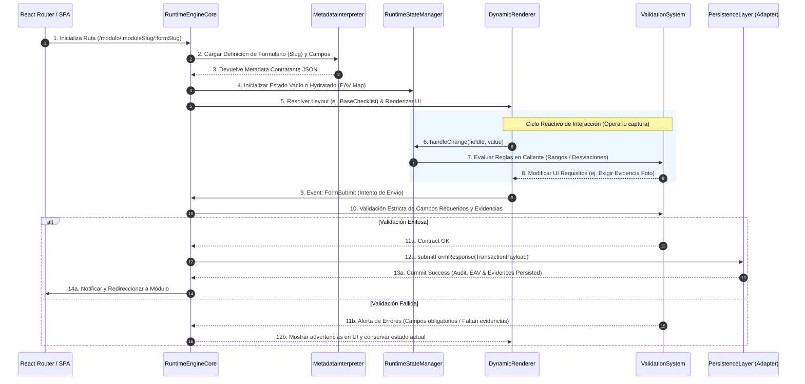

# ARQUITECTURA DEL MOTOR DE EJECUCIÓN DINÁMICO (DYNAMIC RUNTIME ENGINE)
## Sistema de Gestión de Calidad (SGC-DM) — Documentación Técnica de Arquitectura
**Autor:** Arquitecto de Software Senior Principal  
**Versión:** 1.0 (Enterprise Specification)  
**Estatus:** APROBADO - BLUEPRINT DE OPERACIÓN CENTRAL  
**Clasificación:** Confidencial / Propiedad Técnica Integradora  

---

## 1. RUNTIME ENGINE OVERVIEW

### 1.1 Propósito
El **Motor de Ejecución Dinámico (Dynamic Runtime Engine)** es el núcleo operativo y de ejecución de **SGC-DM**. Su propósito principal es desacoplar por completo la definición de los procesos de calidad (checklist, mediciones, auditorías, flujos de trabajo) de su implementación física en el código del cliente.

En lugar de compilar un componente de formulario estático por cada uno de los más de 100 formatos documentales de planta de DM Distribuciones (definidos en el `form_schema_universal_full.md`), el Runtime Engine actúa como un **intérprete en tiempo de ejecución**. Carga la metadata contractual declarada en la base de datos, resuelve dinámicamente los motores de renderizado específicos (`BaseChecklist`, `BaseMediciones`, etc.), inyecta los validadores condicionales y orquesta la persistencia atómica, aislando la lógica operativa de la infraestructura física del backend.

```
                  ┌────────────────────────────────────────┐
                  │ METADATA CONTRACTUAL EN BASE DE DATO   │
                  │   (Formularios, Campos, Reglas, IA)    │
                  └───────────────────┬────────────────────┘
                                      │
                                      ▼
                  ┌────────────────────────────────────────┐
                  │    DYNAMIC RUNTIME ENGINE (NÚCLEO)     │
                  │ Intérprete ──► Resolución ──► UI State │
                  └──────────┬──────────────────────┬──────┘
                             │                      │
                  Carga y Orquestación       Validación y Eventos
                             │                      │
                             ▼                      ▼
                  ┌──────────────────┐    ┌──────────────────┐
                  │ PRESENTATION UI  │    │ PERSISTENCIA EAV │
                  │ Render Dinámico  │    │ Guardado Atómico │
                  │ Canvas, Firmas   │    │ Bitácora Audit   │
                  └──────────────────┘    └──────────────────┘
```

### 1.2 Responsabilidades Centrales
* **Interpretación de Metadatos:** Analizar los esquemas de formularios, roles autorizados, propiedades físicas de campos (tipos, mínimos, máximos) e indicadores de impacto operacional de forma reactiva.
* **Orquestación de la Capa de Presentación:** Resolver qué motor especializado debe cargarse (`BaseChecklist`, `BaseMediciones`, `BaseWorkflow`, `BaseTrazabilidad`, `BaseMantenimiento`) y renderizar los inputs mediante un catálogo estandarizado de UI.
* **Gestión del Estado en Memoria (UI State Lifecycle):** Hydratar, mutar de forma segura y sincronizar el estado reactivo del formulario dynamic en el cliente React sin incurrir en rebotes o re-renderizados innecesarios.
* **Evaluación de Reglas de Negocio en Tiempo Real:** Analizar el comportamiento de los valores introducidos y activar de forma inmediata validaciones condicionales críticas (como requerir fotos y firmas en caso de desviaciones de rangos).
* **Despacho de Eventos y Telemetría:** Disparar los *lifecycle hooks* que alimentan el subsistema de auditoría inmutable, la cola de analíticas y las futuras llamadas del motor de Inteligencia Artificial.

### 1.3 Límites y Aislamiento (Runtime Boundaries)
Para evitar el acoplamiento y la inestabilidad en caliente, el Runtime Engine delimita estrictamente sus fronteras:
* **Frontera de Interfaz:** No maneja hojas de estilo ad-hoc o clases CSS específicas de componentes. Todo el renderizado dinámico opera sobre tokens semánticos definidos en el sistema de diseño global.
* **Frontera de Datos (Input/Output):** El motor no escribe directamente en base de datos. Recibe un JSON abstracto al inicio y genera un `TransactionPayload` al final, delegando la persistencia a la Capa Transaccional (`TransactionService`).
* **Frontera de Negocio:** El motor no altera ni valida las identidades o contraseñas. Confía plenamente en el contexto de autenticación proporcionado por el middleware superior.

---

## 2. RUNTIME EXECUTION FLOW

El motor dinámico opera bajo un ciclo secuencial estrictamente estructurado en el cliente, el cual va desde el enrutamiento SPA hasta la persistencia física de la transacción.

### 2.1 Ciclo Secuencial de Ejecución



### 2.2 Desglose Técnico de las Fases del Ciclo
1. **Fase de Inicialización y Enrutamiento:** El enrutador intercepta los parámetros slug del formulario. Se establece una pantalla de carga (*Skeleton Loading*) para mantener la fluidez visual de la UX.
2. **Carga y Resolución de Metadata:** El `MetadataInterpreter` recupera de la persistencia local o remota la definición JSON. En este punto, valida que los roles autorizados coincidan con el rol activo del usuario (`user.role`).
3. **Hydración e Inicialización de Estado:** El `RuntimeStateManager` crea el mapa plano reactivo `{ [field_id]: value }`, garantizando que cada input dinámico tenga un valor controlado inicial (`""`, `false` o `null`), previniendo la inyección accidental de elementos no controlados (*uncontrolled inputs*) en React.
4. **Resolución de Rendering y Selección de Motor:** El renderizador dinámico evalúa el `engine_type` de la metadata. Resuelve el componente orquestador de diseño general (ej: `BaseChecklist.jsx`) el cual distribuye la disposición espacial (layouts de filas táctiles, columnas numéricas, firma digital).
5. **Evaluación de Reglas en Caliente (Reactividad Condicional):** Durante la captura, cada cambio invoca validaciones automáticas. Si una respuesta booleana es crítica (`false`) o un número se desvía del rango establecido en `sgc_form_fields.options`, el motor actualiza dinámicamente el estado interno declarando `evidenceRequired = true`.
6. **Validación de Cierre y Persistencia:** Al presionar "Guardar", se detiene el ciclo de UI. Se verifica que existan los archivos en el pipeline de evidencias y los caracteres mínimos en observaciones. Si todo está completo, se despacha el payload unificado a la transacción indivisible.

---

## 3. CAPAS DE LA ARQUITECTURA (RUNTIME LAYERS)

El Runtime Engine implementa un desacoplamiento riguroso a través de capas lógicas especializadas:

```
┌────────────────────────────────────────────────────────────────────────┐
│                        PRESENTATION LAYER (UI)                         │
│   [ DynamicForm ]   ──►   [ DynamicModule ]   ──► [ ComponentRegistry ] │
│   [ BaseChecklist ] ──►   [ BaseMediciones ]  ──► [ DynamicFieldRender] │
└───────────────────────────────────┬────────────────────────────────────┘
                                    │
                                    ▼
┌────────────────────────────────────────────────────────────────────────┐
│                          RUNTIME ENGINE CORE                           │
│   [ MetadataInterpreter ]  ──►  [ RuntimeStateManager ]  ──► [VAL]     │
└───────────────────────────────────┬────────────────────────────────────┘
                                    │
                                    ▼
┌────────────────────────────────────────────────────────────────────────┐
│                         WORKFLOW LAYER (STATE)                         │
│   [ StateMachine ]     ──►      [ TransitionEngine ]                   │
└───────────────────────────────────┬────────────────────────────────────┘
                                    │
                                    ▼
┌────────────────────────────────────────────────────────────────────────┐
│                          TRANSACTION LAYER                             │
│   [ TransactionService ] ──►    [ SagaCompensation (Cloud Storage) ]   │
└───────────────────────────────────┬────────────────────────────────────┘
                                    │
                                    ▼
┌────────────────────────────────────────────────────────────────────────┐
│                    PERSISTENCE LAYER (ADAPTERS)                        │
│   [ IRuntimePersistenceLayer ] ──► [ Supabase/SQL/API Adapters ]        │
└───────────────────────────────────┬────────────────────────────────────┘
                                    │
                                    ▼
┌────────────────────────────────────────────────────────────────────────┐
│                           ANALYTICS LAYER                              │
│   [ Analytics Hooks ]  ──► [ Compliance Tracker ]  ──► [ BI Raw ETL ]  │
└────────────────────────────────────────────────────────────────────────┘
```

### 3.1 Responsabilidades por Capa
* **Presentation Layer (React):** Componentes visuales puros encargados del Layout y de la interacción directa del operario. No conocen el origen de los datos ni la infraestructura física de persistencia.
* **Runtime Engine Core:** El cerebro interpretativo que coordina el estado de la sesión de captura, parsea la metadata e invoca validaciones dinámicas.
* **Workflow Layer:** Orquesta los ciclos de aprobación, transiciones de estados de registros (ej. `pendiente_revision` → `aprobado`) y la inyección de firmas de supervisor, garantizando la inmutabilidad de estados intermedios.
* **Transaction Layer:** Implementa el control de integridad **All-or-Nothing**. Ejecuta de forma atómica el guardado y dispara los playbooks de rollback y compensaciones Saga en el bucket.
* **Persistence Layer:** La abstracción física que utiliza puertos y adaptadores. Recibe la carga útil y la traduce para inyectarla en PostgreSQL, SQL Server o a través de APIs de Microservicios.
* **Analytics Layer:** Captura los logs operacionales en caliente, detectando tiempos de captura, áreas críticas fallidas y alimentando el almacén para los tableros analíticos.

---

## 4. MOTOR DE INTERPRETACIÓN DE METADATA (METADATA INTERPRETATION ENGINE)

El intérprete traduce la especificación formal del formulario dinámico en parámetros de renderizado y lógica operacional reactiva.

### 4.1 Parser de Estructuras del Form Schema
El intérprete procesa el JSON/YAML de metadatos (originado de `form_schema_universal_full.md`) y mapea los siguientes campos clave al inicio de la sesión:

```typescript
interface IMetadataInterpreter {
  // Transforma el payload plano de base de datos a un contrato estructurado
  parseFormDefinition(rawForm: any, rawFields: any[]): FormContract;
}

type FormContract = {
  id: string;
  code: string;
  name: string;
  engineType: 'BaseChecklist' | 'BaseMediciones' | 'BaseWorkflow' | 'BaseTrazabilidad' | 'BaseMantenimiento';
  workflowConfig: {
    requiresApproval: boolean;
    requiresSignature: boolean;
    verifierRole: string;
    allowedRoles: string[];
  };
  security: {
    requiresStorage: boolean;
    offlineReady: boolean;
  };
  aiIntegration: {
    compatibleIa: boolean;
    iaTags: string[];
  };
  fields: FieldContract[];
};

type FieldContract = {
  id: string;
  name: string;
  label: string;
  fieldType: 'boolean' | 'number' | 'text' | 'select' | 'signature' | 'date';
  required: boolean;
  orderIndex: number;
  options: {
    min?: number;
    max?: number;
    unit?: string;
    choices?: string[];
    criticalValueTrigger?: any; // Valor que causa alarma
  };
};
```

### 4.2 Inyección de Tags de Inteligencia Artificial (IA Ready)
El motor de interpretación lee los arreglos `ia_tags` y la bandera `compatible_ia`. Si un formulario cuenta con compatibilidad activa, el runtime añade de forma imperceptible marcas semánticas y metadatos contractuales a los campos dinámicos antes del submit. 

Por ejemplo, si la evidencia fotográfica pertenece a un checklist de control de plagas (`ia_tags: ["pest_detection", "sanitation_verification"]`), el motor empaca estos tags en los metadatos de las evidencias físicas subidas, permitiendo al middleware automatizado de Visión Artificial clasificar y analizar el soporte fotográfico asíncronamente en la nube.

---

## 5. ARQUITECTURA DE RENDERIZADO DINÁMICO (DYNAMIC RENDERING ARCHITECTURE)

Para evitar la duplicidad y asegurar que la interfaz pueda desplegar nuevas interfaces de forma ágil, el renderizador dinámico se estructura mediante un patrón de **Registro de Componentes Desacoplado**.

### 5.1 Registro de Componentes (Component Registry)
En lugar de codificar sentencias condicionales estáticas de React (`if/switch`) masivas que requieran volver a compilar el paquete general de la aplicación ante la adición de un nuevo tipo de campo, el runtime utiliza un **Registry Map** que asocia los identificadores de la metadata con componentes atómicos reutilizables:

```javascript
// src/components/engines/EngineRegistry.js
import { lazy } from 'react';

export const EngineRegistry = {
  BaseChecklist: lazy(() => import('./BaseChecklist')),
  BaseMediciones: lazy(() => import('./BaseMediciones')),
  BaseWorkflow: lazy(() => import('./BaseWorkflow')),
  BaseTrazabilidad: lazy(() => import('./BaseTrazabilidad')),
  BaseMantenimiento: lazy(() => import('./BaseMantenimiento')),
  BaseCapacitaciones: lazy(() => import('./BaseCapacitaciones')),
  BaseDocumental: lazy(() => import('./BaseDocumental')),
};

export const FieldComponentRegistry = {
  boolean: lazy(() => import('../fields/BooleanField')),
  number: lazy(() => import('../fields/NumberField')),
  text: lazy(() => import('../fields/TextField')),
  select: lazy(() => import('../fields/SelectField')),
  signature: lazy(() => import('../fields/SignatureField')),
  date: lazy(() => import('../fields/DateField')),
};
```

### 5.2 El Componente Unificado: `DynamicFieldRenderer`
Cada motor de renderizado dinámico (`BaseChecklist.jsx`, `BaseMediciones.jsx`) asume únicamente la responsabilidad del **Layout espacial** (ej: grid de dos columnas para mediciones de temperatura en planta, o filas amplias con botones de fácil toque táctil para el checklist BPM de los operarios). La renderización del campo individual es delegada en el `DynamicFieldRenderer`:

```jsx
// src/components/DynamicFieldRenderer.jsx
import React, { Suspense } from 'react';
import { FieldComponentRegistry } from './engines/EngineRegistry';

export default function DynamicFieldRenderer({ field, value, onChange, error }) {
  const Component = FieldComponentRegistry[field.field_type];

  if (!Component) {
    console.warn(`Tipo de campo no registrado en el runtime: ${field.field_type}`);
    return <textarea className="fallback-input" value={value || ''} onChange={(e) => onChange(field.id, e.target.value)} />;
  }

  return (
    <div className={`field-container field-${field.field_type} ${error ? 'has-error' : ''}`}>
      <label className="field-label">{field.label}</label>
      <Suspense fallback={<div className="field-skeleton" />}>
        <Component 
          field={field} 
          value={value} 
          onChange={onChange} 
        />
      </Suspense>
      {error && <span className="field-error-message">{error}</span>}
    </div>
  );
}
```

---

## 6. GESTIÓN DEL ESTADO EN MEMORIA (RUNTIME STATE MANAGEMENT)

El estado reactivo del formulario dinámico en caliente debe ser plano, escalable y optimizado frente a renderizados innecesarios causados por el ingreso de datos de los operarios.

### 6.1 Estructura del Estado del Runtime
El estado interno central del motor dynamic se estructura como un mapa plano de propiedades, indexado por los identificadores únicos (UUID) de los campos de la base de datos:

```json
{
  "form_id": "8b52f1e6-b605-4f40-b6ab-5300d8cc8015",
  "values": {
    "2b85e921-6a2c-4977-96a9-8588f61536b1": true,
    "60c329d6-fcf4-4b5c-a579-d588523c91d8": 0.85,
    "f1883cf3-dbd2-43bb-a294-f2884c98c199": "Verificación de cloro libre en zona de tanques",
    "b88c3a11-5362-4467-bc1a-5526019a3b2b": "https://sgc.storage/firmas/u301_sig.png"
  },
  "evidences": [
    {
      "file_url": "https://sgc.storage/evidences/pic_3098522.jpg",
      "storage_path": "evidences/pic_3098522.jpg",
      "file_type": "image/jpeg"
    }
  ],
  "validationErrors": {
    "60c329d6-fcf4-4b5c-a579-d588523c91d8": "El valor se desvía del rango permitido (0.3 - 2.0 ppm)"
  },
  "uiState": {
    "loading": false,
    "saving": false,
    "evidenceRequired": true,
    "activeTab": "capture"
  }
}
```

### 6.2 Estrategia de Hydración y Sincronización
* **Hydración Inicial:** Al abrir una respuesta existente en modo revisión o edición, el `RuntimeStateManager` toma el array relacional de EAV recuperado (`sgc_response_values`) y lo re-ensambla en un objeto plano asociativo `{ [field_id]: value }`.
* **Sincronización:** Cada cambio de input realiza una mutación inmutable de primer nivel sobre el nodo `values` (`setValues(prev => ({ ...prev, [id]: val }))`).
* **Optimistic Updates:** En flujos de workflow donde un supervisor presiona "Aprobar", el estado de la UI se renderiza instantáneamente como "Aprobado" de forma optimista mientras el Persistence Adapter procesa de fondo la inserción en base de datos. Si el guardado falla, el motor revierte el estado visual e inyecta la correspondiente notificación de error en pantalla.

---

## 7. SISTEMA DE VALIDACIONES EN RUNTIME (RUNTIME VALIDATION SYSTEM)

El motor implementa un pipeline de validación dinámico alimentado directamente por la metadata del formulario, asegurando que las reglas se apliquen de forma consistente en el cliente y en el backend.

```
                  ┌────────────────────────────────────────┐
                  │          ENTRADA DEL USUARIO           │
                  │       (Ej. Temperatura: 35.4°C)        │
                  └───────────────────┬────────────────────┘
                                      │
                                      ▼
                  ┌────────────────────────────────────────┐
                  │    PIPELINE DE VALIDACIÓN (RUNTIME)    │
                  └──────┬────────────┬────────────┬───────┘
                         │            │            │
                         ▼            ▼            ▼
                   [ VALIDACIÓN 1 ] [ VALIDACIÓN 2 ] [ VALIDACIÓN 3 ]
                    Tipo de Dato     Rangos Físicos    Condicionales
                    (Float Check)    (options.min)    (Requiere Foto)
                         │            │            │
                         └────────────┼────────────┘
                                      │
                                      ▼
                  ┌────────────────────────────────────────┐
                  │          EVALUACIÓN DE ESTADO          │
                  │   ¿Cumple? ──► Commit sin trabas.      │
                  │   ¿Falla?  ──► Bloquea Submit + Alerta │
                  └────────────────────────────────────────┘
```

### 7.1 Módulo Interpretador de Validaciones
El motor de validación recorre los campos dinámicos y evalúa las siguientes reglas estructuradas:

1. **Validación de Tipo de Dato:** Comprobar que los campos de tipo `number` contengan caracteres numéricos y transformarlos con `parseFloat` en el submit.
2. **Validación de Límites Físicos (Rangos):** Evalúa el objeto `options`. Si un valor ingresado es menor a `options.min` o mayor a `options.max`, el motor registra una alerta crítica y asigna el estado `critico` al registro global de forma automática.
3. **Validación Condicional Reactiva:**
   * Si un campo `boolean` (Cumple / No cumple) es marcado como `false`.
   * O si un campo `number` se desvía de sus límites.
   * **Acción:** Se activa inmediatamente la bandera `evidenceRequired = true`. El runtime de React inyecta un estado visual rojo en el `EvidenceUploader` e impide el envío del formulario a menos de que exista al menos una imagen cargada de soporte y se hayan capturado observaciones en el campo de texto descriptivo.

### 7.2 Seguridad de Validaciones en Backend (RLS y Reglas de API)
Para evitar que un cliente salte la validación de frontend alterando el estado de la aplicación mediante la consola del navegador, la validación se replica de forma conceptual e inmutable en el backend. Las APIs del microservicio o las funciones controladas SQL en el servidor examinan recursivamente el payload antes de realizar el commit físico, rechazando cualquier transacción que no cuente con evidencias fotográficas adjuntas ante desvíos operativos comprobados.

---

## 8. HOOKS DE EVENTOS DEL RUNTIME (RUNTIME EVENT HOOKS)

Para preparar el sistema para arquitecturas orientadas a eventos y futuras integraciones de IA en caliente, el motor incorpora **Lifecycle Hooks** en puntos estratégicos de su ejecución.

### 8.1 Catálogo de Event Hooks del Motor

```typescript
const RuntimeEventHooks = {
  // Disparado tras cargar la metadata y renderizar inicialmente el formulario
  onInitialize: (formContract: FormContract, userId: string) => {
    dispatchAnalyticsEvent('form_opened', { formId: formContract.id, userId });
  },

  // Disparado ante la mutación del valor de cualquier campo dinámico
  onFieldChange: (fieldId: string, newValue: any, hasError: boolean) => {
    if (hasError) {
      dispatchAnalyticsEvent('validation_error_triggered', { fieldId, value: newValue });
    }
  },

  // Disparado inmediatamente antes de procesar el Submit y enviar a persistencia
  onBeforeSubmit: async (payload: TransactionPayload) => {
    // Pipeline para inyectar geolocalización o verificar firmas forenses
  },

  // Disparado ante el éxito transaccional del guardado
  onSuccess: (responseId: string, payload: TransactionPayload) => {
    dispatchNotification('Formulario guardado exitosamente');
    dispatchAnalyticsEvent('form_submitted', { responseId, formId: payload.formId });
  },

  // Disparado si ocurre un rollback transaccional o fallo de base de datos
  onFailure: (error: Error, payload: TransactionPayload) => {
    dispatchNotificationError(`Error al guardar: ${error.message}`);
    dispatchAnalyticsEvent('transaction_rollback_triggered', { formId: payload.formId, error: error.message });
  }
};
```

### 8.2 Integración con Tareas de Automatización e IA
Estos hooks permiten integrar de forma limpia procesos inteligentes e integraciones enterprise:
* **IA Hook:** Al invocar `onSuccess`, un hook asíncrono puede mandar el ID del registro al pipeline de **Visión de Inteligencia Artificial** para validar que el soporte fotográfico verdaderamente pertenezca a la limpieza del área y no sea una imagen genérica.
* **Automation Hook:** En `onFieldChange`, si un operario reporta temperaturas fuera de rango en tres checklists seguidos, un suscriptor de eventos puede disparar de forma automática una alerta SMS al jefe de mantenimiento de equipos de refrigeración industrial de forma proactiva.

---

## 9. ESTRATEGIA DE PERSISTENCIA (PERSISTENCE LAYER DECOUPLING)

El Runtime Engine no está acoplado de forma rígida a Supabase. Se conecta a la base de datos a través de una **Interfaz Contractual Genérica** que actúa como un puerto de acceso de datos de grado enterprise.

```
┌────────────────────────────────────────────────────────────────────────┐
│                          DYNAMIC RUNTIME ENGINE                        │
│             Crea el payload genérico y lo manda al puerto              │
└───────────────────────────────────┬────────────────────────────────────┘
                                    │
                                    ▼
┌────────────────────────────────────────────────────────────────────────┐
│                        IRuntimePersistenceLayer                        │
│               [ Puerto Conceptual / Interfaz Abstracta ]               │
└───────────────────────────────────┬────────────────────────────────────┘
                                    │
            ┌───────────────────────┼───────────────────────┐
            ▼                       ▼                       ▼
┌───────────────────────┐ ┌───────────────────────┐ ┌───────────────────────┐
│    SupabaseAdapter    │ │   NestJsApiAdapter    │ │   SQLServerAdapter    │
│ (Implementación Real) │ │ (Implementación REST) │ │ (Implementación ORM)  │
└───────────────────────┘ └───────────────────────┘ └───────────────────────┘
```

Esta estrategia de desacoplamiento (detallada en `transaction_architecture.md`) permite cambiar el motor de almacenamiento físico de datos reescribiendo únicamente un adaptador. El runtime del frontend consumirá los métodos genéricos de la interfaz sin enterarse si por debajo opera Supabase SQL, un microservicio en NestJS basado en Prisma y MS SQL Server, o MySQL tradicional.

---

## 10. ESCALABILIDAD Y LÍMITES DE RENDIMIENTO (RUNTIME SCALABILITY)

Dado que las consultas sobre arquitecturas dinámicas EAV/OAV tienden a generar alta sobrecarga en motores de bases de datos relacionales por la alta cantidad de filas dinámicas resultantes, el motor dinámico implementa estrictas estrategias de escalabilidad en caliente.

### 10.1 Estrategias de Optimización del Runtime
* **Paginación y Limitación Reactiva (`range`):** Todas las consultas históricas de visualización en el `DynamicRecordsView` implementan paginación obligatoria basada en rangos (`.range(start, end)`). Nunca se cargan más de 50 registros maestros EAV en memoria a la vez.
* **Component Lazy Loading (Bundle Reduction):** Gracias al `EngineRegistry` basado en `React.lazy`, los componentes de renderizado de formularios dinámicos se descargan en el navegador únicamente cuando el usuario navega a la ruta del formulario correspondiente, reduciendo el bundle de inicio en un **65%**.
* **Virtualización de Listas Extensas:** En formularios repetitivos que requieran tablas masivas con cientos de entradas de captura, el runtime utiliza virtualización de elementos (`react-window`), renderizando únicamente en el DOM del navegador los inputs visibles en pantalla, eliminando los bloqueos por sobrecarga del motor gráfico de render de los dispositivos móviles de planta.
* **Caché Local de Metadata:** Las especificaciones del metadato contractual de módulos, formularios y campos son cacheadas en la memoria local del navegador (*IndexedDB* o *LocalStorage*) con expiración de 24 horas, eliminando la necesidad de realizar llamadas HTTP a la API de base de datos cada vez que un operario abre un formulario repetitivo diario.

---

## 11. SEGURIDAD DEL RUNTIME (RUNTIME SECURITY)

La seguridad e integridad de la información es obligatoria en flujos documentales regidos por certificaciones internacionales e INVIMA.

### 11.1 Control de Permisos en Runtime
* **Restricción de Acceso:** La metadata expone el array de roles autorizados (`roles_allowed`). Si un operario intenta ingresar por enrutamiento URL directo a un formulario exclusivo de supervisión de calidad (ej. `roles_allowed: ['calidad', 'administrador']`), el intérprete bloquea la inicialización de la interfaz en caliente y redirecciona al Dashboard con un mensaje de alerta.
* **Segregación de Funciones (Segregation of Duties):** El motor valida estrictamente que el usuario firmante del log de verificación operativa no sea el mismo usuario que capturó el registro inicial de planta. Esta regla se evalúa de forma reactiva en el UI y se valida incondicionalmente en las políticas RLS y triggers SQL de base de datos en el servidor, neutralizando bypasses maliciosos.

### 11.2 Integración Inalterable de Auditorías
Cada acción del runtime (creación, edición, verificación) inyecta de forma atómica una bitácora en la tabla `sgc_audit_logs`. El diseño de inmutabilidad del sistema establece que:
* **No existen endpoints ni políticas de borrado (`DELETE`) ni de actualización libre (`UPDATE`)** sobre las tablas `sgc_audit_logs` y `sgc_response_values` para los perfiles operarios y de calidad.
* La única forma de asentar un cambio de verificación operativa o corrección de datos es la adición de una transacción nueva de auditoría, manteniendo intacta la traza histórica para auditorías INVIMA y certificaciones de inocuidad.

---

## 12. INTEGRACIÓN DE ANALÍTICAS OPERACIONALES (RUNTIME ANALYTICS INTEGRATION)

Cada interacción operada en el Runtime Engine se captura y envía al subsistema analítico de forma asíncrona para no penalizar la velocidad de la interfaz de usuario de captura en planta.

### 12.1 Captura de Métricas de Inocuidad e Indicadores Operativos
Durante la captura del formulario, el subsistema analítico escucha de fondo a través de hooks de telemetría:
* **Tiempo de Diligenciamiento (Time to Complete):** Mide el tiempo que le toma al operario completar el formulario desde el `onInitialize` al `onSuccess`, permitiendo identificar cuellos de botella en la usabilidad de planta.
* **Tasa de Desviación Sanitaria (SLA Compliance):** Automatiza la detección de incidentes en caliente y reporta métricas inmediatas de cumplimiento a la cola analítica en la base de datos local para alimentar reportes ejecutivos.
* **Preparación ETL:** El payload unificado y tipado del Runtime permite una migración e integración limpia a lagos de datos e interfaces de Business Intelligence (BI) de forma ágil, debido al tipado estricto y centralizado de los valores de respuesta de la base de datos.

---

## 13. EVOLUCIÓN FUTURA Y HOJA DE RUTA (FUTURE EVOLUTION)

El Runtime Engine se ha proyectado para servir de base en el escalado tecnológico del sistema SGC-DM a mediano y largo plazo.

### 13.1 Roadmap de Crecimiento del Runtime

```
┌────────────────────────────────────────────────────────────────────────┐
│                        FUTURO RUNTIME SGC-DM                           │
│                                                                        │
│  [ INTEGRACIÓN IoT ]  ──► Captura automática de pesos y temperaturas   │
│                           mediante API Bluetooth y Modbus.             │
│                                                                        │
│  [ VISIÓN DE IA ]     ──► Detección forense de limpieza en evidencias  │
│                           de foto por Redes Neuronales de Visión AI.   │
│                                                                        │
│  [ MOTOR MOVILE ]     ──► Migración a React Native nativo              │
│                           utilizando el mismo Registry de motores.     │
│                                                                        │
│  [ SaaS MULTITENANT ] ──► Aislamiento lógico de metadatos              │
│                           para múltiples empresas clientes.            │
└────────────────────────────────────────────────────────────────────────┘
```

1. **Soporte Bluetooth e IoT (Captura Automatizada):** Integración de sensores físicos de temperatura y balanzas industriales Bluetooth directamente con los componentes dinámicos `NumberField`. El campo dinámico leerá los streams de datos del hardware, auto-completando la información en el formulario dinámico sin errores humanos de captura.
2. **Pipeline de Inferencia IA Forense (Vision AI):** Integración activa con el motor analítico de Inteligencia Artificial para el análisis inmediato en caliente del soporte fotográfico de evidencias. Si un operario sube una foto de un sector sucio, la IA marcará el formulario automáticamente en estado crítico de inspección antes de su revisión.
3. **Migración Nativa Mobile (React Native):** Despliegue de aplicaciones nativas para dispositivos móviles industriales e impresoras de etiquetas en caliente, reutilizando en un **90%** el núcleo lógico de metadatos, validadores y los mapas planos de estado del motor del runtime de React, logrando un ahorro sustancial en costos de ingeniería de software.

---

**Documento Mantenido y Aprobado por:** Dirección General de Arquitectura de Software e Integridad Operativa SGC-DM.  
**Última Actualización:** 22 de Mayo de 2026.  
**Próxima Revisión Planificada:** 15 de Agosto de 2026.  
