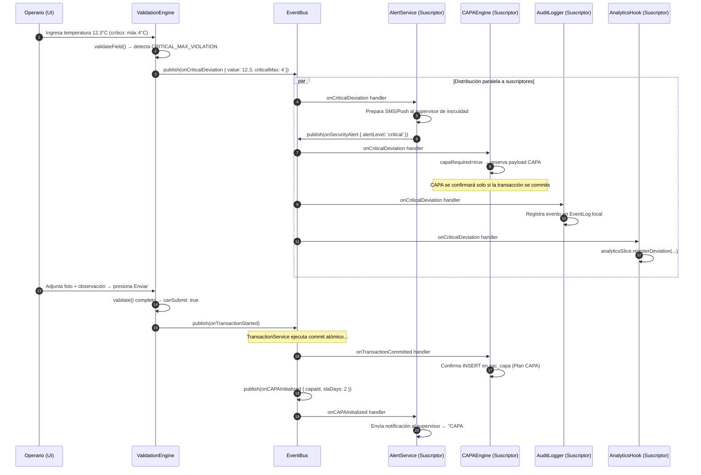
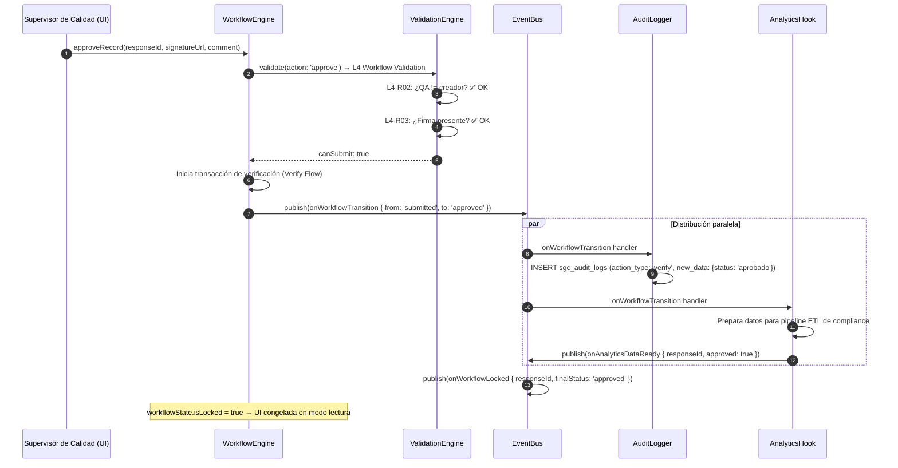
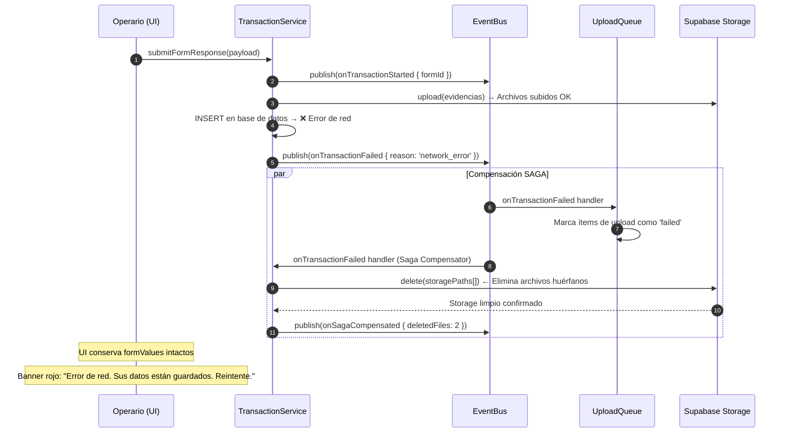

# ARQUITECTURA DEL BUS DE EVENTOS INTERNO (EVENT BUS ARCHITECTURE)
## Sistema de Gestión de Calidad (SGC-DM) — Fase 1: Core Runtime Foundation
**Autor:** Principal Software Architect / Enterprise Solution Architect  
**Versión:** 1.0 (Fase 1 — Core Runtime Foundation)  
**Estatus:** APROBADO — ARQUITECTURA DE COMUNICACIÓN DESACOPLADA  
**Clasificación:** Confidencial / Propiedad Técnica Integradora  

---

## 1. VISIÓN GENERAL Y PROPÓSITO

### 1.1 El Problema del Acoplamiento en Sistemas Complejos

Sin un mecanismo de comunicación desacoplado, un sistema como **SGC-DM** inevitablemente se convierte en un tejido de dependencias directas: el componente de temperatura llama directamente al servicio de alertas, que llama directamente al motor CAPA, que llama directamente a la capa analítica. Cada cambio en cualquier componente rompe los demás.

El **Event Bus Interno** resuelve este problema de raíz. Provee un canal central de comunicación asíncrona donde:

- Los **productores** (componentes, motores, servicios) publican eventos sin saber quién los escucha.
- Los **suscriptores** (alert service, capa engine, analytics) reaccionan a eventos relevantes sin acoplarse al emisor.
- El sistema puede **crecer, modificarse y extenderse** sin que los cambios en un módulo rompan a los demás.

### 1.2 Responsabilidades del Event Bus

| Responsabilidad | Descripción |
| :--- | :--- |
| **Desacoplamiento de Módulos** | Elimina dependencias directas entre Runtime Engine, Workflow, Analytics y CAPA. |
| **Comunicación Asíncrona Interna** | Permite que eventos sean procesados fuera del hilo principal de la UI React. |
| **Preparación de Integraciones Futuras** | El bus local puede reemplazarse o extenderse con Kafka/RabbitMQ sin cambiar los productores. |
| **Trazabilidad de Eventos** | Todos los eventos publicados se registran con metadatos para auditoría. |
| **Orquestación de Side Effects** | Coordina reacciones en cascada (ej: desviación → alerta → CAPA → analítica) sin lógica entrelazada. |

### 1.3 Posición en la Arquitectura General

```
┌────────────────────────────────────────────────────────────────────────────────┐
│                           SGC-DM RUNTIME ARCHITECTURE                         │
│                                                                                │
│  [ Runtime Engine ]  [ Validation Engine ]  [ Workflow Engine ]               │
│        │                     │                      │                         │
│        │ publica eventos      │ publica eventos       │ publica eventos        │
│        └─────────────────────┴──────────────────────┘                         │
│                                      │                                         │
│                                      ▼                                         │
│                    ┌─────────────────────────────────┐                         │
│                    │      EVENT BUS (SGC-DM Internal) │                         │
│                    │  Dispatcher · Registry · Queue   │                         │
│                    └────────────┬────────────────────┘                         │
│                                 │ distribuye eventos                            │
│                    ┌────────────┼────────────────────────────┐                  │
│                    ▼            ▼                            ▼                  │
│         [ Alert Service ] [ CAPA Engine ]  [ Analytics Hooks ] [ Audit Logger ]│
│                    │            │                            │                  │
│              [Futuro]     [Futuro: API]             [Futuro: AI Engine]         │
└────────────────────────────────────────────────────────────────────────────────┘
```

---

## 2. DISEÑO DEL EVENT BUS

### 2.1 Principios de Diseño

> [!IMPORTANT]
> **In-Process First:** El Event Bus de la Fase 1 es **in-process** (vive en la memoria de la SPA React). No requiere infraestructura externa (Redis, Kafka). En fases futuras, el `EventDispatcher` puede reemplazarse por un bus externo sin modificar los productores ni suscriptores.

> [!TIP]
> **Síncrono con Timeout:** Los handlers de suscriptores se ejecutan sincrónicamente pero con un timeout de protección de `50ms`. Si un suscriptor tarda más (por un bug o cómputo pesado), el bus lo desconecta para no bloquear la UI del operario.

> [!NOTE]
> **Immutable Events:** Los eventos publicados son objetos inmutables (frozen). Los suscriptores no pueden modificar el payload del evento. Esto garantiza la consistencia cuando múltiples suscriptores consumen el mismo evento.

### 2.2 Arquitectura Interna del Bus

```
┌────────────────────────────────────────────────────────────────────────────┐
│                          EVENT BUS INTERNO SGC-DM                          │
│                                                                            │
│  ┌─────────────────────────────────────────────────────────────────────┐   │
│  │                        EVENT REGISTRY                               │   │
│  │  Mapa de: EventType → Handler[]                                     │   │
│  │  { 'onCriticalDeviation': [CAPAHandler, AlertHandler, LogHandler] } │   │
│  └─────────────────────────────────────────────────────────────────────┘   │
│                                                                            │
│  ┌─────────────────────────────────────────────────────────────────────┐   │
│  │                       EVENT DISPATCHER                              │   │
│  │  publish(event) → itera handlers registrados → ejecuta con timeout │   │
│  └─────────────────────────────────────────────────────────────────────┘   │
│                                                                            │
│  ┌─────────────────────────────────────────────────────────────────────┐   │
│  │                         EVENT LOG (Audit)                           │   │
│  │  Registra cada publicación: timestamp, type, payload, handlersRun  │   │
│  └─────────────────────────────────────────────────────────────────────┘   │
└────────────────────────────────────────────────────────────────────────────┘
```

---

## 3. CONTRATOS DE INTERFAZ DEL EVENT BUS

### 3.1 Interfaz TypeScript del Bus

```typescript
// ============================================================
// EVENT BUS — Contratos de Interfaz SGC-DM
// ============================================================

/**
 * Todos los eventos del sistema extienden esta interfaz base.
 */
interface SGCBaseEvent {
  readonly eventId: string;         // UUID único del evento
  readonly eventType: SGCEventType; // Tipo del evento (discriminated union)
  readonly publishedAt: string;     // ISO timestamp de publicación
  readonly sourceModule: SGCModule; // Módulo que origina el evento
  readonly sessionId?: string;      // ID de sesión del usuario activo
  readonly correlationId?: string;  // Para rastrear cadenas de eventos relacionados
}

/**
 * Módulos del sistema que pueden publicar eventos.
 */
type SGCModule =
  | 'RuntimeEngine'
  | 'ValidationEngine'
  | 'WorkflowEngine'
  | 'TransactionService'
  | 'ComponentRegistry'
  | 'AnalyticsEngine'
  | 'CAPAService'
  | 'AuditLogger'
  | 'System';

/**
 * Tipo de handler: función que recibe un evento y no retorna nada.
 */
type SGCEventHandler<T extends SGCBaseEvent> = (event: T) => void;

/**
 * Interfaz principal del Event Bus.
 */
interface ISGCEventBus {
  /**
   * Publicar un evento. El dispatcher lo distribuye a todos los suscriptores registrados.
   */
  publish<T extends SGCBaseEvent>(event: T): void;

  /**
   * Suscribirse a un tipo de evento específico.
   * Retorna una función de desuscripción para cleanup en useEffect.
   */
  subscribe<T extends SGCBaseEvent>(
    eventType: SGCEventType,
    handler: SGCEventHandler<T>
  ): () => void;

  /**
   * Desuscribirse manualmente de un evento.
   */
  unsubscribe(eventType: SGCEventType, handler: SGCEventHandler<SGCBaseEvent>): void;

  /**
   * Obtener el log de eventos publicados (para auditoría y debugging).
   */
  getEventLog(): SGCEventLogEntry[];

  /**
   * Limpiar todos los suscriptores (útil en tests o reset completo).
   */
  clearAll(): void;
}
```

### 3.2 Catálogo Completo de Tipos de Eventos (SGCEventType)

```typescript
type SGCEventType =
  // ── RUNTIME EVENTS ──────────────────────────────────────────────
  | 'onFormInitialized'       // Formulario dinámico cargado y listo
  | 'onFormReset'             // Estado del formulario limpiado/reseteado
  | 'onFieldChanged'          // Un campo fue modificado por el operario
  | 'onDraftSaved'            // Auto-guardado de borrador completado

  // ── VALIDATION EVENTS ───────────────────────────────────────────
  | 'onValidationError'       // Se detectaron errores bloqueantes en el formulario
  | 'onValidationCleared'     // Todos los errores fueron resueltos
  | 'onCriticalDeviation'     // Un valor supera un límite crítico de control
  | 'onEvidenceRequired'      // Business rule exige foto de evidencia obligatoria
  | 'onSignatureRequired'     // Workflow exige firma digital para continuar

  // ── WORKFLOW EVENTS ──────────────────────────────────────────────
  | 'onWorkflowTransition'    // El estado del registro cambió (ej: submitted → approved)
  | 'onWorkflowLocked'        // Registro alcanzó estado final inmutable
  | 'onApprovalGranted'       // Un nivel de aprobación fue completado exitosamente
  | 'onApprovalRejected'      // Un nivel de aprobación fue rechazado
  | 'onWorkflowViolation'     // Intento de transición no autorizada detectada

  // ── TRANSACTION EVENTS ──────────────────────────────────────────
  | 'onTransactionStarted'    // TransactionService inició una operación atómica
  | 'onTransactionCommitted'  // Commit exitoso en base de datos
  | 'onTransactionFailed'     // Fallo de transacción — estado conservado para retry
  | 'onSagaCompensated'       // Compensación SAGA ejecutada (Storage limpiado)

  // ── EVIDENCE / UPLOAD EVENTS ────────────────────────────────────
  | 'onEvidenceUploaded'      // Archivo de evidencia subido a Storage exitosamente
  | 'onEvidenceUploadFailed'  // Fallo al subir evidencia fotográfica
  | 'onSignatureUploaded'     // Firma digital subida y confirmada

  // ── CAPA EVENTS ──────────────────────────────────────────────────
  | 'onCAPAInitialized'       // Plan de acción correctiva creado automáticamente
  | 'onCAPAResolved'          // Plan CAPA cerrado por el supervisor de calidad
  | 'onCAPAEscalated'         // CAPA escalada a nivel gerencial por vencimiento de SLA

  // ── ANALYTICS EVENTS ─────────────────────────────────────────────
  | 'onAnalyticsDataReady'    // Datos post-commit disponibles para pipeline ETL
  | 'onAnomalyDetected'       // Motor de IA detectó anomalía estadística
  | 'onComplianceScoreUpdated'// Índice de cumplimiento del operario actualizado

  // ── AUDIT EVENTS ─────────────────────────────────────────────────
  | 'onAuditLogCreated'       // Nueva entrada de auditoría inmutable registrada
  | 'onSecurityAlert'         // Alerta de seguridad (acceso no autorizado, etc.)

  // ── AI EVENTS (Futuro) ───────────────────────────────────────────
  | 'onVisionAnalysisCompleted'    // Análisis de imagen de evidencia completado por IA
  | 'onPredictiveAlertGenerated'   // Alerta predictiva generada por modelo de mantenimiento
  | 'onNLPSentimentAnalyzed';      // Análisis de sentimiento de observaciones completado
```

---

## 4. ESPECIFICACIÓN DE EVENTOS CRÍTICOS

### 4.1 `onCriticalDeviation` — Desviación de Límite Crítico

```typescript
interface OnCriticalDeviationEvent extends SGCBaseEvent {
  readonly eventType: 'onCriticalDeviation';
  readonly payload: {
    readonly responseId: string | null;       // ID del registro activo (null si aún no committed)
    readonly fieldId: string;                 // ID del campo con la desviación
    readonly fieldLabel: string;              // Nombre legible del campo
    readonly fieldIaTag: string;              // Tag IA (#temperatura_camara, #cloro_libre_ppm)
    readonly currentValue: number;            // Valor capturado por el operario
    readonly criticalMin?: number;            // Límite crítico inferior
    readonly criticalMax?: number;            // Límite crítico superior
    readonly deviationSide: 'below_min' | 'above_max';
    readonly severity: 'critical';
    readonly formCode: string;                // Código del formulario (ej: BPM-012)
    readonly operatorId: string;              // Usuario que capturó el valor
    readonly capturedAt: string;              // ISO timestamp de la captura
    readonly requiresCapa: boolean;           // Si la desviación activa el protocolo CAPA
  };
}

// Ejemplo de publicación:
bus.publish<OnCriticalDeviationEvent>({
  eventId: 'evt-7a3f1b29-...',
  eventType: 'onCriticalDeviation',
  publishedAt: new Date().toISOString(),
  sourceModule: 'ValidationEngine',
  correlationId: 'session-uuid-...',
  payload: {
    responseId: null,
    fieldId: 'cf8a1b2d-aa01',
    fieldLabel: 'Temperatura Cámara Principal',
    fieldIaTag: '#temperatura_camara',
    currentValue: 12.3,
    criticalMax: 4,
    deviationSide: 'above_max',
    severity: 'critical',
    formCode: 'BPM-012',
    operatorId: '3e9b2921-...',
    capturedAt: new Date().toISOString(),
    requiresCapa: true,
  },
});
```

### 4.2 `onWorkflowTransition` — Transición de Estado del Registro

```typescript
interface OnWorkflowTransitionEvent extends SGCBaseEvent {
  readonly eventType: 'onWorkflowTransition';
  readonly payload: {
    readonly responseId: string;
    readonly fromStatus: WorkflowStatus;
    readonly toStatus: WorkflowStatus;
    readonly triggeredBy: string;             // userId del actor
    readonly triggeredByRole: string;         // rol del actor
    readonly transitionEvent: string;         // 'SUBMIT_RESPONSE', 'APPROVE_RECORD', etc.
    readonly comment?: string;                // Comentario del supervisor (en aprobaciones)
    readonly signatureUrl?: string;           // URL de la firma digital en Storage
    readonly capaTriggered: boolean;          // Si esta transición gatilló un CAPA
  };
}
```

### 4.3 `onEvidenceUploaded` — Evidencia Fotográfica Confirmada

```typescript
interface OnEvidenceUploadedEvent extends SGCBaseEvent {
  readonly eventType: 'onEvidenceUploaded';
  readonly payload: {
    readonly uploadQueueId: string;           // ID del ítem en la upload queue
    readonly fieldId: string;
    readonly storagePath: string;             // Path físico en Supabase Storage
    readonly publicUrl: string;               // URL pública del archivo
    readonly fileType: string;                // 'image/jpeg', 'image/png', etc.
    readonly fileSizeBytes: number;
    readonly hasGPSMetadata: boolean;         // Si la foto tiene coordenadas GPS
    readonly operatorId: string;
  };
}
```

### 4.4 `onCAPAInitialized` — Plan Correctivo Creado Automáticamente

```typescript
interface OnCAPAInitializedEvent extends SGCBaseEvent {
  readonly eventType: 'onCAPAInitialized';
  readonly payload: {
    readonly capaId: string;                  // UUID del registro en sgc_capa
    readonly responseId: string;              // Registro de inspección que lo originó
    readonly triggeredByDeviationField: string; // Campo que causó el CAPA
    readonly priority: 'critical' | 'high' | 'medium';
    readonly assignedToRole: string;          // Rol responsable de resolver
    readonly slaDays: number;                 // Días para cerrar el CAPA
    readonly formCode: string;
    readonly area: string;                    // Área de planta afectada
  };
}
```

### 4.5 `onTransactionCommitted` — Commit Exitoso en Base de Datos

```typescript
interface OnTransactionCommittedEvent extends SGCBaseEvent {
  readonly eventType: 'onTransactionCommitted';
  readonly payload: {
    readonly responseId: string;              // UUID del registro recién creado
    readonly formId: string;
    readonly formCode: string;
    readonly operatorId: string;
    readonly committedAt: string;
    readonly evidenceCount: number;           // Evidencias confirmadas en Storage
    readonly hasDeviations: boolean;          // Si el registro tiene campos en estado crítico
    readonly workflowStatus: WorkflowStatus;  // Estado inicial post-commit
  };
}
```

---

## 5. FLUJOS DE EVENTOS OPERACIONALES

### 5.1 Flujo: Desviación Crítica de Temperatura



### 5.2 Flujo: Aprobación Exitosa de Registro



### 5.3 Flujo: Fallo de Transacción y Compensación SAGA



---

## 6. IMPLEMENTACIÓN DEL EVENT BUS

### 6.1 Implementación de Referencia (In-Process)

```typescript
// ============================================================
// SGCEventBus — Implementación In-Process (Fase 1)
// ============================================================

class SGCEventBusImpl implements ISGCEventBus {
  private readonly registry: Map<SGCEventType, Set<SGCEventHandler<SGCBaseEvent>>>;
  private readonly eventLog: SGCEventLogEntry[];
  private readonly handlerTimeoutMs: number = 50;

  constructor() {
    this.registry = new Map();
    this.eventLog = [];
  }

  publish<T extends SGCBaseEvent>(event: T): void {
    // Inmutabilizar el evento antes de distribuir
    const frozenEvent = Object.freeze({ ...event });

    // Registrar en el log de auditoría interno
    this.eventLog.push({
      eventId: frozenEvent.eventId,
      eventType: frozenEvent.eventType,
      publishedAt: frozenEvent.publishedAt,
      sourceModule: frozenEvent.sourceModule,
    });

    // Distribuir a todos los handlers registrados para este tipo
    const handlers = this.registry.get(frozenEvent.eventType);
    if (!handlers || handlers.size === 0) return;

    handlers.forEach((handler) => {
      try {
        handler(frozenEvent as T);
      } catch (error) {
        // Un handler roto nunca debe romper al bus completo
        console.error(
          `[SGCEventBus] Handler error for ${frozenEvent.eventType}:`,
          error
        );
      }
    });
  }

  subscribe<T extends SGCBaseEvent>(
    eventType: SGCEventType,
    handler: SGCEventHandler<T>
  ): () => void {
    if (!this.registry.has(eventType)) {
      this.registry.set(eventType, new Set());
    }
    this.registry.get(eventType)!.add(handler as SGCEventHandler<SGCBaseEvent>);

    // Retorna función de cleanup para useEffect de React
    return () => this.unsubscribe(eventType, handler as SGCEventHandler<SGCBaseEvent>);
  }

  unsubscribe(eventType: SGCEventType, handler: SGCEventHandler<SGCBaseEvent>): void {
    this.registry.get(eventType)?.delete(handler);
  }

  getEventLog(): SGCEventLogEntry[] {
    return [...this.eventLog]; // Retorna copia inmutable
  }

  clearAll(): void {
    this.registry.clear();
    this.eventLog.length = 0;
  }
}

// Singleton global — una única instancia compartida por toda la SPA
export const sgcEventBus: ISGCEventBus = new SGCEventBusImpl();
```

### 6.2 Uso desde React (Hooks Pattern)

```typescript
// Hook para suscribirse a eventos desde componentes React
function useSGCEvent<T extends SGCBaseEvent>(
  eventType: SGCEventType,
  handler: SGCEventHandler<T>
): void {
  useEffect(() => {
    const unsubscribe = sgcEventBus.subscribe(eventType, handler);
    return unsubscribe; // Cleanup automático al desmontar el componente
  }, [eventType, handler]);
}

// Ejemplo de uso en el panel de alertas de desviaciones:
function DeviationAlertBanner() {
  const [deviation, setDeviation] = useState<OnCriticalDeviationEvent | null>(null);

  useSGCEvent<OnCriticalDeviationEvent>('onCriticalDeviation', (event) => {
    setDeviation(event);
  });

  if (!deviation) return null;

  return (
    <div className="alert-banner-critical">
      ⛔ Desviación crítica detectada en {deviation.payload.fieldLabel}:
      valor {deviation.payload.currentValue} excede el límite de {deviation.payload.criticalMax}.
    </div>
  );
}
```

---

## 7. CATÁLOGO DE SUSCRIPTORES Y RESPONSABILIDADES

### 7.1 Mapa Completo de Suscriptores

| Suscriptor | Eventos Escuchados | Responsabilidad |
| :--- | :--- | :--- |
| **AlertService** | `onCriticalDeviation`, `onCAPAInitialized`, `onWorkflowViolation` | Despacha notificaciones push/SMS a supervisores. |
| **CAPAEngine** | `onCriticalDeviation`, `onTransactionCommitted` | Inicializa el plan de acción correctiva si `requiresCapa === true`. |
| **AuditLogger** | `onWorkflowTransition`, `onTransactionCommitted`, `onSecurityAlert` | Escribe trazas inmutables en `sgc_audit_logs`. |
| **AnalyticsHook** | `onTransactionCommitted`, `onWorkflowTransition`, `onCAPAResolved` | Alimenta el pipeline ETL asíncrono de la capa analítica. |
| **UploadQueueManager** | `onTransactionFailed`, `onTransactionCommitted` | Limpia la cola de subida o ejecuta compensación SAGA. |
| **UIStateManager** | `onWorkflowLocked`, `onValidationError`, `onValidationCleared` | Actualiza el `validationSlice` y el `workflowSlice` del store. |
| **DraftEngine** | `onTransactionFailed`, `onDraftSaved` | Persiste borradores ante fallos y gestiona TTL del draft. |
| **[Futuro] IAEngine** | `onTransactionCommitted`, `onEvidenceUploaded` | Ejecuta análisis de visión y anomaly detection asíncronamente. |
| **[Futuro] ERPConnector** | `onTransactionCommitted` | Sincroniza lotes y despachos con SAP/Odoo vía webhook. |

---

## 8. PREPARACIÓN PARA INTEGRACIONES FUTURAS

### 8.1 Puerta de Extensión: Event Bus como Abstracción

El `ISGCEventBus` está diseñado como una **interfaz**, no como una implementación específica. En fases futuras de crecimiento del sistema, la implementación `SGCEventBusImpl` puede reemplazarse por otras implementaciones sin cambiar **ni un solo productor ni suscriptor**:

```
Fase 1 (Actual):     SGCEventBusImpl → In-Process (RAM)
Fase 2 (Supabase):   RealtimeBusAdapter → Supabase Realtime (WebSockets)
Fase 3 (Enterprise): KafkaAdapter → Apache Kafka (SaaS multi-tenant masivo)
```

### 8.2 Preparación para Edge Functions (Supabase)

```
[ SPA React ] → publica onTransactionCommitted en bus local
     │
     │ [Fase 2: Supabase Realtime Adapter]
     ▼
[ Supabase Edge Function ] → consume el evento via pg_notify
     │
     ├── Ejecuta pipeline ETL de analytics (cálculo de sgc_compliance_scores)
     ├── Envía notificación push via OneSignal/FCM
     └── Inicia inferencia de Vision AI asíncronamente
```

### 8.3 Preparación para IA y Sensores IoT (Fase 3+)

```typescript
// Los eventos de IA ya están tipados en SGCEventType.
// Cuando el AI Engine esté disponible, simplemente se registra como suscriptor:

sgcEventBus.subscribe<OnEvidenceUploadedEvent>('onEvidenceUploaded', async (event) => {
  if (event.payload.fileType.startsWith('image/')) {
    // Delegar análisis de imagen a Vision AI Engine asíncrono
    await visionAIEngine.analyze(event.payload.publicUrl, event.payload.fieldId);
  }
});
```

---

## 9. RIESGOS Y ESTRATEGIAS DE MITIGACIÓN

| ID | Riesgo | Severidad | Mitigación |
| :--- | :--- | :---: | :--- |
| **EB-R-01** | Suscriptor roto bloquea la publicación de otros eventos | 🔴 Alta | Cada handler se ejecuta en try/catch independiente. Un error en un suscriptor no interrumpe la distribución a los demás. |
| **EB-R-02** | Memory leak por suscriptores no desregistrados en React | 🔴 Alta | El hook `useSGCEvent` ejecuta `unsubscribe` en el cleanup de `useEffect`. |
| **EB-R-03** | Handler lento bloquea la UI del operario | 🟡 Media | Los handlers con lógica asíncrona pesada deben usar `setTimeout(handler, 0)` para diferir fuera del hilo principal. |
| **EB-R-04** | Eventos duplicados por publicación redundante | 🟡 Media | El `eventId` único por evento permite a los suscriptores implementar deduplicación con un Set de IDs procesados. |
| **EB-R-05** | Pérdida de eventos ante caída de la SPA (offline) | 🟡 Media | Los eventos críticos (`onCriticalDeviation`, `onCAPAInitialized`) se persisten en `DraftSnapshot` para reenvío al recuperar conectividad. |
| **EB-R-06** | Acumulación indefinida del event log en memoria | 🟡 Media | El event log tiene un límite de 1000 entradas. Al superarlo, descarta las más antiguas (rolling buffer). |

---

## 10. BUENAS PRÁCTICAS DE USO

### 10.1 Para Productores (Quienes Publican Eventos)

```typescript
// ✅ Correcto: Publicar un evento inmutable y tipado
bus.publish<OnCriticalDeviationEvent>({
  eventId: crypto.randomUUID(),
  eventType: 'onCriticalDeviation',
  publishedAt: new Date().toISOString(),
  sourceModule: 'ValidationEngine',
  payload: { ... }
});

// ❌ Incorrecto: Mutar el payload después de publicar
const event = { eventType: 'onCriticalDeviation', payload: { ... } };
bus.publish(event);
event.payload.currentValue = 99; // BUG: El evento ya se distribuyó inmutable
```

### 10.2 Para Suscriptores (Quienes Escuchan Eventos)

```typescript
// ✅ Correcto: Suscribirse con cleanup en React
useEffect(() => {
  const unsubscribe = bus.subscribe('onCriticalDeviation', handleDeviation);
  return unsubscribe;
}, []);

// ✅ Correcto: Operaciones asíncronas diferidas fuera del hilo
bus.subscribe('onTransactionCommitted', (event) => {
  setTimeout(() => {
    analyticsService.processCovarianceMatrix(event.payload.responseId);
  }, 0);
});

// ❌ Incorrecto: Llamadas HTTP síncronas dentro del handler (bloquea la UI)
bus.subscribe('onCriticalDeviation', async (event) => {
  await fetch('/api/alerts/send'); // No hacer esto — es asíncrono bloqueante
});
```

---

## 11. ROADMAP DE IMPLEMENTACIÓN

### Fase 1A — Bus Base In-Process (Q2 2026)
- Implementar `SGCEventBusImpl` como singleton global en `src/core/eventBus.ts`.
- Definir el catálogo completo de `SGCEventType` con TypeScript discriminated unions.
- Implementar `useSGCEvent` hook para integración en componentes React.
- Conectar `ValidationEngine` → publicación de `onCriticalDeviation` y `onValidationError`.

### Fase 1B — Suscriptores Core (Q2 2026)
- Implementar `AuditLogger` subscriber → escribe en `sgc_audit_logs` tras `onWorkflowTransition`.
- Implementar `AnalyticsHook` subscriber → prepara payload ETL tras `onTransactionCommitted`.
- Implementar `UploadQueueManager` subscriber → limpieza SAGA tras `onTransactionFailed`.
- Implementar `UIStateManager` subscriber → actualiza store tras `onWorkflowLocked`.

### Fase 2 — Supabase Realtime Adapter (Q3 2026)
- Crear `SupabaseRealtimeBusAdapter` que extiende `ISGCEventBus`.
- Conectar `onTransactionCommitted` a Supabase Edge Functions vía `pg_notify`.
- Habilitar notificaciones push en tiempo real a supervisores de calidad.

### Fase 3 — Enterprise Event Bus (Q4 2026+)
- Evaluar migración de eventos críticos a cola de mensajes persistente (Apache Kafka / AWS SQS).
- Implementar `KafkaAdapter` compatible con la interfaz `ISGCEventBus`.
- Conectar `onEvidenceUploaded` al pipeline de Vision AI para clasificación automática de evidencias.

---

**Documento Mantenido y Aprobado por:** Dirección General de Arquitectura de Software e Integridad Operativa SGC-DM.  
**Última Actualización:** 22 de Mayo de 2026.  
**Próxima Revisión Planificada:** 15 de Agosto de 2026.  
