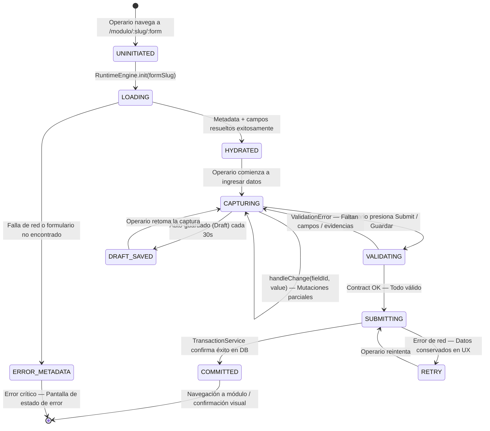
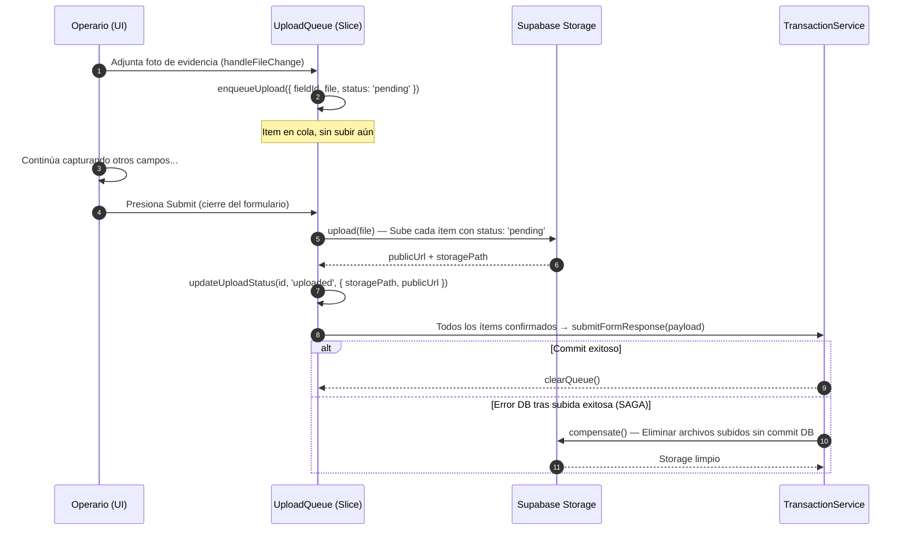

# ARQUITECTURA DEL ESTADO GLOBAL DEL RUNTIME (RUNTIME STATE ARCHITECTURE)
## Sistema de Gestión de Calidad (SGC-DM) — Fase 1: Core Runtime Foundation
**Autor:** Principal Software Architect / Enterprise Solution Architect  
**Versión:** 1.0 (Fase 1 — Core Runtime Foundation)  
**Estatus:** APROBADO — BLUEPRINT DE ESTADO CENTRAL  
**Clasificación:** Confidencial / Propiedad Técnica Integradora  

---

## 1. VISIÓN GENERAL Y PROPÓSITO

### 1.1 El Problema del Estado en Plataformas Metadata-Driven

En un sistema estático tradicional, el estado de un formulario es simple: vive en variables locales de componente y se envía al servidor al presionar "Guardar". En **SGC-DM**, la realidad operativa es radicalmente diferente.

Un operario de planta puede estar:
- Capturando un checklist de temperatura de cámaras en zona de almacenamiento frío.
- Simultáneamente subiendo una foto de evidencia del sellado de pallets.
- Mientras el sistema evalúa en caliente si el valor de `4.2°C` viola el límite crítico de `< 4°C`.
- Y el formulario lleva **47 campos de metadatos distintos** todos en estado reactivo.

El estado no es una variable. Es una **arquitectura**. Y esa arquitectura debe ser: predecible, estable, sincronizable, aislada y segura.

### 1.2 Responsabilidades del Runtime State

| Responsabilidad | Alcance |
| :--- | :--- |
| **Ciclo de vida del estado** | Inicio, hydratación, mutación segura, limpieza y descarte. |
| **Separación temporal vs. persistente** | Qué vive en RAM, qué se sincroniza a Storage, qué se escribe en DB. |
| **Orquestación de formularios dinámicos** | Estado plano EAV `{ [field_id]: value }` para cientos de campos. |
| **Estado de workflow y permisos** | Estado del ciclo de aprobación del registro activo. |
| **Cola de subida y sincronización** | Buffer de archivos pendientes y reintentos ante fallas de red. |
| **Estado de validación** | Errores, warnings y bloqueos contextuales en caliente. |
| **Estado analítico ligero** | Indicadores inmediatos de desviación para feedback visual al operario. |

---

## 2. ARQUITECTURA GENERAL DEL ESTADO

```
┌────────────────────────────────────────────────────────────────────────────────┐
│                          RUNTIME STATE ARCHITECTURE                            │
│                                                                                │
│  ┌──────────────────────────────────────────────────────────────────────────┐  │
│  │                         GLOBAL RUNTIME STORE                            │  │
│  │  ┌─────────────┐  ┌─────────────────┐  ┌──────────────────────────────┐ │  │
│  │  │  FORM STATE │  │  WORKFLOW STATE  │  │     PERMISSIONS STATE        │ │  │
│  │  │  (EAV Map)  │  │ (Status / Locks) │  │  (Rol / Autoría / Acceso)   │ │  │
│  │  └──────┬──────┘  └────────┬────────┘  └────────────┬─────────────────┘ │  │
│  │         │                  │                         │                   │  │
│  │  ┌──────┴──────┐  ┌────────┴────────┐  ┌────────────┴─────────────────┐ │  │
│  │  │  VALIDATION │  │  UPLOAD QUEUE   │  │      ANALYTICS STATE         │ │  │
│  │  │    STATE    │  │  (Sync Buffer)  │  │  (Desviaciones / KPIs Live)  │ │  │
│  │  └─────────────┘  └─────────────────┘  └──────────────────────────────┘ │  │
│  └──────────────────────────────────────────────────────────────────────────┘  │
│                                       │                                        │
│                     ┌─────────────────┴────────────────┐                      │
│                     ▼                                   ▼                      │
│          ┌──────────────────────┐            ┌──────────────────────┐          │
│          │   DRAFT STATE LOCAL  │            │   PERSISTENCE LAYER  │          │
│          │  (IndexedDB/Memory)  │            │  (Supabase/SQL API)  │          │
│          └──────────────────────┘            └──────────────────────┘          │
└────────────────────────────────────────────────────────────────────────────────┘
```

---

## 3. CICLO DE VIDA DEL ESTADO RUNTIME

El estado del runtime atraviesa 6 fases bien definidas desde el momento en que el operario accede a un formulario hasta que el registro queda consolidado en base de datos.

### 3.1 Diagrama del Ciclo de Vida



### 3.2 Descripción de Fases

| Fase | Responsable | Descripción Técnica |
| :--- | :--- | :--- |
| **UNINITIATED** | React Router | Estado vacío. No existe ningún store asociado al formulario. |
| **LOADING** | `MetadataInterpreter` | Se recupera el contrato JSON del formulario y sus campos dinámicos. |
| **HYDRATED** | `RuntimeStateManager` | Se construye el `FormState` inicial: `{ [field_id]: null/false/"" }`. |
| **CAPTURING** | `FormStateStore` | El operario muta el estado campo por campo. Reactividad en caliente. |
| **DRAFT_SAVED** | `DraftEngine` | Snapshot local del estado actual en memoria / IndexedDB temporal. |
| **VALIDATING** | `ValidationEngine` | Se ejecuta el pipeline completo de validaciones antes de persistir. |
| **SUBMITTING** | `TransactionService` | Se envía el payload a la capa de persistencia. Estado bloqueado. |
| **COMMITTED** | `PersistenceAdapter` | Confirmación exitosa. Estado se limpia y la UI redirige. |
| **RETRY** | `TransactionService` | Fallo transitorio. Estado conservado en UX para reintento. |

---

## 4. SEPARACIÓN: ESTADO TEMPORAL vs. ESTADO PERSISTENTE

Esta separación es el principio cardinal del diseño de estado en SGC-DM.

### 4.1 Tabla de Clasificación

| Dato | Vive en | Persistido en DB | Sincronizado | Tiempo de Vida |
| :--- | :--- | :---: | :---: | :--- |
| `formValues` (mapa EAV campo-valor) | RAM (React State) | ✅ Al commit | Sí | Sesión de captura |
| `fieldErrors` (errores de validación) | RAM (React State) | ❌ Nunca | No | Por interacción |
| `workflowStatus` (estado del registro) | RAM + DB | ✅ Permanente | Sí | Ciclo de vida del registro |
| `uploadQueue` (archivos pendientes) | RAM + IndexedDB | ✅ Al commit | Sí | Hasta confirmación |
| `draftSnapshot` (auto-guardado) | RAM / IndexedDB | ⚠️ Solo si offline | Condicional | 30min TTL |
| `permissionsContext` (rol activo) | RAM (Context) | ❌ Nunca | No | Sesión de usuario |
| `analyticsState` (KPIs en caliente) | RAM | ❌ Nunca directo | No | Por cálculo ETL |
| `signaturesBuffer` (firmas digitales) | RAM + Storage URL | ✅ URL en DB | Sí | Ciclo del registro |
| `metadataCache` (form definition) | RAM + LocalStorage | ❌ Solo caché | No | TTL de 24h |

### 4.2 Reglas Fundamentales de Estado

> [!IMPORTANT]
> **Regla 1 — Aislamiento de Efectos:** El estado de un formulario dinámico nunca contamina el estado de otro. Cada instancia de `FormStateStore` es completamente independiente y se destruye al desmontarse del DOM.

> [!IMPORTANT]
> **Regla 2 — Inmutabilidad de Workflow State:** Una vez que `workflowStatus` llega a `aprobado` o `rechazado`, el estado se convierte en de solo lectura. Ninguna función del store puede mutar `formValues` si el workflow está bloqueado.

> [!TIP]
> **Regla 3 — Conservación en Errores de Red:** Si `TransactionService` retorna un error de conectividad, `formValues` y `uploadQueue` NO se destruyen. Se activa el modo `RETRY` conservando el trabajo del operario.

---

## 5. ESPECIFICACIÓN DEL GLOBAL RUNTIME STORE

### 5.1 Interfaz TypeScript del Store Central

```typescript
// ============================================================
// RUNTIME STORE — Contrato Central de Estado SGC-DM
// ============================================================

/**
 * FormValues: Mapa plano EAV del estado del formulario dinámico.
 * Clave: field_id (UUID del campo en sgc_form_fields)
 * Valor: Tipado según field_type del contrato del campo
 */
type FormValues = Record<string, string | number | boolean | null | object>;

/**
 * ValidationState: Estado del motor de validaciones en caliente.
 */
type ValidationState = {
  isValid: boolean;
  errors: Record<string, string>;        // { [field_id]: "mensaje de error" }
  warnings: Record<string, string>;      // { [field_id]: "advertencia contextual" }
  blockedSubmit: boolean;                // true si hay errores críticos sin resolver
  pendingEvidenceFields: string[];       // field_ids que exigen evidencia fotográfica
  pendingSignatureFields: string[];      // field_ids que exigen firma digital
};

/**
 * WorkflowState: Estado del ciclo de vida del registro activo.
 */
type WorkflowState = {
  responseId: string | null;            // UUID del registro en sgc_form_responses
  status: WorkflowStatus;               // Estado actual del ciclo de vida
  isLocked: boolean;                    // true si status es final (aprobado/rechazado)
  canEdit: boolean;                     // Calculado: rol + autoría + estado
  canApprove: boolean;                  // Calculado: rol calidad + != creador
  approvalLevels: ApprovalLevel[];      // Niveles de firma configurados en metadata
};

type WorkflowStatus =
  | 'draft'
  | 'in_progress'
  | 'submitted'
  | 'pendiente_revision'
  | 'under_review'
  | 'approved'
  | 'aprobado'
  | 'rejected'
  | 'rechazado'
  | 'archived'
  | 'cancelled';

/**
 * UploadQueue: Buffer de archivos pendientes de confirmación.
 */
type UploadQueueItem = {
  id: string;                           // ID temporal del ítem
  fieldId: string;                      // Campo asociado
  file: File;                           // Objeto File original
  storagePath: string | null;           // Path en Supabase Storage (post-upload)
  publicUrl: string | null;             // URL pública (post-upload)
  status: 'pending' | 'uploading' | 'uploaded' | 'failed';
  retries: number;                      // Intentos de subida realizados
};

type UploadQueue = UploadQueueItem[];

/**
 * PermissionsContext: Contexto de permisos del usuario activo.
 */
type PermissionsContext = {
  userId: string;
  userRole: 'operativo' | 'calidad' | 'administrador' | 'auditor';
  isAuthor: boolean;                    // El usuario es el creador del registro
  authorizedModules: string[];          // Módulos a los que tiene acceso
};

/**
 * AnalyticsState: Estado ligero de KPIs y desviaciones en caliente.
 */
type AnalyticsState = {
  activeDeviations: DeviationAlert[];   // Desviaciones detectadas en este ciclo
  captureStartTime: number;             // Timestamp de inicio de captura (ms)
  fieldInteractionCount: number;        // Campos modificados en esta sesión
};

type DeviationAlert = {
  fieldId: string;
  fieldLabel: string;
  currentValue: number;
  criticalMin?: number;
  criticalMax?: number;
  severity: 'warning' | 'critical';
  message: string;
};

/**
 * GlobalRuntimeStore: Contrato maestro del estado completo del runtime.
 */
interface GlobalRuntimeStore {
  // Estado del formulario dinámico (EAV)
  formValues: FormValues;
  setFieldValue: (fieldId: string, value: FormValues[string]) => void;
  resetForm: () => void;

  // Metadata del formulario activo
  formContract: FormContract | null;
  isLoading: boolean;
  loadError: string | null;

  // Estado del motor de validaciones
  validationState: ValidationState;
  triggerValidation: () => ValidationState;

  // Estado del ciclo de vida del workflow
  workflowState: WorkflowState;
  setWorkflowStatus: (status: WorkflowStatus) => void;

  // Cola de subida de evidencias y firmas
  uploadQueue: UploadQueue;
  enqueueUpload: (item: Omit<UploadQueueItem, 'status' | 'retries'>) => void;
  updateUploadStatus: (id: string, status: UploadQueueItem['status'], urls?: { storagePath: string; publicUrl: string }) => void;

  // Contexto de permisos del usuario
  permissionsContext: PermissionsContext | null;

  // Estado analítico en caliente
  analyticsState: AnalyticsState;
  registerDeviation: (deviation: DeviationAlert) => void;
  clearDeviations: () => void;

  // Draft local (auto-guardado)
  saveDraft: () => void;
  loadDraft: (formId: string) => boolean;
  clearDraft: (formId: string) => void;
}
```

### 5.2 Ejemplo de Estado JSON en Tiempo de Ejecución

```json
{
  "formContract": {
    "id": "f3a9b2c1-...",
    "code": "FORM-BPM-012",
    "name": "Control de Temperatura - Cámaras de Conservación",
    "engineType": "BaseMediciones",
    "workflowConfig": {
      "requiresApproval": true,
      "requiresSignature": true,
      "verifierRole": "calidad"
    }
  },
  "formValues": {
    "cf8a1b2d-aa01": 3.8,
    "cf8a1b2d-aa02": "Turno Mañana - Área Carnes",
    "cf8a1b2d-aa03": true,
    "cf8a1b2d-aa04": null
  },
  "validationState": {
    "isValid": false,
    "errors": {
      "cf8a1b2d-aa04": "Campo obligatorio: ingrese la firma del responsable."
    },
    "warnings": {
      "cf8a1b2d-aa01": "⚠ Temperatura 3.8°C próxima al límite inferior (4°C). Verificar calibración del sensor."
    },
    "blockedSubmit": true,
    "pendingEvidenceFields": [],
    "pendingSignatureFields": ["cf8a1b2d-aa04"]
  },
  "workflowState": {
    "responseId": null,
    "status": "in_progress",
    "isLocked": false,
    "canEdit": true,
    "canApprove": false,
    "approvalLevels": [
      { "level": 1, "role": "operativo", "label": "Firma del Operario" },
      { "level": 2, "role": "calidad", "label": "Verificación del Supervisor de Inocuidad" }
    ]
  },
  "uploadQueue": [
    {
      "id": "uq-001",
      "fieldId": "cf8a1b2d-aa03",
      "storagePath": "evidencias/2026/05/22/uq-001.jpg",
      "publicUrl": "https://storage.supabase.co/...",
      "status": "uploaded",
      "retries": 0
    }
  ],
  "permissionsContext": {
    "userId": "3e9b2921-...",
    "userRole": "operativo",
    "isAuthor": true,
    "authorizedModules": ["inocuidad", "bpm", "despachos"]
  },
  "analyticsState": {
    "activeDeviations": [],
    "captureStartTime": 1716394200000,
    "fieldInteractionCount": 12
  }
}
```

---

## 6. RUNTIME STORE — SEPARACIÓN POR DOMINIOS (SLICES)

Para mantener la mantenibilidad en el largo plazo, el Global Runtime Store se divide en **slices especializados** que pueden evolucionar de forma independiente sin acoplarse entre sí.

```
┌────────────────────────────────────────────────────────────────────────┐
│                          GLOBAL RUNTIME STORE                          │
│                                                                        │
│  ┌─────────────────────┐   ┌─────────────────────────────────────────┐ │
│  │   formSlice         │   │           workflowSlice                 │ │
│  │                     │   │                                         │ │
│  │  - formValues       │   │  - responseId                           │ │
│  │  - formContract     │   │  - status                               │ │
│  │  - isLoading        │   │  - isLocked                             │ │
│  │  - setFieldValue    │   │  - canEdit / canApprove                 │ │
│  │  - resetForm        │   │  - approvalLevels                       │ │
│  └─────────────────────┘   └─────────────────────────────────────────┘ │
│                                                                        │
│  ┌─────────────────────┐   ┌─────────────────────────────────────────┐ │
│  │  validationSlice    │   │             uploadSlice                 │ │
│  │                     │   │                                         │ │
│  │  - errors           │   │  - uploadQueue[]                        │ │
│  │  - warnings         │   │  - enqueueUpload                        │ │
│  │  - blockedSubmit    │   │  - updateUploadStatus                   │ │
│  │  - pendingFields    │   │  - clearQueue                           │ │
│  │  - triggerValidation│   │                                         │ │
│  └─────────────────────┘   └─────────────────────────────────────────┘ │
│                                                                        │
│  ┌─────────────────────┐   ┌─────────────────────────────────────────┐ │
│  │  permissionsSlice   │   │           analyticsSlice                │ │
│  │                     │   │                                         │ │
│  │  - userId           │   │  - activeDeviations[]                   │ │
│  │  - userRole         │   │  - captureStartTime                     │ │
│  │  - isAuthor         │   │  - fieldInteractionCount                │ │
│  │  - authorizedModules│   │  - registerDeviation                    │ │
│  └─────────────────────┘   └─────────────────────────────────────────┘ │
│                                                                        │
│  ┌──────────────────────────────────────────────────────────────────┐  │
│  │                         draftSlice                               │  │
│  │   - saveDraft()  ─── loadDraft(formId)  ─── clearDraft(formId)  │  │
│  └──────────────────────────────────────────────────────────────────┘  │
└────────────────────────────────────────────────────────────────────────┘
```

---

## 7. DRAFT STATE — PROTECCIÓN DE DATOS ANTE INTERRUPCIONES

En ambientes de planta industrial, las interrupciones son parte de la realidad operativa: el operario puede perder conectividad a mitad de la captura, o el teléfono puede bloquearse por inactividad. El `DraftEngine` protege el trabajo del operario ante estos escenarios.

### 7.1 Política de Auto-Guardado

| Condición | Acción del DraftEngine |
| :--- | :--- |
| Cada 30 segundos mientras `status === 'capturing'` | Serializa `formValues` + `uploadQueue` a `IndexedDB[formId]`. |
| Al perder foco de la pestaña del navegador | Serializa inmediatamente (evento `visibilitychange`). |
| Al detectar error de red en `TransactionService` | Persiste el último estado completo del store. |
| Al presionar "Cancelar" intencional | El draft se borra explícitamente con `clearDraft(formId)`. |
| Al completar un `COMMITTED` exitoso | El draft se borra automáticamente tras la redirección. |

### 7.2 Estructura del Draft Snapshot

```typescript
type DraftSnapshot = {
  formId: string;
  savedAt: string;                      // ISO timestamp del auto-guardado
  ttlMinutes: number;                   // Tiempo de vida (default: 1440min = 24h)
  formValues: FormValues;
  uploadQueue: UploadQueueItem[];       // Solo ítems con estado 'uploaded'
  captureStartTime: number;
};
```

---

## 8. SINCRONIZACIÓN Y COLA DE SUBIDA (UPLOAD QUEUE)

Las evidencias fotográficas y firmas digitales se suben al bucket de Supabase Storage **antes** de iniciar la transacción SQL principal. Esta secuencia es deliberada y está alineada con la estrategia SAGA definida en `transaction_architecture.md`.

### 8.1 Flujo de la Upload Queue



---

## 9. ESTADO DE PERMISOS EN RUNTIME (PERMISSIONS RUNTIME)

Los permisos no son solo "qué puede hacer el usuario en el sistema". En SGC-DM, los permisos son **contextuales y dinámicos**: varían en función del estado actual del registro y de la relación de autoría del usuario.

### 9.1 Matriz de Permisos Contextuales Runtime

```
┌──────────────────────────────────────────────────────────────────────────────┐
│                   MATRIX: ROL × ESTADO × AUTORÍA → PERMISO                   │
│                                                                              │
│  Rol: operativo  │  Estado: in_progress  │  Es Autor: SÍ                    │
│  ──────────────────────────────────────────────────────────────────────────  │
│  canEdit:      TRUE  (puede editar campos y agregar evidencias)               │
│  canApprove:   FALSE (no puede auto-aprobar su propio registro)               │
│  canView:      TRUE                                                           │
│                                                                              │
│  Rol: calidad   │  Estado: submitted    │  Es Autor: NO                     │
│  ──────────────────────────────────────────────────────────────────────────  │
│  canEdit:      FALSE (no modifica el contenido original del operario)         │
│  canApprove:   TRUE  (puede aprobar/rechazar — supervisor calificado)         │
│  canComment:   TRUE  (puede registrar comentario de verificación)             │
│                                                                              │
│  Rol: cualquiera │  Estado: aprobado   │  Es Autor: cualquiera              │
│  ──────────────────────────────────────────────────────────────────────────  │
│  canEdit:      FALSE (registro congelado — inmutable legalmente)              │
│  canApprove:   FALSE                                                          │
│  canView:      TRUE  (lectura de solo visualización)                          │
└──────────────────────────────────────────────────────────────────────────────┘
```

### 9.2 Función de Cálculo de Permisos Contextuales

```typescript
function computeRuntimePermissions(
  userRole: PermissionsContext['userRole'],
  isAuthor: boolean,
  workflowStatus: WorkflowStatus
): { canEdit: boolean; canApprove: boolean; canView: boolean; canComment: boolean } {

  const isFinalState = ['approved', 'aprobado', 'rejected', 'rechazado', 'archived'].includes(workflowStatus);
  const isInReview   = ['submitted', 'pendiente_revision', 'under_review'].includes(workflowStatus);
  const isQAorAdmin  = ['calidad', 'administrador'].includes(userRole);

  return {
    canView:    true,
    canEdit:    !isFinalState && isAuthor && !isInReview,
    canApprove: !isFinalState && isInReview && isQAorAdmin && !isAuthor,
    canComment: isQAorAdmin && !isFinalState,
  };
}
```

---

## 10. ESTADO ANALÍTICO EN TIEMPO REAL (ANALYTICS STATE)

El `analyticsSlice` no reemplaza la capa de analítica persistente (`sgc_compliance_scores`, `sgc_trends`). Su rol es proveer **feedback inmediato al operario durante la captura** sin hacer llamadas externas.

### 10.1 Responsabilidades del Analytics State

```
Durante la captura de datos (Ciclo Reactivo):
  ├── Campo numérico modificado (ej: temperatura 12°C fuera de rango 0–4°C)
  │     └──► registerDeviation({ fieldId, currentValue, criticalMax: 4, severity: 'critical' })
  │
  ├── Campo booleano marcado como "No Cumple"
  │     └──► registerDeviation({ fieldId, severity: 'warning', message: '...' })
  │
  └── Todos los campos dentro de rango
        └──► clearDeviations()
```

### 10.2 Integración con el Event Bus

Cuando el `analyticsSlice` registra una nueva desviación crítica (`severity === 'critical'`), publica automáticamente el evento `onCriticalDeviation` al **Event Bus** central (definido en `event_bus_architecture.md`). Esto mantiene al `analyticsSlice` completamente desacoplado del motor de alertas y CAPA.

---

## 11. INTEGRACIÓN CON LAS CAPAS DE ARQUITECTURA EXISTENTES

### 11.1 Mapa de Integración

| Capa | Interacción con Runtime State |
| :--- | :--- |
| **MetadataInterpreter** (`dynamic_runtime_engine.md`) | Produce `FormContract` → hidrata `formSlice` al inicio. |
| **ValidationEngine** (`validation_engine.md`) | Consume `formValues` → produce `validationState`. |
| **Workflow Engine** (`workflow_engine.md`) | Lee `workflowState.status` → dicta `isLocked` y `canEdit`. |
| **TransactionService** (`transaction_architecture.md`) | Consume `formValues` + `uploadQueue` → genera `TransactionPayload`. |
| **ComponentRegistry** (`component_registry.md`) | Lee `permissionsContext.canEdit` → inyecta `disabled` en cada componente. |
| **Event Bus** (`event_bus_architecture.md`) | Recibe eventos publicados por los slices (desviaciones, errores, etc.). |
| **Analytics Layer** (`analytics_architecture.md`) | Consume datos del `analyticsSlice` post-commit para ETL asíncrono. |

---

## 12. ESCALABILIDAD Y EVOLUCIÓN FUTURA

### 12.1 Preparación Multi-Formulario Concurrente
El diseño de slices aislados permite en el futuro soportar múltiples formularios abiertos simultáneamente (ej. el operario deja a medias un checklist y abre uno nuevo). Cada instancia de `GlobalRuntimeStore` es completamente independiente e identificada por `formId`.

### 12.2 Preparación Offline-First
El `draftSlice` está diseñado como el primer paso hacia una arquitectura offline completa. El siguiente paso arquitectónico (`Offline Runtime Architecture`) extenderá la `DraftSnapshot` para incluir una cola de sincronización diferida que se vacía automáticamente cuando regresa la conectividad de red.

### 12.3 Preparación Multi-Tenant (SaaS)
El `permissionsContext` incluirá en la evolución multi-empresa un campo `tenantId` que garantice que los datos de diferentes organizaciones nunca se mezclen en el mismo store de sesión activa.

---

## 13. RIESGOS Y ESTRATEGIAS DE MITIGACIÓN

| ID | Riesgo | Severidad | Mitigación |
| :--- | :--- | :---: | :--- |
| **RS-01** | Estado corrupto por mutación directa fuera del store | 🔴 Alta | Toda mutación pasa por setters controlados del store. Prohibido escribir directamente sobre el objeto de estado. |
| **RS-02** | Memory leak por no limpiar el store al desmontar | 🟡 Media | `resetForm()` se ejecuta en el `useEffect` de cleanup del componente orquestador. |
| **RS-03** | Draft corrupto por cierre abrupto del navegador | 🟡 Media | La `DraftSnapshot` incluye un hash de integridad. Si el hash no coincide al cargar, el draft se descarta. |
| **RS-04** | Upload Queue con ítems huérfanos en Storage | 🔴 Alta | Estrategia SAGA de compensación definida en `transaction_architecture.md`. |
| **RS-05** | Permisos calculados incorrectamente al cambiar de rol | 🟡 Media | `computeRuntimePermissions` se recalcula en cada cambio de `workflowState.status`. |

---

## 14. ROADMAP DE IMPLEMENTACIÓN

### Fase 1A — Core State (Q2 2026)
- Definir e implementar `GlobalRuntimeStore` con `formSlice`, `workflowSlice`, `validationSlice`.
- Implementar el ciclo UNINITIATED → HYDRATED → CAPTURING → COMMITTED.
- Integrar `permissionsSlice` con el contexto de autenticación existente.

### Fase 1B — Upload y Draft (Q3 2026)
- Implementar `uploadSlice` con flujo de Upload Queue y compensación SAGA.
- Implementar `draftSlice` con auto-guardado en IndexedDB.
- Integrar el modo RETRY con conservación de estado del formulario en red.

### Fase 2 — Analytics State y Event Bus (Q3 2026)
- Implementar `analyticsSlice` con detección de desviaciones en caliente.
- Conectar el analytics state al Event Bus central.
- Publicar eventos de desviación hacia el motor de alertas y CAPA.

### Fase 3 — Offline Runtime y Multi-Tenant (Q4 2026)
- Extender `draftSlice` a cola de sincronización diferida.
- Añadir campo `tenantId` al `permissionsContext`.
- Preparar el store para soportar múltiples formularios concurrentes.

---

**Documento Mantenido y Aprobado por:** Dirección General de Arquitectura de Software e Integridad Operativa SGC-DM.  
**Última Actualización:** 22 de Mayo de 2026.  
**Próxima Revisión Planificada:** 15 de Agosto de 2026.  
