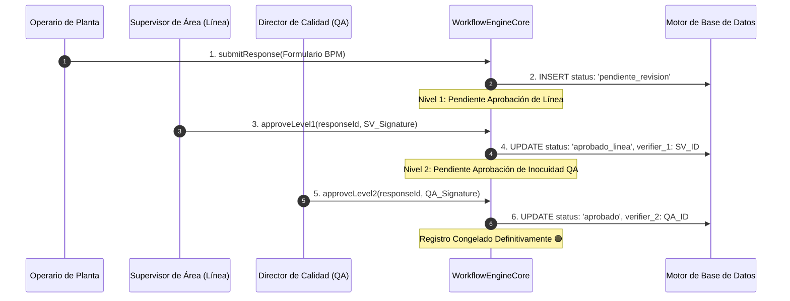
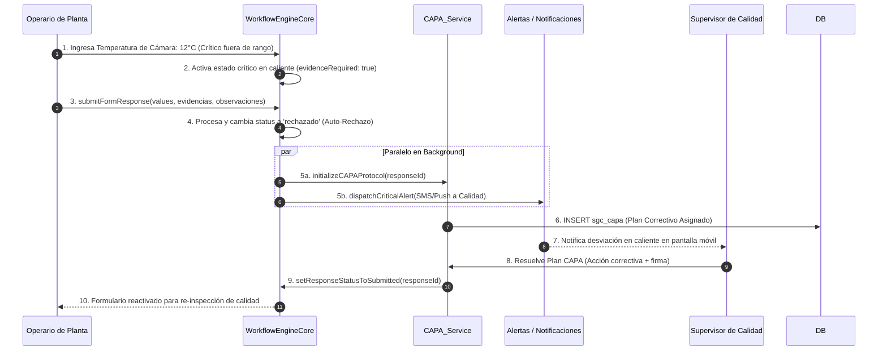

# ARQUITECTURA DEL MOTOR DE WORKFLOWS (WORKFLOW ENGINE)
## Sistema de Gestión de Calidad (SGC-DM) — Documentación Técnica de Arquitectura
**Autor:** Arquitecto de Software Senior Principal  
**Versión:** 1.0 (Enterprise Specification)  
**Estatus:** APROBADO - CORE WORKFLOW SPECIFICATION  
**Clasificación:** Confidencial / Propiedad Técnica Integradora  

---

## 1. WORKFLOW ENGINE OVERVIEW

### 1.1 Propósito
El **Motor de Workflows (Workflow Engine)** de **SGC-DM** es la capa de la plataforma encargada de modelar, orquestar, securizar y auditar el ciclo de vida operacional de todos los registros de calidad capturados en planta. 

En la industria de alimentos y distribución farmacéutica, un registro de calidad (ej. *Control de Temperatura en Despachos*) no es simplemente una fila estática persistida en una base de datos. Representa un proceso dinámico que involucra operarios de planta, supervisores de calidad, directores técnicos e inspectores externos del INVIMA. El Workflow Engine garantiza de forma inquebrantable que cada registro transicione a través de las etapas normativas correspondientes, validando los permisos contextuales de los usuarios y forzando la segregación de funciones antes de consolidar el estado de inmutabilidad del registro.

```
                    ┌─────────────────────────┐
                    │    CREACIÓN REGISTRO    │
                    │      (Rol Operario)     │
                    └────────────┬────────────┘
                                 │
                                 ▼
                    ┌─────────────────────────┐
                    │    WORKFLOW STATE       │
                    │   pendiente_revision    │
                    └────────────┬────────────┘
                                 │
                   Evaluación de Reglas en Caliente
                                 │
                                 ▼
                    ┌─────────────────────────┐
                    │     WORKFLOW ENGINE     │
                    │   Frontera de Control   │
                    └──────┬────────────┬─────┘
                           │            │
              Aprobación / Firma      Desviación / Falla
                           │            │
                           ▼            ▼
                    ┌────────────┐┌────────────┐
                    │ APROBADO   ││ RECHAZADO  │
                    │ Registro   ││ Disparar   │
                    │ Congelado  ││ CAPA Flow  │
                    └────────────┘└────────────┘
```

### 1.2 Responsabilidades
* **Gestión del Ciclo de Vida de Registros (Lifecycle Management):** Controlar las transiciones lógicas desde el borrador temporal hasta el archivado final.
* **Segregación de Funciones (Segregation of Duties):** Impedir que un mismo usuario apruebe o valide una inspección que él mismo creó, blindando la validez del control normativo.
* **Estrategia de Congelamiento Operativo (Runtime Locking):** Deshabilitar de forma inmediata la edición de campos de datos y evidencias en el cliente y en el servidor cuando el registro alcanza un estado final, previniendo alteraciones históricas.
* **Escalamiento de No Conformidades (CAPA & Deviation Pipeline):** Detectar en caliente si una variable de inocuidad se desvía del rango crítico e iniciar de forma inmediata el flujo correctivo CAPA de contingencia.

### 1.3 Relación con el Runtime Engine
Mientras el **Runtime Engine** se encarga de *interpretar la estructura* del formulario y pintar los inputs a nivel de UI, el **Workflow Engine** *gobierna las transiciones de estado* de la instancia del documento. El Runtime Engine invoca continuamente al Workflow Engine para determinar si el formulario cargado debe estar editable, qué paneles de firma e inputs de supervisión deben renderizarse, y qué acciones contextuales de control están autorizadas para el rol del usuario activo.

---

## 2. CICLO DE VIDA DEL REGISTRO (WORKFLOW LIFECYCLE)

El ciclo de vida del registro define los estados contractuales oficiales que una instancia de inspección de calidad experimenta en SGC-DM.

```
                  ┌────────────────────────────────────────┐
                  │                 DRAFT                  │
                  │   Borrador temporal (Listo Offline)    │
                  └───────────────────┬────────────────────┘
                                      │
                                      ▼
                  ┌────────────────────────────────────────┐
                  │              IN_PROGRESS               │
                  │        Captura parcial en planta       │
                  └───────────────────┬────────────────────┘
                                      │
                                      ▼
                  ┌────────────────────────────────────────┐
                  │               SUBMITTED                │
                  │      Enviado (Pendiente Revisión)      │
                  └───────────────────┬────────────────────┘
                                      │
                         Determinar Desviación / Rango
                                      │
                                      ▼
                  ┌────────────────────────────────────────┐
                  │              UNDER_REVIEW              │
                  │       Evaluación de Supervisor         │
                  └──────┬──────────────────────────┬──────┘
                         │                          │
                   ¿Todo Conforme?             ¿No Conforme?
                         │                          │
                         ▼                          ▼
                  ┌──────────────┐           ┌──────────────┐
                  │   APPROVED   │           │   REJECTED   │
                  │ Aprobado 🟢  │           │ Rechazado 🔴 │
                  │ Inmutable    │           │ Plan CAPA    │
                  └──────┬───────┘           └──────┬───────┘
                         │                          │
                         └────────────┬─────────────┘
                                      │
                                      ▼
                  ┌────────────────────────────────────────┐
                  │          ARCHIVED / CANCELLED          │
                  │  Depuración histórica / Descarte Adm.  │
                  └────────────────────────────────────────┘
```

### 2.1 Especificación Conceptual de Estados
* **`draft` (Borrador):** Registro guardado en la memoria local del cliente (Offline Ready). No tiene validez normativa y no es visible para la capa gerencial.
* **`in_progress` (En Proceso):** Inspección parcialmente capturada en caliente por el operario. Falta completar campos obligatorios, firmas o evidencias de soporte.
* **`submitted` / `pendiente_revision` (Enviado):** El operario finalizó la captura y envió el checklist a la base de datos central. El registro pasa a cola de supervisión.
* **`under_review` (En Revisión):** El supervisor de calidad o inspector de inocuidad ha abierto el registro, iniciando el análisis fisicoquímico u operativo en la interfaz.
* **`approved` / `aprobado` (Aprobado):** El supervisor calificado validó que el registro cumple con todos los parámetros. Se inyecta la firma digital, congelando la información de forma definitiva.
* **`rejected` / `rechazado` (Rechazado):** El registro presenta desviaciones inaceptables. Se detiene el proceso físico en planta (ej: camión retenido) y se gatilla el escalamiento a Plan CAPA.
* **`archived` (Archivado):** Estado inmutable histórico. Se traslada a almacenamiento lento de logs tras 12 meses de inactividad, conservando la firma y la auditoría.
* **`cancelled` (Cancelado):** Descarte administrativo del registro por errores graves de digitación detectados antes del submit, dejando el log correspondiente.

---

## 3. ARQUITECTURA DE LA MÁQUINA DE ESTADOS (STATE MACHINE)

El Workflow Engine implementa una **Máquina de Estados Finitos (FSM - Finite State Machine)** estricta que gobierna las transiciones en base de datos. Ningún registro puede saltar de una etapa a otra sin validar las precondiciones, firmas y roles contractuales exigidos.

### 3.1 Transiciones y Precondiciones (State Transitions Matrix)

| Estado Origen | Estado Destino | Evento de Disparo | Roles Autorizados | Precondiciones y Firmas Exigidas |
| :--- | :--- | :--- | :--- | :--- |
| **`draft`** | **`in_progress`** | `START_CAPTURE` | Operativo, Calidad, Admin | Se genera `UUID` de respuesta y se vincula al `form_id`. |
| **`in_progress`**| **`submitted`** | `SUBMIT_RESPONSE`| Operativo, Calidad, Admin | Todos los campos con `required: true` resueltos. Firma del operario registrada. |
| **`submitted`** | **`under_review`**| `OPEN_REVIEW` | Calidad, Admin | El usuario revisor es diferente al usuario creador del registro (`created_by != current_user`). |
| **`under_review`**| **`approved`** | `APPROVE_RECORD`| Calidad, Admin | Comentario de verificación ingresado. Firma del supervisor registrada. |
| **`under_review`**| **`rejected`** | `REJECT_RECORD` | Calidad, Admin | Comentario de rechazo descriptivo obligatorio. Registro de la causa de desviación. |
| **`rejected`** | **`submitted`** | `RE_SUBMIT` | Operativo, Calidad, Admin | Requiere plan de acción CAPA enlazado y soporte fotográfico de corrección. |
| **`approved`** | **`archived`** | `SYSTEM_ARCHIVE`| Sistema (Cron Job) | Tiempo de creación mayor a 365 días calendarios. |

### 3.2 Estrategia de Rollback Conceptual de Estados
Si durante el transcurso de una transición atómica ocurre una falla transaccional de persistencia (ej: el storage rechazó la firma del supervisor por cuota excedente o error de red):
* El motor de estados **detiene el proceso en seco**.
* Realiza el rollback físico de base de datos a nivel SQL.
* Devuelve el estado de la máquina en memoria al estado de origen (`under_review`).
* Bloquea de forma segura el visualizador en caliente para no corromper la consistencia en el cliente SPA.

---

## 4. REGLAS DE NEGOCIO Y CUMPLIMIENTO OPERATIVO (WORKFLOW RULES)

Para asegurar la confiabilidad del SGC-DM ante las inspecciones del INVIMA y las auditorías de calidad de la norma ISO 9001, el Workflow Engine enforza de forma nativa reglas de negocio inquebrantables:

```
                  ┌────────────────────────────────────────┐
                  │    INTENTO DE VERIFICACIÓN REGISTRO    │
                  └───────────────────┬────────────────────┘
                                      │
                         Ejecuta Reglas de Validación
                                      │
                                      ▼
                  ┌────────────────────────────────────────┐
                  │       VERIFICACIÓN EN TRES PASOS       │
                  └──────┬────────────┬────────────┬───────┘
                         │            │            │
                         ▼            ▼            ▼
                   [ REGLA 1 ]   [ REGLA 2 ]   [ REGLA 3 ]
                   Segregación   Obligación   Bloqueo Estado
                    Revisor !=    Firmas e    Frontera Final
                     Creador     Evidencias     Inmutable
                         │            │            │
                         └────────────┼────────────┘
                                      │
                                      ▼
                  ┌────────────────────────────────────────┐
                  │           ESTADO DE DECISIÓN           │
                  │   ¿Pasa Todo? ──► Commit Transacción.  │
                  │   ¿Falla?     ──► Rechazo y Auditoría. │
                  └────────────────────────────────────────┘
```

1. **Segregación Estricta de Funciones (Segregation of Duties):**
   * *La Regla:* El usuario supervisor que firma y verifica un registro en estado `pendiente_revision` **debe ser físicamente diferente** al operario que lo capturó en planta.
   * *Enforzamiento:* Validado en React ocultando los controles de aprobación al autor, y blindado en base de datos mediante una restricción `CHECK (created_by != verified_by)` o a nivel de trigger SQL en Supabase en el submit.
2. **Obligatoriedad de Evidencias en Hallazgos Críticos:**
   * Si en el ciclo de captura una variable numérica excede el límite (ej. Cloro fuera del rango $0.3 - 2.0$ ppm) o se marca un booleano como "No Cumple".
   * El Workflow Engine **cambia dinámicamente los requisitos contractuales**. Bloquea la transición a `submitted` a menos de que el operario anexe como mínimo una evidencia fotográfica de soporte y digite la descripción del desvío en el campo observaciones.
3. **Firma Digital Mandatoria (Inmutabilidad Legal):**
   * Las transiciones hacia los estados finales `approved` o `rejected` exigen de forma imperativa la incrustación de la firma digital de calidad (`value_text` con la URL del PNG del Storage). El motor valida la existencia física del archivo del trazo antes de persistir la verificación.

---

## 5. ESTRATEGIA DE BLOQUEO EN CALIENTE (RUNTIME LOCKING STRATEGY)

La inmutabilidad de los datos históricos de inspección es la piedra angular del control de cumplimiento. Si un registro ya ha sido verificado, nadie debe poder modificar sus valores dinámicos.

### 5.1 Bloqueo en Caliente (Runtime Freeze)
* **A nivel de Interfaz de Usuario (React):** Cuando el orquestador detecta `status === 'aprobado'` o `status === 'rechazado'`, inyecta recursivamente la propiedad `disabled = true` en todos los componentes del *Component Registry* (`TextField`, `TemperatureField`, `EvidenceUploader`, `SignatureField`). Visualmente, la UI se despliega sombreada con badges flotantes inmutables de "Solo Lectura", desactivando los handlers de eventos `onChange`.
* **A nivel de Capa Transaccional y API:** El middleware del backend evalúa el estado previo en base de datos. Si se intenta realizar una actualización HTTP PUT/POST a un registro cuyo campo `status` es final, el servicio de persistencia aborta la transacción y retorna código de excepción de seguridad.
* **A nivel de Storage:** Las políticas de Supabase Storage deniegan la eliminación o modificación de archivos alojados en carpetas de firmas o evidencias correspondientes a registros con estados consolidados en el historial.

---

## 6. ARQUITECTURA DE APROBACIONES (APPROVAL ARCHITECTURE)

Para plantas complejas, el Workflow Engine soporta orquestaciones y aprobaciones de múltiples niveles secuenciales.



### 6.1 Niveles de Verificación del Sistema
* **Nivel 1 (Operación):** El operario de planta captura y firma. El registro pasa a revisión.
* **Nivel 2 (Supervisión de Línea):** El supervisor de área valida la limpieza del sector y firma la aprobación parcial.
* **Nivel 3 (Dirección Técnica / Calidad QA):** Para inspecciones muy críticas (ej. *Despachos de Exportación*), el Director de Calidad o QA evalúa los análisis químicos y estampa la aprobación final.
* **Metadata Configurable:** El número de aprobaciones y los roles firmantes requeridos no se codifican a fuego. Se declaran como metadatos en `sgc_forms.workflow` mediante un JSON paramétrico que el motor interpreta en el ciclo de carga.

---

## 7. INTEGRACIÓN CON BITÁCORA DE AUDITORÍA (AUDIT INTEGRATION)

Cada transición de estado en el ciclo del workflow debe registrarse de forma inalterable para garantizar la trazabilidad operacional exigida por el INVIMA.

### 7.1 Estructura del Audit Trail
El Workflow Engine interactúa directamente con la tabla física `sgc_audit_logs`, escribiendo una traza ante cada cambio del ciclo de vida del dato:

```json
{
  "id": "c1f85522-8cc5-4190-8809-5300d8cc8015",
  "response_id": "8b52f1e6-b605-4f40-b6ab-5300d8cc8015",
  "action_type": "verify",
  "modified_by": "3e9b2921-6a2c-4977-96a9-8588f61536b1", // Revisor
  "old_data": {
    "status": "pendiente_revision",
    "verification_comment": null
  },
  "new_data": {
    "status": "aprobado",
    "verification_comment": "Área fría inspeccionada. Cumple con la cadena de frío a -18°C.",
    "verified_at": "2026-05-22T17:02:00Z",
    "verified_by": "3e9b2921-6a2c-4977-96a9-8588f61536b1"
  },
  "reason": "Verificación semanal ordinaria del Programa de Frío.",
  "created_at": "2026-05-22T17:02:05Z"
}
```

Las llaves de auditoría se blindan a nivel de base de datos impidiendo el borrado o alteración de cualquier fila en `sgc_audit_logs`, asegurando que la historia de un registro permanezca 100% íntegra desde su creación.

---

## 8. INTEGRACIÓN DE EVENTOS OPERACIONALES (EVENT INTEGRATION)

Las transiciones de estado del workflow gatillan señales internas asíncronas para orquestar la comunicación entre subsistemas.

```
                    ┌─────────────────────────┐
                    │ TRANSICIÓN DE WORKFLOW  │
                    │   (Ej. status: rejected)│
                    └────────────┬────────────┘
                                 │
                                 ▼
                    ┌─────────────────────────┐
                    │  EVENT DISPATCHER (WE)  │
                    └──────┬────────────┬─────┘
                           │            │
                           ▼            ▼
                    ┌────────────┐┌────────────┐
                    │ ALERTA SLA ││ TELEMETRÍA │
                    │ Dispara SMS││ Registra   │
                    │ a Gerente  ││ métricas   │
                    └────────────┘└────────────┘
```

* **`onStateTransition` (Gatillador Analítico):** Cuando el estado de un registro cambia a `rechazado`, se publica un evento en el despachador de la aplicación.
* **Suscriptor de Alertas:** El subsistema de alarmas lee el evento de desvío y envía un correo o notificación push al supervisor de inocuidad en planta de forma asíncrona.
* **Métricas Operacionales:** Incrementa de fondo la tasa diaria de no conformidad en la tabla analítica local, alimentando en tiempo real los tableros gerenciales.

---

## 9. PERMISOS CONTEXTUALES (RUNTIME PERMISSIONS)

El motor gestiona el acceso y la visibilidad de los controles basándose en la intersección de tres variables: **El Rol del Usuario**, **El Estado del Registro** y **La Relación de Autoría**.

```
┌────────────────────────────────────────────────────────────────────────┐
│                      MATRIZ DE PERMISOS CONTEXTUALES                   │
│                                                                        │
│  [ Creador (Operario) ]  ──► Edita en 'draft' / 'in_progress'.         │
│                              Solo visualiza en 'submitted' / 'aprobado'│
│                                                                        │
│  [ Revisor (Calidad) ]   ──► Visualiza en cualquier estado.            │
│                              Modifica comentario y firma en 'review'.  │
│                              Bloqueado de editar campos del operario.  │
│                                                                        │
│  [ Administrador ]       ──► Acceso total a edición y reestructuración.│
└────────────────────────────────────────────────────────────────────────┘
```

* **Permisos Dinámicos:** Si el operario es autor del registro, pierde de forma automática el derecho a editar campos al presionar "Enviar".
* **Rol de Calidad:** La firma digital del revisor sólo se activa en pantalla si el usuario autenticado cuenta con el rol `calidad` o `administrador` declarado en su perfil de seguridad.

---

## 10. PROTOCOLO CAPA Y FLUJO DE ESCALAMIENTO (CAPA & ESCALATION FLOW)

Cuando ocurre un rechazo o una desviación crítica en variables sanitarias, la plataforma interrumpe la operación regular y activa de forma automática el **Protocolo CAPA (Corrective Action / Preventive Action)**.



### 10.1 Proceso de Escalamiento a CAPA
1. **Detección Automática:** Durante el submit, el motor evalúa si alguna variable fisicoquímica vulneró las tolerancias contractuales paramétricas.
2. **Auto-Rechazo e Inicialización:** El registro se persiste con el estado de workflow `rechazado`. De forma paralela y atómica, se inyecta una fila en la tabla satélite `sgc_capa` y se gatilla el disparo de alertas inmediatas a los supervisores calificados.
3. **Contingencia y Cierre:** El supervisor e ingenieros de planta aplican la acción de contingencia (ej. *Traslado de mercancías a cámara de contingencia*), registran la evidencia física en la bitácora correctiva y firman el cierre del incidente CAPA.
4. **Re-inspección:** La resolución del plan CAPA reactiva y habilita el registro de planta para que el operario ingrese una nueva medición (re-inspección), cerrando el ciclo de control de calidad.

---

## 11. CAPACIDADES CON INTELIGENCIA ARTIFICIAL (IA READY)

El motor de workflow se estructura de forma semántica y desacoplada para facilitar interacciones automatizadas con Inteligencia Artificial:

* **Semantic Workflow States:** Cada transición de estado del ciclo de vida publica etiquetas semánticas (`workflow_tags: ["deviation_detected", "quality_release"]`). Esto permite a los modelos analíticos de clasificación de texto y procesamiento natural (NLP) agrupar desviaciones y causas de rechazo históricas para predecir vulnerabilidades futuras en la operación.
* **Operational Anomaly Hooks:** Durante la transición del workflow, un hook de IA analiza el comportamiento de la inspección. Si detecta patrones de falsificación documental (ej. el operario firma 15 checklists de desinfección en menos de 2 minutos utilizando las mismas evidencias fotográficas), el motor de anomalías levanta una alarma de auditoría forense para revisión interna.

---

## 12. ESCALABILIDAD Y REUTILIZACIÓN DE FLUJOS (WORKFLOW SCALABILITY)

Para mitigar los costos de redespliegue de software ante la adición de nuevos formatos en DM Distribuciones, la máquina de estados opera 100% dirigida por metadatos.

* **Reutilización por Templates:** El Workflow Engine no codifica flujos específicos por cada formulario de planta. Lee una estructura declarativa de transiciones parametrizada en la tabla `sgc_forms.workflow` que actúa como plantilla reutilizable:
  ```json
  {
    "template_name": "StandardTwoLevelApproval",
    "steps": [
      { "state": "submitted", "allowed_roles": ["operativo", "calidad"] },
      { "state": "approved", "allowed_roles": ["calidad", "administrador"], "requires_signature": true }
    ],
    "on_deviation": { "action": "auto_reject", "trigger_capa": true }
  }
  ```
* **Extensibilidad a Futuro:** Para desplegar un nuevo checklist de mantenimiento de camiones con aprobaciones de tres niveles, el arquitecto de sistemas únicamente debe subir la configuración de la plantilla al metadato del formulario, permitiendo al motor de workflows instanciar e interpretar el nuevo flujo en caliente en el runtime de React y del backend de forma inmediata.

---

## 13. ROADMAP TÉCNICO DE IMPLEMENTACIÓN DEL MOTOR

Para implementar y consolidar la máquina de estados en el ecosistema operativo de SGC-DM, se diseña el siguiente plan de fases evolutivas:

### Fase 1: Control de Estados en Base de Datos (Q2 2026 - Corto Plazo)
* **Despliegue del Status Trigger:** Crear el trigger de base de datos en PostgreSQL para enforzar la segregación de funciones (`created_by != verified_by`) a nivel de API.
* **Congelamiento de Campos en React:** Refactorizar el orquestador visual para inyectar la prop `disabled` de forma masiva si el estado es final.

### Fase 2: Protocolo CAPA y Alertas en Background (Q3 2026 - Corto Plazo)
* **Automatización del Auto-Rechazo:** Programar la evaluación de límites en el submit y disparar de forma atómica la creación de registros CAPA ante desviaciones.
* **Implementación del Panel de Firmas de Calidad:** Desplegar el `ApprovalPanel` interactivo en el visualizador histórico de registros.

### Fase 3: Integraciones y Detección de Anomalías por IA (Q4 2026 - Mediano Plazo)
* **Conexión de Event Bus:** Transicionar la publicación de cambios de estado a colas de mensajería asíncronas para integración de sistemas.
* **Despliegue del Motor de Anomalías:** Conectar los hooks de auditoría forense e IA para análisis de patrones de falsificación y mantenimiento predictivo de cámaras frías.

---

**Documento Mantenido y Aprobado por:** Dirección General de Arquitectura de Software e Integridad Operativa SGC-DM.  
**Última Actualización:** 22 de Mayo de 2026.  
**Próxima Revisión Planificada:** 15 de Agosto de 2026.  
