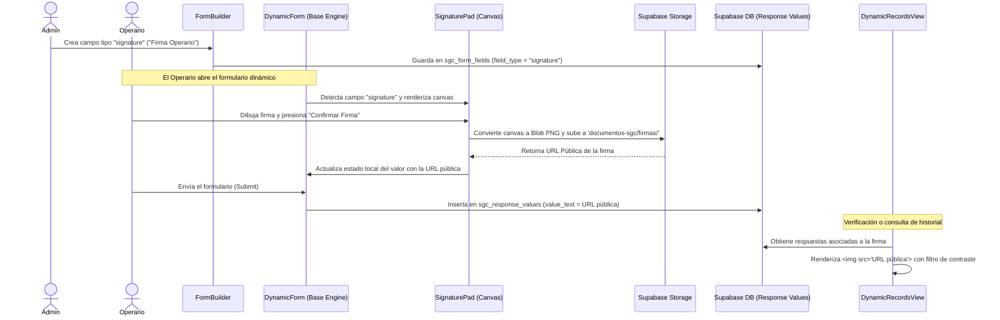

# Tipos de Campos en el Motor Dinámico de Formularios

Este documento describe la especificación técnica de los tipos de campos disponibles en el constructor y el motor de renderizado de formularios dinámicos del Sistema de Gestión de Calidad (SGC).

---

## 1. Catálogo de Tipos de Campos

A continuación se detallan los tipos de datos/campos que pueden configurarse en la interfaz del constructor ([FormBuilder.jsx](file:///c:/Users/USUARIO/OneDrive/Desktop/proyectos/sistema-gestion-calidad-dm%20-v1%20-%20operativo/src/components/FormBuilder.jsx)) e insertarse en la tabla `sgc_form_fields`:

| Identificador (`field_type`) | Nombre en Interfaz | Componente HTML / Renderizado | Tipo de Valor Almacenado | Opciones Adicionales (`options`) |
| :--- | :--- | :--- | :--- | :--- |
| `text` | Texto corto | `<input type="text">` | `value_text` | N/A |
| `textarea` | Texto largo | `<textarea>` | `value_text` | N/A (Generalmente observaciones) |
| `number` | Número | `<input type="number">` | `value_number` | `{ "unit": "ppm", "min": 0, "max": 10 }` |
| `boolean` | Casilla (Sí/No) | Radio button / Checkbox | `value_boolean` | N/A |
| `select` | Lista desplegable | `<select>` con opciones | `value_text` | `{ "choices": ["Opción A", "Opción B"] }` |
| `date` | Fecha | `<input type="date">` | `value_text` | N/A |
| `time` | Hora | `<input type="time">` | `value_text` | N/A |
| `signature` | Firma digital | `SignaturePad` (Canvas interactivo) | `value_text` (URL de imagen PNG) | N/A |

---

## 2. Comportamiento en los Motores de Renderizado

El sistema cuenta con tres motores principales de visualización de formularios ubicados en la carpeta `src/components/engines/`:

1. **[BaseGeneric.jsx](file:///c:/Users/USUARIO/OneDrive/Desktop/proyectos/sistema-gestion-calidad-dm%20-v1%20-%20operativo/src/components/engines/BaseGeneric.jsx)**: Diseñado para entradas genéricas organizadas en una cuadrícula de dos columnas.
2. **[BaseChecklist.jsx](file:///c:/Users/USUARIO/OneDrive/Desktop/proyectos/sistema-gestion-calidad-dm%20-v1%20-%20operativo/src/components/engines/BaseChecklist.jsx)**: Optimizado para auditorías tipo check/no-check, con soporte para desplegar el canvas de firma al pie y campos de texto para observaciones.
3. **[BaseMediciones.jsx](file:///c:/Users/USUARIO/OneDrive/Desktop/proyectos/sistema-gestion-calidad-dm%20-v1%20-%20operativo/src/components/engines/BaseMediciones.jsx)**: Especializado en parámetros cuantitativos. Ofrece validación de rangos tolerables (`options.min` y `options.max`) en tiempo real y resalta alertas visuales en caso de valores fuera de rango.

---

## 3. Flujo Técnico del Tipo `signature` (Firma Digital)

El tipo de campo `signature` interactúa de manera transversal con el constructor, el renderizador, el storage de Supabase y las vistas de historial.

### Detalle del Flujo de Firma:

1. **Definición en Base de Datos**:
   Cuando un administrador crea un campo de tipo firma, se guarda una fila en la tabla `sgc_form_fields` con el atributo `field_type = 'signature'`.
   
2. **Carga y Renderizado**:
   Al abrir el formulario dinámico ([DynamicForm.jsx](file:///c:/Users/USUARIO/OneDrive/Desktop/proyectos/sistema-gestion-calidad-dm%20-v1%20-%20operativo/src/pages/DynamicForm.jsx)), el motor correspondiente carga el componente interactivo **[SignaturePad.jsx](file:///c:/Users/USUARIO/OneDrive/Desktop/proyectos/sistema-gestion-calidad-dm%20-v1%20-%20operativo/src/components/SignaturePad.jsx)**.

3. **Dibujo y Captura en Cliente**:
   El usuario interactúa con un canvas HTML5 (`<canvas>`) con soporte para eventos táctiles y de ratón. Al finalizar el trazo, debe presionar **"Confirmar Firma"**.

4. **Persistencia del Archivo (PNG)**:
   - Al confirmar, `SignaturePad` invoca `canvas.toBlob(...)` para codificar el dibujo como imagen PNG.
   - Genera un nombre de archivo único: `firma_${Math.random()}_${Date.now()}.png`.
   - Se sube al bucket de Supabase Storage `documentos-sgc` en la ruta `firmas/`.
   - Se obtiene la URL pública del archivo y se pasa al manejador del formulario a través de la función `onChange(URL)`.

5. **Guardado del Registro**:
   Al enviar el formulario, el cliente realiza un insert a `sgc_response_values`, guardando la URL de la imagen en la columna de texto libre `value_text`.

6. **Visualización en Historial**:
   La vista de registros ([DynamicRecordsView.jsx](file:///c:/Users/USUARIO/OneDrive/Desktop/proyectos/sistema-gestion-calidad-dm%20-v1%20-%20operativo/src/components/DynamicRecordsView.jsx)) verifica si el tipo de campo es `signature` y si contiene un valor de texto. En tal caso, renderiza una etiqueta `` con estilos CSS para optimizar la visualización de la firma (por ejemplo, filtros de contraste y mezcla de color: `filter contrast-125 mix-blend-multiply`).

---

## 4. Consideraciones de Escalabilidad

Para agregar un nuevo tipo de campo en el futuro, se deben seguir los siguientes pasos:

1. **Exposición en Constructor**: Agregar la nueva `<option>` con el valor del tipo de campo en el selector de [FormBuilder.jsx](file:///c:/Users/USUARIO/OneDrive/Desktop/proyectos/sistema-gestion-calidad-dm%20-v1%20-%20operativo/src/components/FormBuilder.jsx).
2. **Definición de Opciones Dinámicas**: Si el nuevo tipo requiere parámetros de configuración (como rangos o unidades en `number`), agregar controles condicionales en el formulario de creación de `FormBuilder.jsx`.
3. **Soporte en Motores**: Editar los componentes de renderizado (`BaseGeneric`, `BaseChecklist`, `BaseMediciones`) para definir cómo se mostrará e interactuará el usuario con este campo.
4. **Validación del Cliente**: Asegurar que la función de validación de campos obligatorios en `DynamicForm.jsx` (y en el componente específico si requiere subidas previas) evalúe correctamente los valores vacíos.
5. **Visualización en Consultas**: Modificar `DynamicRecordsView.jsx` si el valor requiere un formato de renderizado especial (archivos adjuntos, imágenes, códigos de barras, etc.).
