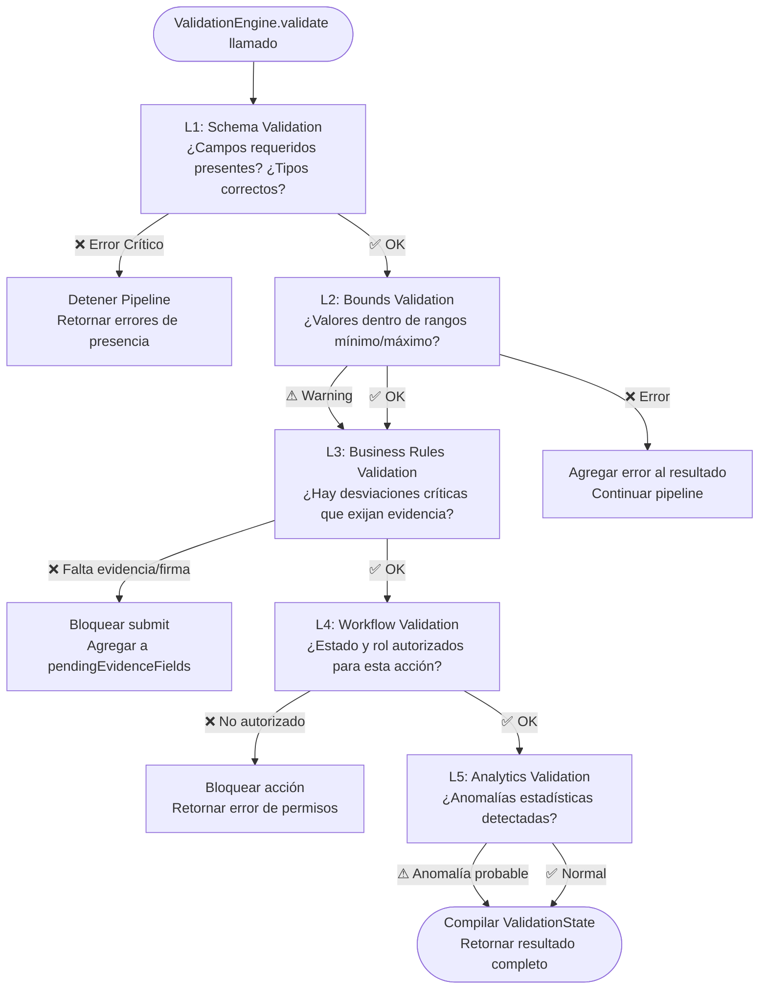

# MOTOR CENTRALIZADO DE VALIDACIONES (VALIDATION ENGINE)
## Sistema de Gestión de Calidad (SGC-DM) — Fase 1: Core Runtime Foundation
**Autor:** Principal Software Architect / Enterprise Solution Architect  
**Versión:** 1.0 (Fase 1 — Core Runtime Foundation)  
**Estatus:** APROBADO — MOTOR DE VALIDACIONES CENTRALIZADO  
**Clasificación:** Confidencial / Propiedad Técnica Integradora  

---

## 1. VISIÓN GENERAL Y PROPÓSITO

### 1.1 El Rol del Validation Engine en SGC-DM

En una plataforma de calidad sanitaria como **SGC-DM**, la validación no es un simple `if (value === '')`. Cada campo tiene un contrato semántico riguroso declarado en la metadata de la base de datos, y la validación debe ser capaz de:

- **Detectar** que una temperatura de `12.3°C` viola el límite crítico de `< 4°C` de la cadena de frío.
- **Exigir** automáticamente que el operario adjunte evidencia fotográfica antes de poder enviar.
- **Bloquear** la transición del workflow hasta que el firma digital del supervisor esté presente.
- **Alertar** en caliente con un mensaje contextual (no un genérico "campo requerido").
- **Prevenir** el envío completo si cualquier regla de negocio crítica está incumplida.

El **Validation Engine** es el motor centralizado que coordina todos estos comportamientos bajo un pipeline estricto, desacoplado de los componentes de UI y del motor transaccional.

### 1.2 Principios de Diseño del Motor

| Principio | Descripción |
| :--- | :--- |
| **Metadata-Driven** | Las reglas se leen del contrato del campo (`FieldContract`), no se codifican a fuego en la UI. |
| **Desacoplado** | El motor no conoce a React, no manipula el DOM, no hace llamadas HTTP. Recibe datos y retorna resultados. |
| **Jerárquico** | Las validaciones se ejecutan en un orden estricto de prioridad. Una falla en nivel superior aborta las inferiores. |
| **Contextual** | Una misma regla puede producir resultados diferentes dependiendo del rol del usuario y el estado del workflow. |
| **Componible** | Las reglas son funciones puras que se pueden combinar, extender y probar de forma independiente. |
| **No Bloqueante en UX** | Errores de nivel `warning` no bloquean el submit. Solo errores de nivel `error` y `critical` lo hacen. |

---

## 2. JERARQUÍA DE VALIDACIONES

El Validation Engine opera en **5 niveles jerárquicos** ejecutados secuencialmente. Cada nivel tiene una responsabilidad estrictamente definida.

```
┌────────────────────────────────────────────────────────────────────────────┐
│                        JERARQUÍA DE VALIDACIONES SGC-DM                    │
│                                                                            │
│  NIVEL 1: PRESENCIA Y TIPO (SCHEMA VALIDATION)                             │
│  ├── ¿El campo requerido tiene valor?                                      │
│  ├── ¿El tipo de dato coincide con el contrato? (number, boolean, text)    │
│  └── Bloquea submit si hay ausencias en campos `required: true`            │
│                                    │                                       │
│                                    ▼                                       │
│  NIVEL 2: RANGOS Y LÍMITES (BOUNDS VALIDATION)                             │
│  ├── ¿El valor numérico está dentro de [min_value, max_value]?             │
│  ├── ¿El texto supera o cumple el mínimo de caracteres?                    │
│  └── Genera warning si está cerca del límite, error si lo viola            │
│                                    │                                       │
│                                    ▼                                       │
│  NIVEL 3: REGLAS DE NEGOCIO CRÍTICAS (BUSINESS RULES VALIDATION)          │
│  ├── ¿La desviación detectada exige evidencia fotográfica obligatoria?     │
│  ├── ¿El campo booleano "No Cumple" requiere campo de observaciones?       │
│  └── ¿Hay un valor incompatible con los datos de otro campo del mismo form?│
│                                    │                                       │
│                                    ▼                                       │
│  NIVEL 4: WORKFLOW Y ESTADO (WORKFLOW VALIDATION)                          │
│  ├── ¿El registro está en estado editable? (no aprobado/rechazado)         │
│  ├── ¿El usuario tiene el rol autorizado para esta transición?             │
│  └── ¿La firma del supervisor está presente antes de aprobar?              │
│                                    │                                       │
│                                    ▼                                       │
│  NIVEL 5: ANALÍTICA E IA (ANALYTICS / AI VALIDATION)                      │
│  ├── ¿La medición es estadísticamente anómala? (fuera de 2σ del histórico) │
│  ├── ¿La evidencia fotográfica cumple los estándares de Vision AI?         │
│  └── Genera advertencias predictivas (no bloquea submit)                   │
└────────────────────────────────────────────────────────────────────────────┘
```

---

## 3. PIPELINE DE VALIDACIÓN

El pipeline define el orden secuencial de ejecución y las condiciones de salida anticipada.

### 3.1 Diagrama del Pipeline



### 3.2 Contrato de Resultado de Validación

```typescript
// ============================================================
// VALIDATION ENGINE — Contratos de Interfaz
// ============================================================

type ValidationLevel = 'schema' | 'bounds' | 'business_rules' | 'workflow' | 'analytics';

type ValidationSeverity = 'error' | 'warning' | 'info';

type ValidationRuleResult = {
  level: ValidationLevel;
  severity: ValidationSeverity;
  fieldId: string | '__form__';     // '__form__' para errores de nivel formulario
  code: string;                     // Código único del error (ej: 'REQUIRED_FIELD_MISSING')
  message: string;                  // Mensaje legible en español para el operario
  metadata?: Record<string, unknown>; // Contexto adicional (valor actual, límites, etc.)
};

type ValidationResult = {
  isValid: boolean;                 // true solo si NO hay errores de severity 'error' o 'critical'
  canSubmit: boolean;               // false si blockedSubmit o isLocked en workflow
  errors: Record<string, string>;   // { [field_id]: "mensaje" } — Solo errores bloqueantes
  warnings: Record<string, string>; // { [field_id]: "advertencia" } — No bloquean submit
  pendingEvidenceFields: string[];  // Fields que exigen foto antes del submit
  pendingSignatureFields: string[]; // Fields que exigen firma digital
  analyticsAlerts: ValidationRuleResult[]; // Alertas de nivel 5 (no bloquean)
  executedLevels: ValidationLevel[];// Niveles del pipeline efectivamente ejecutados
};

interface IValidationEngine {
  /**
   * Pipeline completo de validación al momento del submit.
   * Ejecuta los 5 niveles en orden.
   */
  validate(
    formValues: FormValues,
    formContract: FormContract,
    workflowState: WorkflowState,
    permissionsContext: PermissionsContext
  ): ValidationResult;

  /**
   * Validación reactiva de un solo campo durante la captura.
   * Solo ejecuta Niveles 1, 2 y 3 para respuesta inmediata en UX.
   */
  validateField(
    fieldId: string,
    value: FormValues[string],
    fieldContract: FieldContract,
    formValues: FormValues
  ): Pick<ValidationResult, 'errors' | 'warnings' | 'pendingEvidenceFields'>;
}
```

---

## 4. NIVEL 1 — VALIDACIÓN DE ESQUEMA (SCHEMA VALIDATION)

### 4.1 Reglas de Presencia y Tipo

```typescript
// Regla L1-R01: Campo Requerido
function validateRequired(
  fieldId: string,
  value: FormValues[string],
  fieldContract: FieldContract
): ValidationRuleResult | null {
  if (!fieldContract.required) return null;

  const isEmpty = value === null
    || value === undefined
    || value === ''
    || (typeof value === 'string' && value.trim() === '');

  if (isEmpty) {
    return {
      level: 'schema',
      severity: 'error',
      fieldId,
      code: 'REQUIRED_FIELD_MISSING',
      message: `El campo "${fieldContract.label}" es obligatorio y no puede quedar vacío.`,
    };
  }
  return null;
}

// Regla L1-R02: Compatibilidad de Tipo de Dato
function validateType(
  fieldId: string,
  value: FormValues[string],
  fieldContract: FieldContract
): ValidationRuleResult | null {
  if (value === null || value === undefined) return null;

  const typeMap: Record<string, string> = {
    number: 'number',
    boolean: 'boolean',
    text: 'string',
    textarea: 'string',
    date: 'string',
    select: 'string',
  };

  const expectedType = typeMap[fieldContract.fieldType];
  if (expectedType && typeof value !== expectedType) {
    return {
      level: 'schema',
      severity: 'error',
      fieldId,
      code: 'INVALID_TYPE',
      message: `El campo "${fieldContract.label}" recibió un tipo de dato inválido.`,
      metadata: { expected: expectedType, received: typeof value },
    };
  }
  return null;
}
```

---

## 5. NIVEL 2 — VALIDACIÓN DE RANGOS Y LÍMITES (BOUNDS VALIDATION)

### 5.1 Reglas para Campos Numéricos Críticos

```typescript
// Regla L2-R01: Valor mínimo
function validateMinValue(
  fieldId: string,
  value: number,
  fieldContract: FieldContract
): ValidationRuleResult | null {
  const { min_value, critical_min, label } = fieldContract.options || {};

  if (critical_min !== undefined && value < critical_min) {
    return {
      level: 'bounds',
      severity: 'error',
      fieldId,
      code: 'CRITICAL_MIN_VIOLATION',
      message: `⛔ "${label}": El valor ${value} es CRÍTICO. El mínimo aceptable es ${critical_min}. Se exigirá evidencia y plan de acción.`,
      metadata: { value, critical_min },
    };
  }

  if (min_value !== undefined && value < min_value) {
    return {
      level: 'bounds',
      severity: 'warning',
      fieldId,
      code: 'MIN_VALUE_WARNING',
      message: `⚠ "${label}": El valor ${value} está por debajo del rango recomendado (mín: ${min_value}).`,
      metadata: { value, min_value },
    };
  }
  return null;
}

// Regla L2-R02: Valor máximo
function validateMaxValue(
  fieldId: string,
  value: number,
  fieldContract: FieldContract
): ValidationRuleResult | null {
  const { max_value, critical_max, label } = fieldContract.options || {};

  if (critical_max !== undefined && value > critical_max) {
    return {
      level: 'bounds',
      severity: 'error',
      fieldId,
      code: 'CRITICAL_MAX_VIOLATION',
      message: `⛔ "${label}": El valor ${value} excede el límite CRÍTICO (máx: ${critical_max}). Detener operación e iniciar CAPA.`,
      metadata: { value, critical_max },
    };
  }

  if (max_value !== undefined && value > max_value) {
    return {
      level: 'bounds',
      severity: 'warning',
      fieldId,
      code: 'MAX_VALUE_WARNING',
      message: `⚠ "${label}": El valor ${value} supera el rango recomendado (máx: ${max_value}).`,
      metadata: { value, max_value },
    };
  }
  return null;
}
```

### 5.2 Límites Críticos de Control por Dominio

Los rangos críticos se leen de `FieldContract.options` (persistidos en `sgc_form_fields.options`). Ejemplos de contratos de límites para los procesos críticos del SGC-DM:

| Campo | `min_value` | `max_value` | `critical_min` | `critical_max` | IA Tag |
| :--- | :---: | :---: | :---: | :---: | :--- |
| Temperatura cámara fría | 0°C | 4°C | -2°C | 8°C | `#temperatura_camara` |
| Cloro libre en agua | 0.3 ppm | 2.0 ppm | 0.1 ppm | 3.5 ppm | `#cloro_libre_ppm` |
| pH del agua de proceso | 6.5 | 8.5 | 6.0 | 9.0 | `#ph_agua` |
| Temperatura de despacho | -18°C | -15°C | -22°C | -12°C | `#temperatura_despacho` |
| Humedad relativa bodega | 40% | 70% | 30% | 85% | `#humedad_relativa` |

---

## 6. NIVEL 3 — REGLAS DE NEGOCIO CRÍTICAS (BUSINESS RULES VALIDATION)

### 6.1 Regla de Evidencia Obligatoria por Desvío

Esta es la regla más importante del SGC-DM desde la perspectiva operativa. Si un valor viola un límite crítico, el operario **no puede enviar el formulario** sin adjuntar evidencia fotográfica.

```typescript
// Regla L3-R01: Evidencia exigida ante desvío crítico
function validateEvidenceRequired(
  fieldId: string,
  value: FormValues[string],
  fieldContract: FieldContract,
  formValues: FormValues,
  uploadQueue: UploadQueueItem[]
): ValidationRuleResult | null {
  const opts = fieldContract.options || {};

  // ¿Es un campo numérico fuera de límite crítico?
  const isNumericCritical =
    fieldContract.fieldType === 'number' &&
    typeof value === 'number' &&
    ((opts.critical_min !== undefined && value < opts.critical_min) ||
     (opts.critical_max !== undefined && value > opts.critical_max));

  // ¿Es un booleano marcado como "No Cumple"?
  const isBooleanFail =
    fieldContract.fieldType === 'boolean' &&
    value === false &&
    opts.evidenceOnFail === true;

  if (isNumericCritical || isBooleanFail) {
    // ¿Existe ya una evidencia cargada para este campo?
    const hasEvidence = uploadQueue.some(
      (item) => item.fieldId === fieldId && item.status === 'uploaded'
    );

    if (!hasEvidence) {
      return {
        level: 'business_rules',
        severity: 'error',
        fieldId,
        code: 'EVIDENCE_REQUIRED_ON_DEVIATION',
        message: `📷 "${fieldContract.label}" tiene un valor crítico. Adjunte una foto de evidencia obligatoria para poder continuar.`,
        metadata: { isNumericCritical, isBooleanFail, currentValue: value },
      };
    }
  }
  return null;
}

// Regla L3-R02: Observación obligatoria ante falla de booleano
function validateObservationRequired(
  fieldId: string,
  value: FormValues[string],
  fieldContract: FieldContract,
  formValues: FormValues
): ValidationRuleResult | null {
  const opts = fieldContract.options || {};

  if (fieldContract.fieldType === 'boolean' && value === false && opts.observationFieldId) {
    const observationValue = formValues[opts.observationFieldId];
    const hasObservation =
      typeof observationValue === 'string' &&
      observationValue.trim().length >= (opts.minObservationChars || 10);

    if (!hasObservation) {
      return {
        level: 'business_rules',
        severity: 'error',
        fieldId: opts.observationFieldId,
        code: 'OBSERVATION_REQUIRED_ON_FAIL',
        message: `📝 Es obligatorio describir la causa del incumplimiento antes de enviar.`,
        metadata: { triggerFieldId: fieldId },
      };
    }
  }
  return null;
}
```

### 6.2 Reglas Declarativas en Metadata (options JSON)

Las reglas de negocio de nivel 3 se configuran en el campo `sgc_form_fields.options` (JSONB). Esto permite que los administradores del sistema ajusten las reglas sin modificar código:

```json
{
  "field_id": "cf8a1b2d-aa01",
  "label": "Temperatura Cámara Principal",
  "field_type": "number",
  "options": {
    "unit": "°C",
    "min_value": 0,
    "max_value": 4,
    "critical_min": -2,
    "critical_max": 8,
    "evidenceRequired": false,
    "evidenceOnCritical": true,
    "observationFieldId": "cf8a1b2d-aa05",
    "ia_tag": "#temperatura_camara",
    "capa_trigger": true
  }
}
```

---

## 7. NIVEL 4 — VALIDACIÓN DE WORKFLOW Y ESTADO (WORKFLOW VALIDATION)

### 7.1 Reglas de Estado y Transición

```typescript
// Regla L4-R01: Registro en estado bloqueado
function validateWorkflowIsEditable(
  workflowState: WorkflowState,
  permissionsContext: PermissionsContext
): ValidationRuleResult | null {
  if (workflowState.isLocked) {
    return {
      level: 'workflow',
      severity: 'error',
      fieldId: '__form__',
      code: 'RECORD_LOCKED_FINAL_STATE',
      message: `Este registro ha sido ${workflowState.status === 'approved' || workflowState.status === 'aprobado'
        ? 'aprobado y es inmutable'
        : 'rechazado'}. No puede modificarse.`,
    };
  }
  return null;
}

// Regla L4-R02: Segregación de funciones — el creador no puede aprobar
function validateSegregationOfDuties(
  workflowState: WorkflowState,
  permissionsContext: PermissionsContext,
  action: 'approve' | 'reject'
): ValidationRuleResult | null {
  if ((action === 'approve' || action === 'reject') && permissionsContext.isAuthor) {
    return {
      level: 'workflow',
      severity: 'error',
      fieldId: '__form__',
      code: 'SEGREGATION_OF_DUTIES_VIOLATION',
      message: `El usuario creador del registro no puede verificar ni aprobar su propio formulario. Se requiere un supervisor diferente.`,
    };
  }
  return null;
}

// Regla L4-R03: Firma de supervisor obligatoria en aprobación
function validateSignaturePresent(
  workflowState: WorkflowState,
  uploadQueue: UploadQueueItem[]
): ValidationRuleResult | null {
  const signatureLevel = workflowState.approvalLevels.find(
    (lvl) => lvl.requiresSignature && !lvl.signedAt
  );

  if (signatureLevel) {
    const hasSignature = uploadQueue.some(
      (item) => item.fieldId === signatureLevel.signatureFieldId && item.status === 'uploaded'
    );

    if (!hasSignature) {
      return {
        level: 'workflow',
        severity: 'error',
        fieldId: signatureLevel.signatureFieldId,
        code: 'SIGNATURE_REQUIRED_FOR_APPROVAL',
        message: `La firma digital del ${signatureLevel.label} es obligatoria para completar la aprobación.`,
      };
    }
  }
  return null;
}
```

---

## 8. NIVEL 5 — VALIDACIÓN ANALÍTICA E IA (ANALYTICS VALIDATION)

### 8.1 Reglas Predictivas No Bloqueantes

Las validaciones de nivel 5 son **puramente informativas**. Generan advertencias predictivas para alertar al operario o al supervisor de calidad sobre comportamientos estadísticamente inusuales, pero nunca bloquean el submit.

```typescript
// Regla L5-R01: Detección de anomalía estadística local
function validateStatisticalAnomaly(
  fieldId: string,
  value: number,
  fieldContract: FieldContract,
  historicalBaseline?: { mean: number; stdDev: number }
): ValidationRuleResult | null {
  if (!historicalBaseline) return null;

  const { mean, stdDev } = historicalBaseline;
  const zScore = Math.abs((value - mean) / stdDev);

  if (zScore > 2.5) {
    return {
      level: 'analytics',
      severity: 'warning',
      fieldId,
      code: 'STATISTICAL_ANOMALY_DETECTED',
      message: `🤖 IA: El valor ${value} es estadísticamente inusual (z-score: ${zScore.toFixed(2)}). Verifique el instrumento de medición.`,
      metadata: { value, mean, stdDev, zScore },
    };
  }
  return null;
}
```

---

## 9. INTERACCIÓN CON LAS CAPAS DEL RUNTIME

### 9.1 Validation Engine ↔ Runtime Engine

```
RuntimeEngine (Orquestador)
  │
  │  Al inicializar el formulario:
  │  ──────────────────────────────
  │  Lee FormContract (campos + reglas) → pasa a ValidationEngine
  │
  │  Al modificar un campo (handleChange):
  │  ──────────────────────────────────────
  │  ValidationEngine.validateField(fieldId, value, fieldContract)
  │  → Actualiza validationSlice con errores/warnings del campo
  │
  │  Al intentar submit:
  │  ────────────────────
  │  ValidationEngine.validate(formValues, formContract, workflowState, permissionsCtx)
  │  → Si result.canSubmit === false → aborta, muestra errores en UX
  │  → Si result.canSubmit === true  → delega a TransactionService
```

### 9.2 Validation Engine ↔ Workflow Engine

```
WorkflowEngine
  │
  │  Al intentar una transición de estado (ej: submitted → approved):
  │  ─────────────────────────────────────────────────────────────────
  │  Llama a: ValidationEngine.validate(... , action: 'approve')
  │  Verifica: L4-R02 (Segregación de funciones)
  │  Verifica: L4-R03 (Firma obligatoria)
  │
  │  Si ValidationResult.canSubmit === false:
  │  Aborta la transición de estado
  │  Retorna error de validación al usuario supervisor
```

### 9.3 Validation Engine ↔ Component Registry

```
ComponentRegistry
  │
  │  Renderiza cada componente con props derivadas de validationState:
  │  ─────────────────────────────────────────────────────────────────
  │  error={validationState.errors[fieldId]}
  │  warning={validationState.warnings[fieldId]}
  │  disabled={workflowState.isLocked || !permissionsCtx.canEdit}
  │  evidenceRequired={validationState.pendingEvidenceFields.includes(fieldId)}
  │
  │  El componente visual NO toma decisiones de validación por sí mismo.
  │  Solo renderiza el estado que le provee el ValidationEngine.
```

---

## 10. PROPAGACIÓN DE ERRORES Y FEEDBACK EN UX

### 10.1 Niveles de Feedback Visual

| Severity | Icono | Color | ¿Bloquea Submit? | Destino Visual |
| :--- | :---: | :---: | :---: | :--- |
| `error` | ⛔ | Rojo `#E53E3E` | Sí | Debajo del campo + banner top |
| `warning` | ⚠ | Ámbar `#D69E2E` | No | Debajo del campo (discreto) |
| `info` | ℹ | Azul `#3182CE` | No | Tooltip informativo |
| `analytics` | 🤖 | Violeta `#6B46C1` | No | Panel lateral de IA insights |

### 10.2 Banner de Resumen de Errores (Pre-Submit)

Al presionar "Enviar", si `ValidationResult.canSubmit === false`, se despliega un banner consolidado en la parte superior del formulario con todos los errores agrupados por nivel:

```
┌────────────────────────────────────────────────────────────────────────────┐
│  ⛔  El formulario no puede enviarse. Corrija los siguientes problemas:    │
│                                                                            │
│  [Campos Obligatorios]                                                     │
│   · Temperatura Cámara Principal: valor requerido.                         │
│   · Responsable turno: campo obligatorio.                                  │
│                                                                            │
│  [Evidencias Faltantes]                                                    │
│   · Desinfección de Superficies: adjunte foto de evidencia antes de enviar.│
│                                                                            │
│  [Firma Digital]                                                           │
│   · Firma del Supervisor de Inocuidad: requerida para aprobar.             │
└────────────────────────────────────────────────────────────────────────────┘
```

---

## 11. VALIDACIONES DINÁMICAS DECLARADAS EN METADATA

El Validation Engine lee reglas dinámicas desde el contrato JSONB del campo, sin requerir código adicional. Esto permite a los administradores de la plataforma configurar comportamientos de validación sin intervención de desarrollo:

```json
{
  "validationRules": [
    {
      "ruleId": "VR-001",
      "type": "required_if",
      "condition": {
        "fieldId": "cf8a1b2d-aa03",
        "operator": "equals",
        "value": false
      },
      "targetFieldId": "cf8a1b2d-aa05",
      "errorMessage": "Si 'Desinfección completa' es NO, el campo 'Observaciones' es obligatorio."
    },
    {
      "ruleId": "VR-002",
      "type": "evidence_on_critical",
      "condition": {
        "fieldId": "cf8a1b2d-aa01",
        "operator": "greater_than",
        "value": 8
      },
      "errorMessage": "Temperatura crítica detectada. Adjunte foto del termómetro."
    }
  ]
}
```

---

## 12. INTEGRACIÓN CON EVENT BUS

Cuando el Validation Engine detecta un evento significativo, lo publica al Event Bus (definido en `event_bus_architecture.md`) para que los suscriptores reaccionen de forma desacoplada:

| Evento Publicado | Condición | Suscriptores Principales |
| :--- | :--- | :--- |
| `onValidationError` | Se detectó 1+ error bloqueante de nivel schema/bounds | Analytics State, UI Error Banner |
| `onCriticalDeviation` | Un campo supera `critical_min` o `critical_max` | CAPA Service, Alert Dispatcher, Analytics |
| `onEvidenceRequired` | Business rules exige evidencia fotográfica | Upload Queue, UI Field Highlight |
| `onSignatureRequired` | Se requiere firma para transición de workflow | Workflow Engine, Signature Component |
| `onWorkflowViolation` | Intento de transición no autorizado | Audit Logger, Security Monitor |

---

## 13. RIESGOS Y ESTRATEGIAS DE MITIGACIÓN

| ID | Riesgo | Severidad | Mitigación |
| :--- | :--- | :---: | :--- |
| **VE-R-01** | Reglas codificadas a fuego en componentes React | 🔴 Alta | Todas las reglas se leen de `FieldContract.options`. Prohibido hardcodear condiciones en UI. |
| **VE-R-02** | Corto circuito de validaciones al bypass del frontend | 🔴 Alta | Los RPC/stored procedures del backend reimplementan L1, L2 y L3 como constraints SQL nativas. |
| **VE-R-03** | Mensajes de error en inglés (no entendibles por operarios) | 🟡 Media | Todos los mensajes de error se definen en español en el campo `errorMessage` del `FieldContract`. |
| **VE-R-04** | Validaciones de nivel 5 bloquean submit erróneamente | 🟡 Media | L5 solo genera `warnings`, nunca errores. `canSubmit` ignora el resultado de L5. |
| **VE-R-05** | Performance degradada por validación de todos los campos en cada keystroke | 🟡 Media | `validateField` (por campo individual) solo ejecuta L1–L3. `validate` completo solo al submit. |

---

## 14. ROADMAP DE IMPLEMENTACIÓN

### Fase 1A — Motor Base (Q2 2026)
- Implementar `IValidationEngine` con `validate()` y `validateField()`.
- Ejecutar L1 (Schema) y L2 (Bounds) de forma reactiva en cada `handleChange`.
- Integrar resultado con `validationSlice` del `GlobalRuntimeStore`.

### Fase 1B — Reglas de Negocio (Q2 2026)
- Implementar L3 (Business Rules) con `validateEvidenceRequired` y `validateObservationRequired`.
- Conectar resultado con el `uploadSlice` para tracking de evidencias pendientes.
- Implementar el banner de errores consolidado en la UI pre-submit.

### Fase 2 — Workflow Validation (Q3 2026)
- Implementar L4 con verificación de segregación de funciones y firma digital.
- Integrar con `WorkflowEngine` para bloqueo automático de transiciones inválidas.
- Publicar eventos `onWorkflowViolation` al Event Bus.

### Fase 3 — Analytics y AI (Q4 2026)
- Implementar L5 con detección de anomalías estadísticas usando historial local de `sgc_trends`.
- Conectar `validateStatisticalAnomaly` con los modelos de Isolation Forest de la capa IA.
- Enriquecer el `analyticsSlice` con predicciones preventivas.

---

**Documento Mantenido y Aprobado por:** Dirección General de Arquitectura de Software e Integridad Operativa SGC-DM.  
**Última Actualización:** 22 de Mayo de 2026.  
**Próxima Revisión Planificada:** 15 de Agosto de 2026.  
