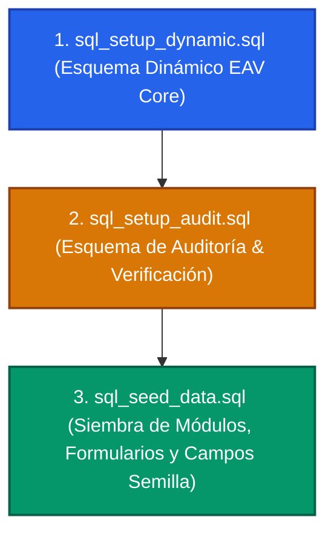

# 🗄️ Manual de Despliegue de Base de Datos y Arquitectura EAV

Este documento técnico sirve como guía paso a paso para la inicialización y el despliegue de la infraestructura de datos en **Supabase** para el **Sistema de Gestión de Calidad (SGC) - DM Distribuciones**. Incluye el orden de ejecución de scripts, la configuración del bucket de almacenamiento y el diagrama técnico relacional de la arquitectura EAV (Entity-Attribute-Value).

---

## ⚡ 1. Secuencia de Despliegue SQL

El proyecto cuenta con tres scripts SQL ubicados en la raíz del repositorio. Para evitar errores de integridad referencial y asegurar una siembra de datos exitosa, los scripts **deben ejecutarse estrictamente en el siguiente orden** en el editor SQL (SQL Editor) de tu consola de Supabase:



### Detalle de cada paso:

### Paso 1: `sql_setup_dynamic.sql`
*   **Propósito**: Realiza la limpieza inicial de tablas previas y crea la estructura central del modelo dinámico EAV (`sgc_modules`, `sgc_forms`, `sgc_form_fields`, `sgc_form_responses`, `sgc_response_values` y `sgc_evidences`).
*   **Seguridad**: Habilita la Seguridad de Fila (RLS) en todas las tablas dinámicas y define políticas de acceso básicas para la lectura y escritura.

### Paso 2: `sql_setup_audit.sql`
*   **Propósito**: Agrega de manera no destructiva los campos de control documental y segregación de funciones en la tabla `sgc_form_responses` (`verified_by`, `verified_at` y `verification_comment`). Además, crea la tabla inmutable de bitácora `sgc_audit_logs`.
*   **Seguridad**: Habilita RLS en la tabla de auditoría con políticas de inserción controlada.

### Paso 3: `sql_seed_data.sql`
*   **Propósito**: Inserta los catálogos base de áreas/módulos operativos del SGC (Operaciones, Trazabilidad, Medición, Calidad, etc.) y siembra dos formularios reales y completamente configurados con sus respectivas preguntas de inspección:
    1.  *Checklist de Limpieza y Desinfección Diaria* (Basado en el motor binario `BaseChecklist`).
    2.  *Control de Cloro y pH del Agua Potable* (Basado en el motor de mediciones cuantitativas `BaseMediciones`).

---

## 📐 2. Esquema Relacional de la Arquitectura EAV (Mermaid)

El siguiente diagrama visualiza cómo interactúan las tablas de metadatos (que definen las preguntas y formularios) con las tablas transaccionales (que almacenan las respuestas reales y la trazabilidad de auditoría de los operarios):

```mermaid
erDiagram
    profiles {
        uuid id PK
        uuid user_id
        text nombre
        text rol
        text email
    }

    sgc_modules {
        uuid id PK
        text name
        text slug UQ
        text icon
        text description
        boolean is_active
        timestamptz created_at
    }

    sgc_forms {
        uuid id PK
        uuid module_id FK
        text name
        text slug UQ
        text description
        text engine_type
        text_array roles_allowed
        boolean is_active
        timestamptz created_at
    }

    sgc_form_fields {
        uuid id PK
        uuid form_id FK
        text name
        text label
        text field_type
        jsonb options
        boolean required
        integer order_index
        timestamptz created_at
    }

    sgc_form_responses {
        uuid id PK
        uuid form_id FK
        uuid created_by FK
        text status
        uuid verified_by FK
        timestamptz verified_at
        text verification_comment
        timestamptz created_at
        timestamptz updated_at
    }

    sgc_response_values {
        uuid id PK
        uuid response_id FK
        uuid field_id FK
        text value_text
        numeric value_number
        boolean value_boolean
        jsonb value_json
        timestamptz created_at
    }

    sgc_evidences {
        uuid id PK
        uuid response_id FK
        text file_url
        text storage_path
        text file_type
        timestamptz created_at
    }

    sgc_audit_logs {
        uuid id PK
        uuid response_id FK
        text action_type
        uuid modified_by FK
        jsonb old_data
        jsonb new_data
        text reason
        timestamptz created_at
    }

    %% Relaciones del Core Metadatos
    sgc_modules ||--o{ sgc_forms : "contiene"
    sgc_forms ||--o{ sgc_form_fields : "define preguntas"
    sgc_forms ||--o{ sgc_form_responses : "recibe instancias"

    %% Relaciones de Datos del Operario
    sgc_form_responses ||--o{ sgc_response_values : "almacena respuestas"
    sgc_form_fields ||--o{ sgc_response_values : "corresponde a"
    sgc_form_responses ||--o{ sgc_evidences : "adjunta pruebas"
    sgc_form_responses ||--o{ sgc_audit_logs : "registra historial"

    %% Relaciones con la Tabla de Usuarios
    profiles ||--o{ sgc_form_responses : "crea (created_by)"
    profiles ||--o{ sgc_form_responses : "verifica (verified_by)"
    profiles ||--o{ sgc_audit_logs : "audita cambios"
```

### Explicación del Flujo de Datos:
1.  **Definición**: Un administrador crea un módulo (`sgc_modules`) y le asocia un formulario (`sgc_forms`). Cada pregunta del formulario se inserta como una fila en `sgc_form_fields`.
2.  **Captura**: Cuando un operario completa una inspección, se genera un registro maestro en `sgc_form_responses` (con estado inicial `pendiente_revision`).
3.  **Valores**: Las respuestas se asocian de forma atómica y tipada en `sgc_response_values` mediante columnas dedicadas (`value_boolean`, `value_number` o `value_text`), lo que optimiza las consultas SQL y los reportes de cumplimiento.
4.  **Multimedia**: Las fotos cargadas como evidencia física se guardan en `sgc_evidences` apuntando a la fila maestra de la respuesta.
5.  **Auditoría**: Cualquier creación, edición o revisión documental se registra en la bitácora inalterable `sgc_audit_logs` indicando los datos previos (`old_data`), los nuevos valores (`new_data`), y el usuario responsable.

---

## 📦 3. Configuración del Almacenamiento (Supabase Storage)

El SGC requiere un **Bucket de Almacenamiento** público para guardar las fotos cargadas como evidencia física y los trazos de firmas digitales en formato PNG. Sigue estos pasos para configurarlo:

### Paso 1: Crear el Bucket en la Consola
1.  Ingresa al dashboard de tu proyecto en Supabase.
2.  En la barra lateral izquierda, selecciona la pestaña **Storage**.
3.  Haz clic en el botón **New Bucket**.
4.  Nombra al bucket exactamente: **`documentos-sgc`**.
5.  Marca la casilla **Public bucket**. *(Esto permite que las firmas y fotos de evidencias puedan ser consultadas mediante URLs públicas en los reportes e interfaces de visualización)*.
6.  Haz clic en **Save**.

### Paso 2: Crear Políticas de Acceso RLS para Storage
Para evitar que usuarios externos o no autenticados alteren el almacenamiento, se deben definir políticas Row Level Security (RLS) sobre los objetos del bucket en la consola de Supabase (sección **Storage** ➡️ **Policies**):

#### Política 1: Permitir Lectura Pública a todos los Archivos
*   **Nombre de la política**: `Permitir Lectura Pública`
*   **Acción**: `SELECT`
*   **Quién puede acceder**: `public` (todos)
*   **Definición de RLS**: `true`

#### Política 2: Permitir Carga de Archivos a Usuarios Autenticados
*   **Nombre de la política**: `Permitir Carga Autenticada`
*   **Acción**: `INSERT`
*   **Quién puede acceder**: `authenticated` (usuarios logueados en el sistema)
*   **Definición de RLS**:
    ```sql
    bucket_id = 'documentos-sgc'
    ```

#### Política 3: Permitir Eliminación de Evidencias a Administradores
*   **Nombre de la política**: `Control de Borrado Admin`
*   **Acción**: `DELETE`
*   **Quién puede acceder**: `authenticated`
*   **Definición de RLS** (Valida el rol de administrador en el token JWT):
    ```sql
    bucket_id = 'documentos-sgc' AND 
    (auth.jwt() ->> 'rol' = 'administrador')
    ```

---

## 🛠️ 4. Verificación del Despliegue de Datos

Para confirmar que la base de datos funciona adecuadamente en tu frontend:
1.  Asegúrate de que tus variables de entorno en el archivo `.env` apunten al proyecto correcto de Supabase.
2.  Inicia la sesión en la plataforma.
3.  Ingresa a la sección de **Configuración** (si eres administrador) y verifica que los módulos base y sus formularios sembrados se listan correctamente.
4.  Intenta registrar un checklist de limpieza; el sistema debería guardar el registro, crear las filas de respuestas y habilitar el banner de éxito de Supabase sin registrar excepciones.
