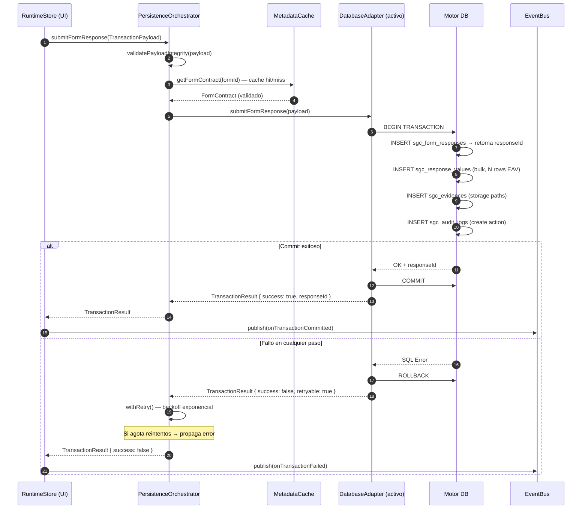

# ARQUITECTURA DE PERSISTENCIA (PERSISTENCE ARCHITECTURE)
## Sistema de Gestión de Calidad (SGC-DM) — Fase 2: Infrastructure & Persistence Layer
**Autor:** Principal Software Architect / Enterprise Solution Architect  
**Versión:** 1.0 (Fase 2 — Infrastructure & Persistence Layer)  
**Estatus:** APROBADO — CONTRATO DE PERSISTENCIA DESACOPLADA  
**Clasificación:** Confidencial / Propiedad Técnica Integradora  

---

## 1. VISIÓN GENERAL

### 1.1 Propósito

La **Capa de Persistencia (Persistence Layer)** es el único punto de contacto autorizado entre la lógica operativa del runtime de SGC-DM y el almacenamiento físico de datos. Su propósito es triple:

1. **Desacoplar** completamente al runtime dinámico de React del motor de base de datos físico (Supabase, PostgreSQL puro, SQL Server, etc.).
2. **Garantizar** la atomicidad transaccional coordinando el orden correcto de escritura en el modelo EAV distribuido.
3. **Proveer** una interfaz de contrato estable que permita migrar, cambiar o añadir motores de base de datos sin tocar ningún componente de la UI ni del runtime.

> [!IMPORTANT]
> **Principio Fundamental:** El runtime de SGC-DM NUNCA escribe directamente en base de datos. Todo flujo de persistencia pasa obligatoriamente por la `PersistenceLayer` a través del contrato `IRuntimePersistenceLayer`. Este principio es innegociable y protege la plataforma ante cambios de infraestructura futuros.

### 1.2 Posición en la Arquitectura de Capas

```
┌────────────────────────────────────────────────────────────────────────────┐
│                         STACK DE PERSISTENCIA SGC-DM                       │
│                                                                            │
│   [ React UI / Dynamic Engines ]                                           │
│          │ consume                                                          │
│          ▼                                                                  │
│   [ GlobalRuntimeStore / TransactionService ]    ← runtime_state + tx      │
│          │ invoca                                                           │
│          ▼                                                                  │
│   ┌──────────────────────────────────────────────────────────────────┐     │
│   │              IRuntimePersistenceLayer (Contrato)                 │     │
│   │          [ PersistenceOrchestrator ]                             │     │
│   └────────────────────────┬─────────────────────────────────────────┘     │
│                            │ delega a implementación activa                 │
│            ┌───────────────┼───────────────────────┐                       │
│            ▼               ▼                       ▼                       │
│   [ SupabaseAdapter ] [ RestApiAdapter ]  [ SQLServerAdapter (futuro) ]    │
│            │               │                       │                       │
│            ▼               ▼                       ▼                       │
│   [ Supabase DB ]  [ Microservicio API ]  [ SQL Server Enterprise ]        │
└────────────────────────────────────────────────────────────────────────────┘
```

---

## 2. RESPONSABILIDADES DE LA CAPA

| Responsabilidad | Descripción |
| :--- | :--- |
| **Orchestración de Escritura** | Coordinar el orden atómico: respuesta → valores EAV → evidencias → audit log → workflow state. |
| **Gestión de Transacciones** | Asegurar que cada unidad de trabajo sea All-or-Nothing. Si falla un paso, se revierte todo. |
| **Abstracción de Adaptadores** | Seleccionar dinámicamente qué adaptador físico usar (Supabase, API REST, SQL Server). |
| **Retry con Backoff** | Reintentar operaciones fallidas por red con estrategia exponential backoff hasta N intentos. |
| **Mapeo EAV** | Transformar el mapa plano `FormValues { [field_id]: value }` al modelo físico `sgc_response_values`. |
| **Compensación SAGA** | Ejecutar rollback de Storage cuando falla la transacción SQL post-subida de evidencias. |
| **Caché de Metadata** | Cachear definiciones de formularios y campos para evitar consultas repetidas en cada carga. |

---

## 3. CONTRATO DE INTERFAZ: `IRuntimePersistenceLayer`

Todo adaptador que implemente la capa de persistencia debe cumplir este contrato sin excepción:

```typescript
// ============================================================
// CONTRATO CENTRAL DE PERSISTENCIA — SGC-DM
// ============================================================

interface IRuntimePersistenceLayer {
  // ── METADATA (Solo Lectura) ─────────────────────────────────────────────
  
  /** Obtiene todos los módulos activos disponibles para el usuario. */
  getModules(): Promise<Module[]>;

  /** Obtiene un módulo por su slug de URL. */
  getModuleBySlug(slug: string): Promise<Module | null>;

  /** Obtiene los formularios asociados a un módulo. */
  getFormsByModule(moduleId: string): Promise<Form[]>;

  /** Obtiene la definición completa de un formulario por su slug. */
  getFormBySlug(slug: string): Promise<FormContract | null>;

  /** Obtiene los campos dinámicos de un formulario específico. */
  getFormFields(formId: string): Promise<FieldContract[]>;

  // ── RUNTIME (Lectura de Registros) ─────────────────────────────────────

  /** Obtiene los registros de un formulario con soporte de paginación. */
  getResponses(formId: string, options?: QueryOptions): Promise<PaginatedResult<FormResponse>>;

  /** Obtiene un registro específico con sus valores EAV completos. */
  getResponseById(responseId: string): Promise<FormResponseDetail | null>;

  /** Obtiene los valores EAV de una respuesta específica. */
  getResponseValues(responseId: string): Promise<ResponseValue[]>;

  // ── OPERACIONES ATÓMICAS (Escritura) ───────────────────────────────────

  /**
   * Operación atómica principal: Crea la respuesta, valores EAV,
   * evidencias y audit log en una sola transacción indivisible.
   */
  submitFormResponse(payload: TransactionPayload): Promise<TransactionResult>;

  /**
   * Verifica (aprueba o rechaza) un registro con firma del supervisor.
   * Actualiza estado, crea audit log y bloquea el registro en una transacción.
   */
  verifyFormResponse(payload: VerificationPayload): Promise<VerificationResult>;

  /**
   * Actualiza el estado del workflow de un registro.
   * Solo permite transiciones válidas según la State Machine del WorkflowEngine.
   */
  updateWorkflowStatus(
    responseId: string,
    newStatus: WorkflowStatus,
    actorId: string,
    reason?: string
  ): Promise<void>;

  // ── EVIDENCIAS Y STORAGE ────────────────────────────────────────────────

  /** Registra las referencias a evidencias subidas al Storage. */
  registerEvidences(responseId: string, evidences: EvidenceRecord[]): Promise<void>;

  /** Elimina referencias de evidencias huérfanas (compensación SAGA). */
  deleteOrphanedEvidences(storagePaths: string[]): Promise<void>;

  // ── AUDITORÍA ───────────────────────────────────────────────────────────

  /** Obtiene el historial de auditoría inmutable de un registro. */
  getAuditLogs(responseId: string): Promise<AuditLog[]>;

  // ── HEALTH ──────────────────────────────────────────────────────────────

  /** Verifica la conectividad con el backend. Usado por el OfflineDetector. */
  healthCheck(): Promise<{ isOnline: boolean; latencyMs: number }>;
}
```

---

## 4. TIPOS DE DATOS CENTRALES

### 4.1 TransactionPayload

```typescript
type TransactionPayload = {
  // Identificadores
  formId: string;
  userId: string;                           // Operario que capturó

  // Valores dinámicos del formulario (EAV plano)
  values: Array<{
    fieldId: string;
    fieldType: string;                      // Para mapeo correcto de columna EAV
    valueText?: string;
    valueNumeric?: number;
    valueBoolean?: boolean;
    valueJson?: object;
    valueDate?: string;
  }>;

  // Evidencias fotográficas (post-upload a Storage)
  evidences: Array<{
    fieldId: string;
    storagePath: string;
    publicUrl: string;
    fileType: string;
    fileSizeBytes: number;
    hasGPSMetadata: boolean;
  }>;

  // Metadatos de contexto operacional
  metadata: {
    capturedAt: string;                     // ISO timestamp del inicio de captura
    deviceInfo?: string;                    // User-Agent del dispositivo
    geolocation?: { lat: number; lng: number };
    networkType?: 'wifi' | '4g' | '3g' | 'offline';
    draftRecovered?: boolean;               // Si el payload fue recuperado de un draft
  };
};

type TransactionResult = {
  success: boolean;
  responseId?: string;                      // UUID del registro creado (si exitoso)
  error?: {
    code: string;
    message: string;
    retryable: boolean;                     // true = error transitorio, puede reintentarse
  };
};
```

### 4.2 VerificationPayload

```typescript
type VerificationPayload = {
  responseId: string;
  verifierId: string;                       // UUID del supervisor que verifica
  action: 'approve' | 'reject';
  comment: string;                          // Obligatorio siempre
  signatureStoragePath?: string;            // Path de la firma digital en Storage
  signaturePublicUrl?: string;
};

type VerificationResult = {
  success: boolean;
  newStatus: WorkflowStatus;
  verifiedAt?: string;
  error?: { code: string; message: string; retryable: boolean };
};
```

### 4.3 QueryOptions y Paginación

```typescript
type QueryOptions = {
  page?: number;
  pageSize?: number;                        // Default: 20
  status?: WorkflowStatus[];               // Filtro por estado
  dateFrom?: string;
  dateTo?: string;
  createdBy?: string;                       // Filtrar por operario
  orderBy?: 'created_at' | 'updated_at';
  orderDir?: 'asc' | 'desc';
};

type PaginatedResult<T> = {
  data: T[];
  total: number;
  page: number;
  pageSize: number;
  hasNextPage: boolean;
};
```

---

## 5. PERSISTENCE ORCHESTRATOR

El `PersistenceOrchestrator` es la clase concreta que implementa `IRuntimePersistenceLayer`. No contiene lógica de SQL ni llamadas HTTP directas. Delega al adaptador activo configurado.

### 5.1 Estructura Interna

```typescript
class PersistenceOrchestrator implements IRuntimePersistenceLayer {
  private readonly adapter: IRuntimePersistenceLayer;
  private readonly retryConfig: RetryConfig;
  private readonly metadataCache: MetadataCacheService;

  constructor(
    adapter: IRuntimePersistenceLayer,
    retryConfig: RetryConfig = { maxRetries: 3, baseDelayMs: 500 },
    metadataCache: MetadataCacheService
  ) {
    this.adapter = adapter;
    this.retryConfig = retryConfig;
    this.metadataCache = metadataCache;
  }

  async submitFormResponse(payload: TransactionPayload): Promise<TransactionResult> {
    // 1. Validación de integridad del payload (antes de transmitir)
    this.validatePayloadIntegrity(payload);
    
    // 2. Intento con retry exponencial automático
    return this.withRetry(() => this.adapter.submitFormResponse(payload));
  }

  private async withRetry<T>(
    operation: () => Promise<T>,
    attempt = 1
  ): Promise<T> {
    try {
      return await operation();
    } catch (error) {
      if (!this.isRetryable(error) || attempt >= this.retryConfig.maxRetries) {
        throw error;
      }
      const delay = this.retryConfig.baseDelayMs * Math.pow(2, attempt - 1);
      await new Promise(resolve => setTimeout(resolve, delay));
      return this.withRetry(operation, attempt + 1);
    }
  }

  private isRetryable(error: unknown): boolean {
    // Solo reintentar errores de red o timeout, nunca errores de validación
    return error instanceof NetworkError || error instanceof TimeoutError;
  }
}
```

### 5.2 Configuración de Retry

```typescript
type RetryConfig = {
  maxRetries: number;       // Máximo intentos (default: 3)
  baseDelayMs: number;      // Delay base en ms (default: 500ms)
  maxDelayMs?: number;      // Delay máximo (default: 8000ms)
  retryableErrorCodes?: string[]; // Códigos de error reintentables
};

// Tiempos de espera con backoff exponencial:
// Intento 1: 500ms
// Intento 2: 1000ms
// Intento 3: 2000ms
// (Máximo: 8000ms para no bloquear la UX indefinidamente)
```

---

## 6. CACHÉ DE METADATA

Los formularios y campos dinámicos cambian raramente. Cachearlos evita latencias innecesarias en cada carga de pantalla en planta.

### 6.1 Política de Caché

| Tipo de Dato | Estrategia | TTL | Invalidación |
| :--- | :--- | :--- | :--- |
| `Module[]` (lista de módulos) | Cache-First | 24h | Manualmente por admin |
| `FormContract` (definición del form) | Cache-First | 24h | Al modificar el form |
| `FieldContract[]` (campos del form) | Cache-First | 24h | Al modificar campos |
| `FormResponse[]` (historial de registros) | Network-First | Sin caché | Siempre fresco |
| `AuditLog[]` (bitácora inmutable) | Cache-Then-Network | 1h | Nunca (inmutable) |

### 6.2 Implementación del MetadataCacheService

```typescript
class MetadataCacheService {
  private readonly store: Map<string, CacheEntry<unknown>> = new Map();

  get<T>(key: string): T | null {
    const entry = this.store.get(key);
    if (!entry) return null;
    if (Date.now() > entry.expiresAt) {
      this.store.delete(key);
      return null;
    }
    return entry.data as T;
  }

  set<T>(key: string, data: T, ttlMs: number): void {
    this.store.set(key, { data, expiresAt: Date.now() + ttlMs });
  }

  invalidate(keyPattern: string): void {
    for (const key of this.store.keys()) {
      if (key.includes(keyPattern)) this.store.delete(key);
    }
  }
}

type CacheEntry<T> = {
  data: T;
  expiresAt: number;    // Unix timestamp ms
};
```

---

## 7. MAPEO EAV — FormValues a sgc_response_values

El núcleo de la persistencia EAV es transformar el mapa plano `{ [field_id]: value }` del store en filas individuales tipadas para `sgc_response_values`.

### 7.1 Lógica de Mapeo por field_type

```typescript
function mapFormValueToEAVRow(
  responseId: string,
  fieldId: string,
  value: FormValues[string],
  fieldType: string
): ResponseValueRow {
  const base = { response_id: responseId, field_id: fieldId };

  switch (fieldType) {
    case 'text':
    case 'textarea':
    case 'select':
    case 'date':
    case 'signature':
      return { ...base, value_text: String(value ?? '') };

    case 'number':
    case 'temperature':
    case 'ph':
    case 'humidity':
      return { ...base, value_numeric: Number(value) };

    case 'boolean':
    case 'checkbox':
      return { ...base, value_boolean: Boolean(value) };

    case 'multiselect':
    case 'dynamic_table':
    case 'repeating_section':
      return { ...base, value_json: JSON.stringify(value ?? {}) };

    default:
      return { ...base, value_text: String(value ?? '') };
  }
}
```

### 7.2 Tabla Física de Destino

```
sgc_form_responses (1)                  sgc_response_values (N)
────────────────────────────            ────────────────────────────────────
id (UUID)                               id (UUID)
form_id                                 response_id → FK → sgc_form_responses
created_by                              field_id → FK → sgc_form_fields
status (workflow)              ──1:N──► value_text  (TEXT)
verified_by                             value_numeric (DECIMAL)
verification_comment                    value_boolean (BOOLEAN)
created_at                              value_json (JSONB)
updated_at                              created_at
```

---

## 8. FLUJO COMPLETO DE PERSISTENCIA (SUBMIT)



---

## 9. ANÁLISIS DE RIESGOS Y INCONSISTENCIAS DETECTADAS

> [!WARNING]
> **Riesgo PA-R-01 — Acoplamiento directo a Supabase en la SPA actual:**
> El código actual de React realiza llamadas directas a `supabase.from(...)` desde componentes y hooks. Esto acopla la UI al proveedor físico e impide la evolución libre de backend. **Recomendación:** Migrar progresivamente a llamar solo al `PersistenceOrchestrator`, que internamente usa el `SupabaseAdapter`.

> [!WARNING]
> **Riesgo PA-R-02 — Falta de metadataCache:** Sin caché de definiciones de formularios, cada carga de pantalla genera una consulta duplicada a `sgc_forms` y `sgc_form_fields`. En plantas con conectividad lenta, esto produce latencias de 2-5 segundos en la pantalla de inicio de formulario.

> [!CAUTION]
> **Riesgo PA-R-03 — Escrituras EAV sin batch:** Si el código actual hace un `INSERT` individual por cada `sgc_response_value`, un formulario de 50 campos genera 50 peticiones HTTP separadas a Supabase. **Recomendación:** Usar `INSERT ... VALUES (row1), (row2), ...` en un único RPC o la API `createMany` de Supabase para reducir el round-trip a 1 sola petición.

---

## 10. ROADMAP DE IMPLEMENTACIÓN

### Fase 2A — Orchestrator y Adapter (Q3 2026)
- Crear `PersistenceOrchestrator` en `src/services/persistence/`.
- Crear `SupabaseAdapter` implementando `IRuntimePersistenceLayer`.
- Migrar todos los `supabase.from(...)` de componentes hacia el Orchestrator.
- Implementar `MetadataCacheService` con TTL de 24h para definiciones.

### Fase 2B — Retry y Resiliencia (Q3 2026)
- Implementar `withRetry` con backoff exponencial configurable.
- Integrar el modo `RETRY` del `GlobalRuntimeStore` con el Orchestrator.
- Agregar circuit breaker básico para evitar cascada de reintentos ante caída total.

### Fase 2C — Multi-Adapter (Q4 2026)
- Crear `RestApiAdapter` para consumir APIs externas de microservicios.
- Implementar `SQLServerAdapter` conceptual para validar portabilidad.
- Documentar proceso de cambio de adaptador sin tocar la UI.

---

**Documento Mantenido y Aprobado por:** Dirección General de Arquitectura de Software e Integridad Operativa SGC-DM.  
**Última Actualización:** 22 de Mayo de 2026.  
**Próxima Revisión Planificada:** 15 de Agosto de 2026.
