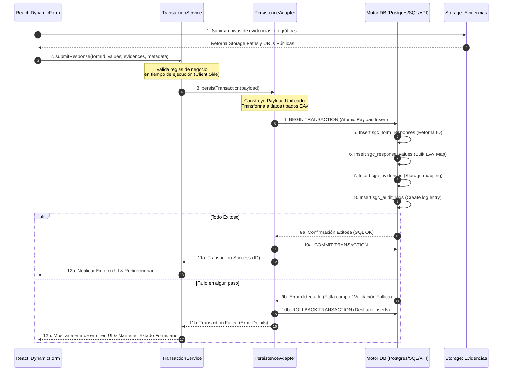
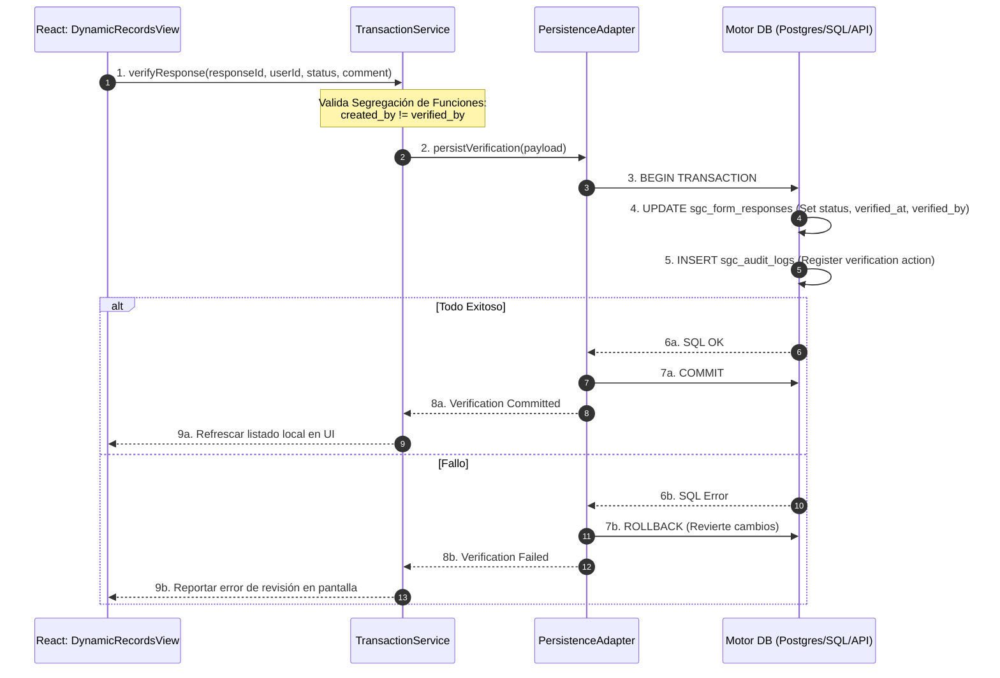

# ARQUITECTURA TRANSACCIONAL ENTERPRISE Y CAPA DE PERSISTENCIA
## Sistema de Gestión de Calidad (SGC-DM) — Documentación Técnica de Arquitectura
**Autor:** Arquitecto de Software Senior Principal  
**Versión:** 1.0 (Enterprise Specification)  
**Estatus:** APROBADO - CONTRATO ARQUITECTÓNICO CENTRAL  
**Clasificación:** Confidencial / Propiedad Técnica Integradora  

---

## 1. VISIÓN GENERAL Y FILOSOFÍA DE DISEÑO

### 1.1 El Desafío de la Consistencia en Sistemas EAV
En una plataforma enterprise dirigida por metadatos (*metadata-driven*) como **SGC-DM**, la captura de información operativa de planta no se asemeja a un sistema relacional plano clásico. En lugar de insertar una única fila en una tabla estática (ej. `registros_temperatura`), el motor *runtime* dinámico debe descomponer el formulario capturado y persistir la información en un modelo **EAV/OAV (Entity-Attribute-Value / Object-Attribute-Value)** distribuido a través de múltiples entidades interrelacionadas:
1. Un encabezado maestro que representa la instancia del documento (`sgc_form_responses`).
2. Múltiples filas dinámicas e independientes de respuestas tipadas (`sgc_response_values`).
3. Archivos adjuntos y metadatos de validación visual (`sgc_evidences`).
4. Trazas inmutables para el control de cumplimiento normativo e INVIMA (`sgc_audit_logs`).
5. Registros de transiciones de estados y aprobaciones (`workflows`, `approvals`, `signatures`).
6. Disparadores de alarmas y notificaciones asíncronas (`alerts`, `analytics events`).

### 1.2 Principio de Ejecución Atómica: "Todo o Nada" (All-or-Nothing)
La dispersión física de los datos de un único formulario dinámico en múltiples tablas relacionales introduce un riesgo crítico de **corrupción e inconsistencia lógica**. Si el sistema experimenta un fallo de conectividad de red, una interrupción en la sesión del operario o un error de validación en base de datos a mitad del guardado, no se puede permitir bajo ninguna circunstancia una confirmación parcial de los datos.

La filosofía del **All-or-Nothing** establece que:
* **O se confirman con éxito todos los componentes del flujo operacional** (el encabezado, todos sus valores tipados, sus evidencias físicas, la bitácora de auditoría inmutable, la inicialización del workflow de revisión y las alertas sanitarias).
* **O el sistema no altera absolutamente nada del almacenamiento físico**, revirtiendo cualquier cambio parcial realizado y devolviendo la interfaz de usuario a un estado consistente, seguro y transparente.

```
                  ┌────────────────────────────────────────┐
                  │      FORMULARIO DE PLANTA ENVIADO      │
                  │   (Respuestas + Evidencias + Firma)    │
                  └───────────────────┬────────────────────┘
                                      │
                                      ▼
                  ┌────────────────────────────────────────┐
                  │    CAPA TRANSACCIONAL (TRANSACTION)    │
                  │        Frontera de Aislamiento         │
                  └──────────┬──────────────────────┬──────┘
                             │                      │
                   Si todo es exitoso         Si algo falla
                             │                      │
                             ▼                      ▼
                  ┌──────────────────┐    ┌──────────────────┐
                  │  COMMIT GENERAL  │    │ ROLLBACK GENERAL │
                  │  * Respuestas    │    │ * Nada se guarda │
                  │  * Valores EAV   │    │ * Estado limpio  │
                  │  * Evidencias    │    │ * Error reportado│
                  │  * Audit Logs    │    └──────────────────┘
                  │  * Workflows     │
                  └──────────────────┘
```

### 1.3 Independencia Tecnológica del Motor de Persistencia
Para garantizar el ciclo de vida y la escalabilidad del producto a largo plazo, **el Runtime Dinámico de SGC-DM no debe acoplarse directamente a Supabase ni a ningún proveedor backend particular**. 

La arquitectura de transacciones se diseña mediante un patrón de **puertos y adaptadores (Arquitectura Hexagonal)**. Esto abstrae completamente la persistencia lógica en el frontend y en la capa del servicio runtime. El sistema se diseña para ser compatible y agnóstico, pudiendo migrarse de Supabase a PostgreSQL puro, MS SQL Server, MySQL, o a microservicios basados en NestJS, Prisma, Drizzle u ORMs tradicionales de grado empresarial sin alterar un solo componente de la interfaz de usuario en React.

---

## 2. CAPA TRANSACCIONAL (TRANSACTION LAYER)

### 2.1 Definición Conceptual
La **Capa Transaccional (Transaction Layer)** es la zona de abstracción del *runtime* que encapsula la lógica de orquestación, validación y persistencia secuencial e indivisible de las operaciones del sistema. Actúa como un intermediario o *gatekeeper* entre los componentes interpretativos del frontend (React Dynamic Engines) y los servicios físicos de base de datos.

### 2.2 Responsabilidades
* **Orquestación de Procesamiento:** Recibir la carga útil (*payload*) del formulario dinámico desnormalizado y coordinar el orden de inserción lógico de las entidades dependientes.
* **Manejo de Fronteras de Aislamiento:** Garantizar que todas las operaciones dentro de una frontera lógica compartan el mismo contexto transaccional en el backend.
* **Seguridad de Tipos y Conversión:** Validar la concordancia de tipos del cliente frente al metadato contractual del campo antes de iniciar el guardado, transformando los strings a valores decimales, booleanos o JSONB según corresponda.
* **Mapeo de Compensación en Fallos:** Monitorear el éxito de la escritura física y, en caso de error, inicializar las estrategias de rollback y las alertas visuales de estado en el cliente React.

### 2.3 Fronteras del Runtime (Runtime Boundaries)
Las fronteras de una transacción lógica delimitan qué componentes forman parte de la unidad de trabajo indivisible. En el SGC-DM, se definen tres fronteras de runtime clave:

```
┌────────────────────────────────────────────────────────────────────────┐
│                   FRONTERAS DEL RUNTIME TRANSACCIONAL                  │
│                                                                        │
│  FRONTERA 1: Captura de Planta (Submit)                                │
│  ┌──────────────────────────────────────────────────────────────────┐  │
│  │ sgc_form_responses ──► sgc_response_values ──► sgc_evidences     │  │
│  │ └──► sgc_audit_logs ──► trigger_alerts                           │  │
│  └──────────────────────────────────────────────────────────────────┘  │
│                                                                        │
│  FRONTERA 2: Verificación de Calidad (Verify)                          │
│  ┌──────────────────────────────────────────────────────────────────┐  │
│  │ update_status (sgc_form_responses) ──► insert_verification_data  │  │
│  │ └──► sgc_audit_logs ──► update_analytics_scores                  │  │
│  └──────────────────────────────────────────────────────────────────┘  │
│                                                                        │
│  FRONTERA 3: Ejecución de Workflows / CAPA (Workflow Trigger)          │
│  ┌──────────────────────────────────────────────────────────────────┐  │
│  │ update_state ──► assign_responsibles ──► insert_action_plan_logs  │  │
│  └──────────────────────────────────────────────────────────────────┘  │
└────────────────────────────────────────────────────────────────────────┘
```

---

## 3. FLUJO TRANSACCIONAL DEL RUNTIME (RUNTIME TRANSACTION FLOW)

A continuación, se detalla el ciclo secuencial y transaccional que experimentan las operaciones dinámicas más complejas del sistema:

### 3.1 Flujo de Diligenciamiento y Envío de Formulario (Submit)
Representa la creación del registro operativo del checklist o mediciones junto a sus dependencias transaccionales.



### 3.2 Flujo de Verificación y Cierre Operativo (Verify Flow)
Asegura que el proceso de control y segregación de funciones se consolide de forma limpia y transparente.



---

## 4. OPERACIONES ATÓMICAS UNIVERSALES (ATOMIC OPERATIONS)

Para evitar la corrupción lógica de datos en el sistema SGC-DM, se declaran como **Operaciones Atómicas Universales** (deben ejecutarse bajo una transacción indivisible) las siguientes unidades funcionales:

1. **Creación de Registro de Captura de Campo (`SUBMIT_FORM`):**
   * Creación del encabezado de respuesta (`sgc_form_responses`).
   * Creación de todos los valores individuales de campo (`sgc_response_values`).
   * Registro de evidencias de soporte fotográfico (`sgc_evidences`).
   * Creación de la bitácora inalterable de auditoría (`sgc_audit_logs`).
   * *Justificación:* Si se guarda el encabezado sin los valores dinámicos, el formulario se visualiza vacío y rompe el runtime del visualizador. Si se guardan los valores sin la bitácora de auditoría, se viola el estándar ISO 9001 e INVIMA de trazabilidad documental.

2. **Diligenciamiento de Auditorías e Inspecciones Multitabla (`SUBMIT_MULTITABLE_FORM`):**
   * Registro de la respuesta dinámica del formulario general.
   * Registro de las filas dinámicas de tablas repetitivas o dinámicas (`DynamicTableSection`).
   * *Justificación:* Las tablas repetitivas (lotes de despacho, listas de asistentes, repuestos de mantenimiento) se almacenan en tablas dependientes. Si el encabezado se guarda pero las líneas de detalle fallan, la inspección pierde su validez técnica legal.

3. **Verificación y Segregación de Funciones (`VERIFY_RESPONSE`):**
   * Actualización del estado del documento de calidad a `aprobado` o `rechazado`.
   * Persistencia del comentario de revisión y firma digital del supervisor calificado.
   * Registro en bitácora de auditoría de la acción `verify`.
   * *Justificación:* Previene que un registro aparezca como verificado sin que se haya registrado el usuario supervisor firmante o el registro del rastro del log histórico.

4. **Ejecución y Escalamiento de Planes de Acción (`DISPATCH_CAPA_PLAN`):**
   * Actualización de la respuesta EAV desviada a estado crítico.
   * Creación del plan correctivo en la tabla satélite `sgc_capa` (Planes de Acción).
   * Envío de la alerta de inocuidad en la tabla analítica `sgc_alerts`.
   * *Justificación:* Evita que un desvío crítico de temperatura o cloro se registre sin iniciar simultáneamente el protocolo CAPA de contingencia obligatorio.

---

## 5. ESTRATEGIA DE ROLLBACK Y COMPENSACIÓN

Cuando ocurre una falla transaccional, el sistema SGC-DM debe ejecutar acciones correctivas en cascada a través de tres niveles lógicos de la aplicación:

```
┌────────────────────────────────────────────────────────────────────────┐
│                        NIVELES DE ROLLBACK SGC-DM                      │
│                                                                        │
│  [ NIVEL FÍSICO DB ]   ──► Ejecuta ROLLBACK nativo SQL.                │
│                            Deshace transacciones a nivel de disco.     │
│                                                                        │
│  [ NIVEL MEMORIA UI ]  ──► Conserva el estado de entrada del usuario.  │
│                            No borra campos para evitar pérdida de UX.  │
│                                                                        │
│  [ NIVEL DISTRIBUIDO ] ──► Inicia patrón SAGA de compensación.         │
│                            Elimina adjuntos subidos a Cloud Storage.   │
└────────────────────────────────────────────────────────────────────────┘
```

### 5.1 Rollback Físico de Base de Datos
* **Transacciones Clásicas SQL:** Invocar la orden de rollback nativa del motor relacional (`ROLLBACK TRANSACTION` o `ROLLBACK`) para descartar cualquier modificación temporal.
* **Integridad por Llaves Foráneas (FK):** Todas las tablas satélites y dependientes del modelo EAV cuentan con restricciones `ON DELETE CASCADE`. En caso de eliminarse un registro en `sgc_form_responses` por algún proceso administrativo de depuración, el motor de la base de datos limpiará de manera atómica todos los valores asociados en `sgc_response_values` y `sgc_evidences` en cascada.

### 5.2 Rollback Lógico en Estado del Runtime (Front-End)
* **Preservación de UX:** Si la transacción falla en la base de datos o por fallo de conectividad de red de la API, el orquestador React (`DynamicForm.jsx`) **no debe vaciar el formulario ni borrar las entradas del operario**.
* **Estado de Reintento:** La aplicación debe interceptar el fallo de persistencia, mantener las respuestas del operario intactas en el estado local de React, activar un banner visual rojo de error de red y habilitar un botón de **Reintentar Envío**. Esto evita la frustración operativa de tener que volver a capturar 50 preguntas del checklist en planta si falló la transmisión.

### 5.3 Estrategia de Compensación Distribuida (Patrón SAGA para Storage)
Dado que las evidencias fotográficas se suben al bucket físico de almacenamiento digital de Supabase Storage de manera previa e independiente a la inserción en base de datos, un fallo en la inserción atómica de la respuesta dejará las imágenes alojadas en la nube como **archivos huérfanos**, consumiendo almacenamiento inútilmente.

* **El Algoritmo de Compensación SAGA:**
  1. Si `submitFormResponse` detecta una excepción de base de datos tras haber subido imágenes exitosamente.
  2. El `TransactionService` intercepta el error de la persistencia de datos.
  3. Ejecuta una orden de compensación asíncrona hacia el Storage.
  4. Elimina físicamente los archivos del bucket utilizando los `storage_path` generados temporalmente.
  5. Asegura que el almacenamiento en la nube permanezca libre de basura operativa digital.

---

## 6. CAPA DE ABSTRACCIÓN DEL SERVICIO (BACKEND ABSTRACTION)

Para independizar al *runtime* operativo de la SPA del proveedor de base de datos de Supabase, se define un modelo de diseño basado en **Interfaces de Persistencia Desacopladas**. 

```
┌──────────────────────────────────────────────────────────┐
│                  REACT DYNAMIC ENGINES                   │
│       (BaseChecklist, BaseMediciones, BaseWorkflow)      │
└────────────────────────────┬─────────────────────────────┘
                             │
                             ▼
┌──────────────────────────────────────────────────────────┐
│                    TransactionService                    │
│      (Orquestador lógico - Lógica de Negocio SGC)       │
└────────────────────────────┬─────────────────────────────┘
                             │
                             ▼ [Llamadas a Interface Lógica]
┌──────────────────────────────────────────────────────────┐
│                IRuntimePersistenceLayer                  │
│                (Contrato de Persistencia)                │
└────────────────────────────┬─────────────────────────────┘
                             │
            ┌────────────────┴────────────────┐
            ▼                                 ▼
┌────────────────────────┐        ┌────────────────────────┐
│    SupabaseAdapter     │        │    SQLServerAdapter    │
│ (Implementación real)  │        │ (Implementación futura)│
└────────────────────────┘        └────────────────────────┘
```

### 6.1 Interfaz de Contrato de Persistencia: `IRuntimePersistenceLayer`
Cualquier proveedor backend (Supabase, MySQL local, microservicio NestJS, etc.) que se desee implementar en el sistema debe ajustarse a esta interfaz conceptual:

```typescript
interface IRuntimePersistenceLayer {
  getModules(): Promise<Module[]>;
  getModuleBySlug(slug: string): Promise<Module>;
  getFormsByModule(moduleId: string): Promise<Form[]>;
  getFormBySlug(slug: string): Promise<Form>;
  getFormFields(formId: string): Promise<FormField[]>;
  
  // Guardado Atómico Unificado
  submitFormResponse(payload: TransactionPayload): Promise<TransactionResult>;
  
  // Verificación y Bitácora
  verifyFormResponse(verificationPayload: VerificationPayload): Promise<VerificationResult>;
  getAuditLogs(responseId: string): Promise<AuditLog[]>;
}
```

### 6.2 Estructura del payload Transaccional: `TransactionPayload`
El payload estructurado que el frontend enviará a la capa de persistencia conceptual de forma agnóstica se compone de:

```typescript
type TransactionPayload = {
  formId: string;
  userId: string;
  // Valores dinámicos del formulario
  values: {
    fieldId: string;
    value: string | number | boolean | object;
  }[];
  // Soporte fotográfico de evidencias
  evidences: {
    fileUrl: string;
    storagePath: string;
    fileType: string;
  }[];
  // Metadatos operacionales y de geolocalización
  metadata: {
    capturedAt: string;
    geolocation?: {
      latitude: number;
      longitude: number;
    };
    deviceInfo?: string;
  };
};
```

---

## 7. PREPARACIÓN MULTI-BASE DE DATOS (MULTI-DATABASE READINESS)

Para que el modelo dinámico EAV/OAV de SGC-DM pueda ejecutarse e interactuar con diferentes tecnologías de bases de datos relacionales y capas API modernas, se definen los siguientes mapeos físicos conceptuales:

### 7.1 PostgreSQL Puro
* **Estrategia:** Mantiene la misma estructura relacional que Supabase.
* **Persistencia:** Se puede utilizar Prisma o Drizzle ORM en un backend de Node.js/NestJS.
* **Atomicidad:** Aprovecha el uso de transacciones estándar nativas:
  ```javascript
  const result = await prisma.$transaction(async (tx) => {
    const response = await tx.sgc_form_responses.create({ data: { form_id, created_by } });
    await tx.sgc_response_values.createMany({ data: responseValues });
    await tx.sgc_evidences.createMany({ data: evidences });
    await tx.sgc_audit_logs.create({ data: auditData });
    return response;
  });
  ```

### 7.2 Microsoft SQL Server (Enterprise Standard)
* **Estrategia:** SQL Server requiere consideraciones especiales para tipos complejos y JSON.
* **Persistencia:** Mapeo de la columna `sgc_form_fields.options` (JSONB en Postgres) a una columna de tipo `NVARCHAR(MAX)` controlada con restricciones `ISJSON(options) = 1` para mantener la flexibilidad semántica del metadato.
* **Rendimiento:** Creación de índices sobre columnas calculadas a partir del JSON analizado para optimizar búsquedas.
* **Atomicidad:** Transacciones explícitas con bloqueos optimistas:
  ```sql
  BEGIN TRANSACTION;
  -- Secuencia de Inserts encapsulados...
  IF @@ERROR <> 0 ROLLBACK TRANSACTION;
  ELSE COMMIT TRANSACTION;
  ```

### 7.3 MySQL 8.0+
* **Estrategia:** MySQL ofrece soporte nativo para tipos JSON mediante funciones del tipo `JSON_EXTRACT()`.
* **Persistencia:** Mapeo de `sgc_form_fields.options` a tipo de dato `JSON` estándar.
* **Rendimiento:** Creación de columnas virtuales generadas e indexadas (`Generated Columns`) a partir del JSON de opciones dinámicas para soportar la desnormalización veloz de la visualización del historial.

### 7.4 Microservicios REST / GraphQL y APIs Desacopladas
En arquitecturas distribuidas SaaS modernas, la base de datos se encuentra totalmente oculta detrás de una compuerta API pública o microservicios especializados (ej. NestJS + Prisma).

* **Desacoplamiento Total:** El cliente React de SGC-DM no realiza consultas directas a base de datos.
* **El Persistencia Adaptador del Microservicio:** El `SupabaseAdapter` es reemplazado en el runtime de React por un **`RestApiAdapter`** que transmite el payload unificado JSON de la transacción mediante una petición HTTP POST a un endpoint unificado (ej. `/api/v1/forms/submit`).
* El microservicio remoto asume el control transaccional íntegro en el lado del servidor, aislando la lógica de la base de datos de la interfaz de usuario en React.

---

## 8. ESTRATEGIA DE CONTROL Y USO DE PROCEDIMIENTOS ALMACENADOS (RPC)

Para conciliar el rendimiento, la atomicidad transaccional y la adaptabilidad a futuro, la plataforma implementa una **Estrategia Híbrida de Persistencia**.

### 8.1 Cuándo Utilizar RPC (Remote Procedure Call) en Base de Datos
Se debe priorizar el uso de procedimientos almacenados y RPC en la base de datos activa en las siguientes condiciones:
* **Conectividad Inestable de Planta:** En redes industriales con alta pérdida de paquetes o conexiones lentas. Transmitir un único payload JSON unificado a través de una sola petición RPC consume un **75% menos de ancho de banda y latencia** que ejecutar 4 peticiones HTTP de inserción secuenciales desde el navegador.
* **Seguridad Estricta e Inmutabilidad de Bitácoras:** Delegar la inserción en la base de datos al procedimiento almacenado (`SECURITY DEFINER`) permite retirar a los usuarios operativos el permiso directo de escritura (`INSERT`) sobre la tabla de bitácoras `sgc_audit_logs`. La bitácora solo puede alterarse a través de la ejecución controlada de la función transaccional, imposibilitando hackeos o modificaciones no autorizadas a nivel de API del cliente.

### 8.2 Cuándo Utilizar Servicios API y Lógica en Middleware (Backend Services)
Se debe trasladar la lógica transaccional de los RPCs a un servicio API o backend middleware (Node.js, NestJS) en los siguientes escenarios:
* **Lógica de Negocio con Integraciones de Terceros:** Si el guardado del formulario requiere operaciones complejas que involucren APIs externas de terceros (ej. comprobar validez de un lote en el ERP de SAP, validar una firma en un certificador estatal o disparar un cobro con tarjeta en Stripe). Las bases de datos no son eficientes realizando peticiones HTTP síncronas.
* **Independencia Extrema del Motor SQL:** Si el negocio planifica migrar con frecuencia de motor de base de datos (ej. migrar de PostgreSQL a Oracle). Mantener la lógica transaccional en el backend (Node.js/Prisma) evita tener que reescribir cientos de líneas de código procedural PL/pgSQL a T-SQL o PL/SQL de Oracle.

---

## 9. CONSISTENCIA DE EVENTOS OPERACIONALES (EVENT CONSISTENCY)

El diligenciamiento de una inspección crítica de calidad en planta tiene implicaciones inmediatas en múltiples subsistemas. La consistencia entre el registro, su control analítico y la auditoría debe ser absoluta.

```
                  ┌────────────────────────────────────────┐
                  │          OPERACIÓN COMPLETADA          │
                  │        (Submit de Medición Cloro)      │
                  └───────────────────┬────────────────────┘
                                      │
                                      ▼
                  ┌────────────────────────────────────────┐
                  │    UNIDAD TRANSACCIONAL (SQL COMMIT)   │
                  │ ├── Graba respuesta en sgc_responses   │
                  │ └── Registra log en sgc_audit_logs     │
                  └───────────────────┬────────────────────┘
                                      │
                         Si el commit es exitoso
                                      │
                                      ▼ (Consistencia Eventos)
                  ┌────────────────────────────────────────┐
                  │   PUBLISHER DE EVENTOS (Background)    │
                  └──────┬──────────────────────────┬──────┘
                         │                          │
                         ▼ (Async Pipeline 1)       ▼ (Async Pipeline 2)
                  ┌──────────────┐           ┌──────────────┐
                  │ ALERTA SLA   │           │ ANALYTICS    │
                  │ Si cloro < 0.3           │ Incrementa   │
                  │ Dispara SMS  │           │ score diario │
                  └──────────────┘           └──────────────┘
```

### 9.1 Consistencia Inmediata (Síncrona)
* **Alcance:** La transacción SQL atómica en el backend garantiza de manera síncrona e incondicional que la respuesta del operario y su log inmutable de auditoría se persistan al mismo tiempo en el disco físico. Si la auditoría falla, la medición se borra.

### 9.2 Consistencia Eventual y Desacoplada (Asíncrona)
* **Alcance:** El procesamiento analítico, el cálculo de KPIs globales y el disparo de notificaciones de alertas de inocuidad se ejecutan de manera asíncrona, fuera de la transacción OLTP principal.
* **Mecanismo:** PostgreSQL notifica el éxito del commit transaccional mediante un trigger nativo de eventos (`pg_notify`). Un suscriptor de eventos en el backend (Supabase Edge Function u orquestador de microservicios) recibe la señal e inicia de forma asíncrona las tareas secundarias:
  * Incrementa la puntuación de calidad del operario en `sgc_compliance_scores`.
  * Genera el registro plano de serie temporal en la tabla `sgc_trends`.
  * Dispara notificaciones Push en el teléfono del supervisor si la medición se encuentra desviada del rango permitido.

---

## 10. PREPARACIÓN PARA ARQUITECTURA ORIENTADA A EVENTOS FUTURA (EDA)

Para escalar el SGC-DM de DM Distribuciones a un ecosistema industrial masivo (SaaS multi-tenant con miles de lecturas IoT, alertas masivas automatizadas y análisis predictivos por IA), la persistencia transaccional se prepara conceptualmente para adoptar una **Arquitectura Dirigida por Eventos (EDA - Event-Driven Architecture)**.

```
                                [ MOTOR TRANSACCIONAL ]
                               (Transacción atómica OK)
                                          │
                                          ▼ (Publica Mensaje)
                        ┌──────────────────────────────────┐
                        │      MENSAJERÍA / EVENT BUS      │
                        │       (Kafka / RabbitMQ)         │
                        └──────┬────────────┬────────────┬─┘
                               │            │            │
             ┌─────────────────┘            │            └─────────────────┐
             ▼ (Async Consumer 1)           ▼ (Async Consumer 2)           ▼ (Async Consumer 3)
     ┌──────────────┐               ┌──────────────┐               ┌──────────────┐
     │ NOTIFICADOR  │               │   Vision AI  │               │ INTEGRACIÓN  │
     │ Notificaciones│               │ Valida foto  │               │ Sincroniza   │
     │ Push y SMS   │               │ de evidencia │               │ con ERP SAP  │
     └──────────────┘               └──────────────┘               └──────────────┘
```

### 10.1 Cola de Mensajes y Orquestación (Event Bus)
* **La Transición:** En lugar de ejecutar procesos analíticos locales pesados mediante Edge Functions síncronas, el `TransactionService` tras el éxito del commit en base de datos publica un mensaje serializado en un bus de eventos enterprise (ej. **Apache Kafka**, **RabbitMQ** o **AWS SQS**).
* **Beneficio:** Garantiza resiliencia frente a caídas. Si el sistema analítico o el motor de IA experimenta mantenimiento, los eventos operacionales de planta no se pierden; permanecen seguros en la cola hasta que los consumidores asíncronos se recuperen.

### 10.2 Casos de Consumo Asíncrono en EDA
* **Vision AI Processing (Consumidor 1):** El servicio de Visión de Inteligencia Artificial consume el evento `response.created`, descarga de forma asíncrona las imágenes de la evidencia fotográfica de Supabase Storage, ejecuta la red neuronal convolucional para verificar que el área esté verdaderamente limpia y actualiza la veracidad del registro sin demorar el envío inicial de la interfaz del operario.
* **Integración ERP / IoT (Consumidor 2):** Un conector de integración de sistemas enterprise lee los eventos de despachos y de manera asíncrona replica los consumos de materias primas e ingresos de lotes directamente en el sistema ERP central de la empresa (SAP o Odoo), manteniendo la coherencia de inventarios a nivel corporativo de forma desatendida.

---

## 11. MATRIZ DE RIESGOS TRANSACCIONALES

| Identificador | Punto de Falla / Escenario de Riesgo | Gravedad / Severidad | Impacto Operativo | Estrategia de Mitigación / Diseño Transaccional |
| :--- | :--- | :---: | :--- | :--- |
| **TR-R-01** | **Escritura Simultánea / Concurrencia**<br/>Dos supervisores de calidad intentan verificar el mismo registro EAV de planta simultáneamente (*Last Write Wins*). | 🟡 Media | Se sobreescribe la opinión y comentario de un verificador sin alertas, corrompiendo la traza de auditoría legal de inocuidad. | Implementar **Bloqueo Optimista (Optimistic Locking)** mediante una columna incremental de versión (`version`) en la tabla `sgc_form_responses`. Si la versión cambió en base de datos antes de guardar la edición del supervisor, se rechaza la transacción en el servidor y se notifica al usuario. |
| **TR-R-02** | **Bloqueo del Runtime por Carga de Fotos**<br/>Fallo de conectividad de red a mitad de la subida masiva de evidencias al Storage. | 🔴 Alta | Pérdida de imágenes de soporte operacional de la inspección crítica de cloro o temperatura de cámaras frías. | Utilizar el **Patrón SAGA de Compensación**. Las imágenes no confirmadas por el commit definitivo de base de datos se marcan con un flag de caducidad temporal y un servicio asíncronico de limpieza depura el storage semanalmente. |
| **TR-R-03** | **Cuello de Botella Transaccional**<br/>Locks en cascada sobre `sgc_response_values` debido a miles de escrituras en caliente. | 🔴 Alta | Congelamiento de las pantallas móviles de captura en planta, provocando retrasos en la liberación física de despachos de camiones. | Reducir el alcance y duración de la transacción al mínimo indispensable. Evitar JOINs de verificación de metadatos dentro del ciclo de escritura transaccional. Mantener la lectura de catálogos en el caché local indexado de la SPA React. |
| **TR-R-04** | **Pérdida de Eventos de Auditoría**<br/>Caída del motor de base de datos durante el registro síncrono del log inmutable en `sgc_audit_logs`. | 🔴 Alta | Pérdida de acreditación INVIMA/ISO por falta de trazabilidad documental inalterable de auditoría. | El procedimiento almacenado unificado RPC fuerza que la creación del log de auditoría comparta la misma frontera física de guardado que el formulario. Si falla el log, la inspección no se registra en base de datos. |

---

## 12. ROADMAP TÉCNICO DE IMPLEMENTACIÓN TRANSACCIONAL

Para desplegar esta arquitectura transaccional enterprise de forma segura, progresiva y alineada con los recursos actuales del proyecto, se establece la siguiente hoja de ruta secuencial:

### Fase 1: Consolidación Transaccional en Base de Datos (Q2 2026 - Corto Plazo)
* **Despliegue de la RPC Unificada:** Crear la función transaccional procedural `submit_dynamic_response` directamente en el editor SQL de Supabase para unificar las 4 inserciones asíncronas dispersas del cliente en React.
* **Refuerzo RLS e Inmutabilidad de Bitácoras:** Configurar las políticas de seguridad a nivel de fila (RLS) para evitar ediciones o borrados malintencionados de auditorías operacionales.
* **Integración del Rollback en la SPA:** Programar el control de excepciones de red en el visualizador de React de forma que las entradas del operario permanezcan intactas ante caídas de la API, previniendo la pérdida de datos del cliente en el front.

### Fase 2: Capa de Abstracción en Runtime de React (Q3 2026 - Corto Plazo)
* **Despliegue del TransactionService en Front:** Modularizar el orquestador transaccional en `src/services/` e implementar la interfaz abstracta `IRuntimePersistenceLayer`.
* **Creación del Adaptador Supabase (`SupabaseAdapter`):** Mover el cliente actual de Supabase a un adaptador especializado. La SPA solo interactuará con el puerto genérico de persistencia.
* **Preservación EXIF en Visión Forense:** Configurar el pipeline de compresión local en el front para asegurar la conservación de las coordenadas GPS y marcas temporales en los metadatos de las fotos de auditoría.

### Fase 3: Desacoplamiento Físico y Multibase (Q4 2026 - Mediano Plazo)
* **Migración a APIs REST Middleware (Microservicios):** Reemplazar el acceso directo a la base de datos Supabase en React por el consumo a una API REST backend implementada con NestJS u Express.
* **Implementación de Patrón Repository en Middleware:** Trasladar el control transaccional del lado del servidor utilizando Prisma ORM, Drizzle u ORMs de grado corporativo, habilitando la compatibilidad nativa con SQL Server y MySQL.
* **Integración con Colas de Eventos (EDA Ready):** Configurar publicadores asíncronos asumiendo el desacoplamiento analítico mediante buses de mensajes para soportar la automatización por Inteligencia Artificial y la monitorización de sensores IoT.

---

**Documento Mantenido y Aprobado por:** Dirección General de Arquitectura de Software e Integridad Operativa SGC-DM.  
**Última Actualización:** 22 de Mayo de 2026.  
**Próxima Revisión Planificada:** 15 de Agosto de 2026.  
