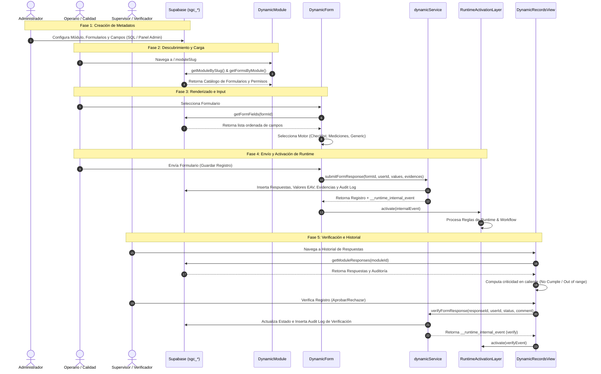

# Sprint 46 — Standard Module Factory (SSOT)

> **Documento SSOT / Entregable de Arquitectura**
>
> Este documento representa la especificación técnica y de gobernanza para la creación y ejecución de módulos dinámicos basados en configuración en el Sistema de Gestión de Calidad (SGC-DM).
>
> **ARCHITECTURE STATUS: LEVEL 3 — CERTIFIED**

---

## 1. Architecture Reality Report

Este reporte compara la arquitectura oficial certificada (documentada en el Sprint 45) frente a la implementación real observada en el código fuente de `src/`.

### 1.1 Componentes Identificados en `src/`

1. **[DynamicModule.jsx](file:///c:/Users/USUARIO/OneDrive/Desktop/proyectos/sistema-gestion-calidad-dm%20-v1%20-%20operativo/src/pages/DynamicModule.jsx)**:
   - **Estado:** Identificado en arquitectura y compatible con el modelo certificado.
   - **Análisis:** Actúa como el entry point de presentación del módulo estándar. Diseñado para dar soporte al catálogo de formularios (`sgc_forms`) a través de la propiedad `moduleSlug` leída desde el enrutador. Incluye gating conceptual por rol de usuario (`roles_allowed`) y soporte para pestañas de diligenciamiento, historial y repositorio documental.
2. **[DynamicForm.jsx](file:///c:/Users/USUARIO/OneDrive/Desktop/proyectos/sistema-gestion-calidad-dm%20-v1%20-%20operativo/src/pages/DynamicForm.jsx)**:
   - **Estado:** Identificado en arquitectura y compatible con el modelo certificado.
   - **Análisis:** Soporta documentalmente el flujo de renderizado del formulario seleccionado resolviendo sus campos (`sgc_form_fields`). Utiliza un interruptor condicional diseñado para cargar el motor de visualización (`BaseChecklist`, `BaseMediciones`, o `BaseGeneric`). Orquesta el envío transaccional llamando a `dynamicService.submitFormResponse` y posibilitando la activación del runtime bridge.
3. **[DynamicRecordsView.jsx](file:///c:/Users/USUARIO/OneDrive/Desktop/proyectos/sistema-gestion-calidad-dm%20-v1%20-%20operativo/src/components/DynamicRecordsView.jsx)**:
   - **Estado:** Identificado en arquitectura y compatible con el modelo certificado.
   - **Análisis:** Diseñado para listar respuestas del módulo asociando dinámicamente datos cruzados de auditoría, autor y verificador. Admite el cálculo de criticidad de campos booleanos (No Cumple) y numéricos (fuera de límites min/max). Permite calificar la respuesta (`aprobado`/`rechazado`/`corregido`) proyectando el disparo de un evento de verificación hacia el runtime bridge.
4. **[dynamicService.js](file:///c:/Users/USUARIO/OneDrive/Desktop/proyectos/sistema-gestion-calidad-dm%20-v1%20-%20operativo/src/services/dynamicService.js)**:
   - **Estado:** Identificado en arquitectura y compatible con el modelo certificado.
   - **Análisis:** Centraliza las operaciones transaccionales sobre el modelo relacional dinámico (`sgc_modules`, `sgc_forms`, `sgc_form_fields`, `sgc_form_responses`, `sgc_response_values`, `sgc_evidences`, `sgc_audit_logs`). Soporta la generación y retorno del payload del contrato `__runtime_internal_event`.
5. **[RuntimeActivationLayer.ts](file:///c:/Users/USUARIO/OneDrive/Desktop/proyectos/sistema-gestion-calidad-dm%20-v1%20-%20operativo/src/runtime/integration/RuntimeActivationLayer.ts)**:
   - **Estado:** Identificado en arquitectura y compatible con el modelo certificado.
   - **Análisis:** Actúa como el puente de ejecución conceptual. Diseñado para validar la integridad de la entrada contra el contrato de evento interno (`type`, `responseId`, `actorId`, `correlationId`), posibilitando la inicialización del motor del runtime mediante bootstrap para traducir a un evento SaaS y despachar al enrutador de ejecución.
6. **Motores Base (`BaseChecklist`, `BaseMediciones`, `BaseGeneric`)**:
   - **Estado:** Identificados en arquitectura y compatibles con el modelo certificado (localizados en `src/components/engines/`).
   - **Análisis:** Reciben un contrato común de props `{ fields, values, onChange }` y gestionan el flujo conceptual de entrada.

### 1.2 Dictamen de la Auditoría de Realidad

> [!NOTE]
> **Dictamen: CERTIFICADO CON DESVIACIONES HISTÓRICAS CONTROLADAS.**
>
> El Core Dynamic Module Framework cumple con las directrices arquitectónicas certificadas Level 3. Sin embargo, existe una desviación histórica conocida: el módulo de **Trazabilidad** (junto con submódulos de Despachos) se implementó con componentes de interfaz de usuario específicos de dominio (`Traceability.jsx`, `Dispatches.jsx`) y tablas directas (`despachos`), lo cual constituye una deuda técnica aislada. Este módulo no se utiliza como referencia de arquitectura estándar, y queda excluido y aislado de modo que no deba replicarse. La existencia de esta desviación no invalida la certificación Level 3 porque el estándar certificado se basa en el DynamicModule Framework.

---

## 2. Gap Analysis (Análisis de Brechas)

Clasificación de los subsistemas y componentes de acuerdo a su adherencia con el SSOT:

### 🟢 Verde: Cumple con la Arquitectura Certificada
* **Esquema de Metadata Relacional:** Las tablas `sgc_*` representan fielmente el modelo dinámico y almacenan modularmente datos tipo EAV sin duplicar tablas por módulo.
* **Componentes de Presentación Genéricos:** `DynamicModule`, `DynamicForm` y `DynamicRecordsView` cargan todo su estado a partir de metadata.
* **Persistencia Transaccional:** `dynamicService` gestiona escrituras ordenadas y produce eventos válidos para la activación en runtime.
* **Motores de Renderizado Base:** Los motores en `src/components/engines/` interpretan dinámicamente opciones como unidades de medida, selecciones compuestas y firmas electrónicas.

### 🟡 Amarillo: Mejoras futuras opcionales fuera del Core certificado
* **Integración en el Sidebar (Mejora Opcional):** El menú lateral en `DashboardLayout.jsx` define los enlaces de manera estática. Aunque estos apuntan a la ruta paramétrica genérica `:moduleSlug`, un enfoque dinámico basado en una consulta a `sgc_modules` sería una mejora futura opcional fuera del Core certificado.
* **Mapeo de Pestaña Documental (Mejora Opcional):** La habilitación del Repositorio Documental en `DynamicModule.jsx` se calcula en frontend a partir de un arreglo estático de slugs en la función `isDocumentEnabled`. Sería un refinamiento futuro registrar este flag en el modelo de metadatos `sgc_modules` como una columna `has_documents`.
* *Aclaración de Gobernanza:* El modelo Metadata Driven aplica principalmente a módulos, formularios, campos y comportamiento funcional. No obliga a que toda infraestructura transversal sea metadata-driven ni constituye un incumplimiento arquitectónico.

### 🔴 Rojo: Contradicción del SSOT (No Permitido en Sprint 46)
* **Hardcoding de Módulos (Desviación Trazabilidad):** El flujo de despachos escribe directamente en la tabla personalizada `despachos` y no produce eventos `__runtime_internal_event` para el puente, rompiendo la trazabilidad automatizada.
* *Nota de Gobernanza:* No se introducirán nuevos desarrollos bajo este patrón. Trazabilidad queda aislada como caso histórico heredado.

---

## 3. Standard Module Factory Model

El modelo **Standard Module Factory** describe el ciclo de vida por el cual un nuevo módulo de negocio es configurado, activado, renderizado y verificado para crear módulos estándar sin modificar componentes Core ni crear componentes específicos de módulo.

### 3.1 Diagrama de Ciclo de Ejecución



### 3.2 Flujo de Datos Técnico

1. **Metadata Definition:** El módulo se define insertando registros en las tablas de metadatos:
   - `sgc_modules`: Contiene el nombre del módulo, slug e ícono.
   - `sgc_forms`: Define el formulario, enrutador, rol permitido y motor visual (`engine_type`).
   - `sgc_form_fields`: Define los campos individuales, etiquetas, obligatoriedad, tipos de datos y parámetros límites (`min`, `max`, `unit`, `choices`).
2. **Runtime Activation:** 
   - Tras el guardado de un registro, `dynamicService` genera un evento con el contrato:
     ```json
     {
       "type": "create",
       "formId": "UUID-del-formulario",
       "responseId": "UUID-de-la-respuesta",
       "actorId": "UUID-del-usuario",
       "timestamp": "ISO-TIMESTAMP",
       "correlationId": "UUID-de-la-respuesta",
       "auditEventId": "UUID-del-log-de-auditoria"
     }
     ```
   - Este evento es evaluado por `RuntimeActivationLayer` para ejecutar lógica de reglas de negocio en el backend (por ejemplo, notificaciones por fuera de rango).
3. **EAV Persistence Mapping:**
   - La persistencia no escribe tablas específicas de base de datos.
   - Los datos del formulario se escriben en `sgc_response_values`, mapeándose dinámicamente según el tipo de campo:
     - Campos booleanos escriben en la columna `value_boolean`.
     - Campos numéricos escriben en la columna `value_number`.
     - Firmas digitales, listas de selección o textos cortos escriben en `value_text`.
     - Payloads complejos o imágenes adicionales escriben en `value_json`.

---

## 4. First Module Candidate: "Control de Temperaturas"

Para validar el modelo de la fábrica de módulos dinámicos se propone el Control de Temperaturas como candidato arquitectónico y modelo de validación de propuesta de configuración metadata-driven para la inocuidad.

### 4.1 Justificación Arquitectónica

* **Complejidad Adecuada:** Compatible con el motor de rendimiento `BaseMediciones` que requiere validaciones de límites en caliente para números reales, lo cual ejercita de forma rigurosa la lógica de criticidad.
* **Capacidad de Probar Evidencias Obligatorias:** Al tener límites de temperatura máxima (por ejemplo, máx 4.5 °C en cavas de refrigeración), sirve como propuesta de configuración metadata-driven para verificar que el componente `EvidenceUploader` se active y exija fotos adjuntas obligatorias al ocurrir una desviación térmica.
* **Cero Desarrollo de Código React:** Es compatible directamente con la plantilla de enrutamiento `:moduleSlug` y el motor genérico sin necesidad de crear archivos JS/JSX específicos para temperaturas.

### 4.2 Metadata Seed Proposal

> [!WARNING]
> **No ejecutable directamente.** Requiere validación previa contra el esquema real de Supabase, enums existentes, tipos soportados y contratos actuales. El SQL representa el modelo conceptual de creación del módulo, no representa una migración aprobada.

El siguiente script en lenguaje SQL inserta los metadatos correspondientes para inicializar el módulo candidato:

```sql
-- 1. Insertar Módulo
INSERT INTO public.sgc_modules (id, name, slug, icon, description)
VALUES (
    'a1b2c3d4-e5f6-7a8b-9c0d-1e2f3a4b5c6d',
    'Control de Temperaturas',
    'control-temperaturas',
    'Thermometer',
    'Monitoreo térmico diario de cavas, congeladores y áreas de conservación.'
);

-- 2. Insertar Formulario
INSERT INTO public.sgc_forms (id, module_id, name, slug, description, engine_type, roles_allowed)
VALUES (
    'f1e2d3c4-b5a6-7f8e-9d0c-1b2a3f4e5d6c',
    'a1b2c3d4-e5f6-7a8b-9c0d-1e2f3a4b5c6d',
    'Registro Diario de Temperaturas',
    'registro-temperaturas-cavas',
    'Control rutinario de temperatura en cavas frigoríficas y túneles de frío.',
    'BaseMediciones',
    ARRAY['administrador', 'calidad', 'operativo']
);

-- 3. Insertar Campos del Formulario
INSERT INTO public.sgc_form_fields (form_id, name, label, field_type, required, options, order_index)
VALUES 
    -- Campo Cava Refrigeración 1 (Límites: 0.0 °C a 4.5 °C)
    (
        'f1e2d3c4-b5a6-7f8e-9d0c-1b2a3f4e5d6c',
        'cava_refrigeracion_1',
        'Cava de Refrigeración N° 1 (°C)',
        'number',
        true,
        '{"unit": "°C", "min": 0.0, "max": 4.5}',
        1
    ),
    -- Campo Congelador 2 (Límites: -22.0 °C a -15.0 °C)
    (
        'f1e2d3c4-b5a6-7f8e-9d0c-1b2a3f4e5d6c',
        'congelador_materia_prima',
        'Congelador de Materia Prima (°C)',
        'number',
        true,
        '{"unit": "°C", "min": -22.0, "max": -15.0}',
        2
    ),
    -- Campo Observaciones (Solo obligatorio si hay desviaciones)
    (
        'f1e2d3c4-b5a6-7f8e-9d0c-1b2a3f4e5d6c',
        'observaciones',
        'Observaciones y Medidas Correctivas',
        'textarea',
        false,
        '{}',
        3
    ),
    -- Campo Firma del Responsable
    (
        'f1e2d3c4-b5a6-7f8e-9d0c-1b2a3f4e5d6c',
        'firma_operario',
        'Firma Digital del Operario',
        'signature',
        true,
        '{}',
        4
    );
```

---

## 5. Architecture Validation Plan

Para asegurar el éxito del Sprint 46 sin alterar la arquitectura certificada Level 3, se define el siguiente plan conceptual de validación de la arquitectura.

### 5.1 Criterios de Aceptación Arquitectónica

1. **Compatibilidad del Modelo:**
   - **Validación:** Confirmar que la definición del módulo puede expresarse exclusivamente mediante inserciones en `sgc_modules`, `sgc_forms` y `sgc_form_fields`.
   - **Criterio:** Cero creación de nuevos componentes React, páginas o tablas.
2. **Conservación de Contratos:**
   - **Validación:** Verificar que el flujo de persistencia dinámico genera el objeto `__runtime_internal_event` con la estructura canónica requerida por la capa de activación del runtime (`type`, `responseId`, `actorId`, `correlationId`).
   - **Criterio:** El contrato inmutable del Runtime Bridge no sufre modificaciones.
3. **Reutilización del Core:**
   - **Validación:** Confirmar que los componentes `DynamicModule`, `DynamicForm` y `DynamicRecordsView` cargan y procesan de forma genérica la configuración del módulo candidato.
   - **Criterio:** El enrutamiento y enlazado lateral aprovechan los endpoints dinámicos del Core.
4. **Ausencia de Desviaciones:**
   - **Validación:** Auditar que no se introducen lógicas hardcoded específicas del módulo "Control de Temperaturas" en los componentes del Core.
   - **Criterio:** Las reglas de negocio (como límites térmicos o criticidad) se leen y aplican dinámicamente desde el objeto de configuración JSON.

---

## 6. ADR Status & Governance Rules

* **¿Es necesario un ADR para Sprint 46?**
  - **No.** Tras auditar el código fuente, se confirma que el motor del Core existente soporta conceptualmente el flujo dinámico propuesto para el candidato "Control de Temperaturas" siempre que la evolución permanezca dentro de los contratos actuales, metadata existente y engines base certificados. No se requiere alterar la arquitectura, modificar el runtime, crear pipelines paralelos ni reestructurar esquemas de datos. Se cumple con el estado congelado (**Freeze State**) de la certificación Level 3.
* **Gobernanza sobre Nuevos Campos/Engines en el futuro:**
  - Si en sprints posteriores se identifica la necesidad de incorporar un nuevo engine, un nuevo contrato, un nuevo comportamiento de runtime, una nueva persistencia o tipos de campos no soportados (ej. Escaneo GPS, códigos de barra por cámara), se deberá redactar obligatoriamente una propuesta de registro de decisión arquitectónica (**ADR Proposal**) bajo el estándar del Sprint 45.13A antes de realizar cualquier cambio técnico.

---

## 7. Sprint 46 Certification Closure

**Resultado:** CERTIFIED ARCHITECTURAL FOUNDATION

**Confirmación:**
* ✓ Standard Module Factory definido documentalmente
* ✓ Core certificado reutilizable
* ✓ Metadata Driven confirmado como mecanismo estándar
* ✓ Runtime existente preservado
* ✓ Contratos existentes preservados
* ✓ No existe desviación arquitectónica introducida
* ✓ Trazabilidad permanece excluida como referencia arquitectónica

**Estado:**
ARCHITECTURE STATUS:
LEVEL 3 — CERTIFIED

Sprint 46:
APPROVED
