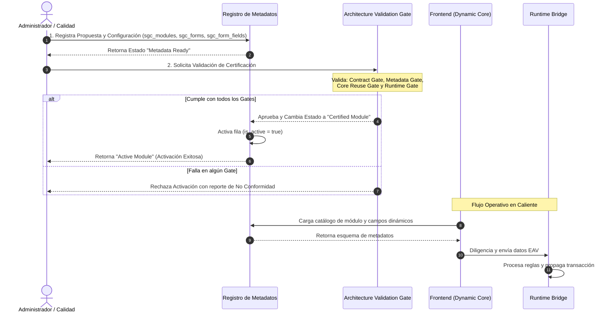

# Sprint 47 — Metadata Module Factory Operational Governance (SSOT)

> **Documento SSOT / Operacional Governance Model**
>
> Este documento formaliza el **modelo operativo de gobernanza** para módulos dinámicos gobernados por metadatos (Metadata Driven Factory) dentro del **Sistema de Gestión de Calidad (SGC-DM)**.
>
> **ARCHITECTURE STATUS: LEVEL 3 — CERTIFIED**

> **Alcance del Sprint 47 (Freeze State):** la gobernanza del Sprint 47 **no introduce cambios técnicos**. El Sprint 47 **no modifica** arquitectura, contratos, runtime, componentes, motores, ni persistencia. El Sprint 47 **opera exclusivamente documentalmente** sobre la utilización del **Core certificado**.

---

## 0. Restricciones del Sprint (Freeze State)

Para preservar la certificación arquitectónica alcanzada en **Level 3**, el Sprint 47 se rige por restricciones absolutas:

* **No se modifica** (arquitectura certificada):
  * El **Core certificado** de presentación del sistema: **DynamicModule**, **DynamicForm** y **DynamicRecordsView** (compatibles con la arquitectura certificada).
  * La **capa de persistencia única**: **dynamicService** (soportada por el modelo certificado).
  * El **bridge de ejecución**: **RuntimeActivationLayer** (representa el puente certificado por la arquitectura certificada).
  * Los **motores base**: **BaseChecklist**, **BaseMediciones** y **BaseGeneric** (constituyen el core de renderizado base compatible con la arquitectura certificada).
  * Los **contratos** y el **modelo EAV / persistencia** existentes (preservados por el SSOT certificado).
* **No se realiza** (a nivel de implementación y arquitectura):
  * No se introduce **ningún** nuevo engine, bridge, runtime, capa o contrato.
  * No se incorporan componentes React o servicios específicos por módulo estándar.
  * No se introducen persistencias paralelas ni tablas específicas.

> **Nota de gobernanza:** el Sprint 47 solamente establece el **modelo operativo de administración y control documental** para módulos metadata-driven.

---

## 1. Objetivo del Sprint

Este Sprint 47 define, certifica y formaliza el **ciclo operativo gobernado** para la creación y administración de módulos dinámicos mediante configuración de metadatos **compatible** con el Core certificado.

Estructura certificada (modelo documental):

$$\text{Metadata Definition} \longrightarrow \text{Validation} \longrightarrow \text{Certification Gate} \longrightarrow \text{Activation} \longrightarrow \text{Operational Monitoring}$$

---

## 2. Metadata Module Factory Lifecycle

El ciclo de vida del módulo dinámico (gobernanza documental) se representa como cinco estados discretos y secuenciales:

### Estado 1 — Module Proposal
* **Entrada documental:** solicitud formal de una nueva necesidad de negocio (ej. *Control de Temperaturas*).
* **Definición requerida:** propósito del proceso, responsable funcional, formularios a capturar, campos requeridos, perfiles y roles con permisos de acceso, y evidencias obligatorias.
* **Salida:** documento formal de propuesta de módulo (Module Proposal Document).

### Estado 2 — Metadata Design
Diseño lógico de entidades relacionales certificadas:
1. **Module (`sgc_modules`):** define nombre, slug único, descripción e ícono del catálogo.
2. **Forms (`sgc_forms`):** define formularios asociados, motor visual (`engine_type`), roles autorizados (`roles_allowed`) y estado de actividad.
3. **Fields (`sgc_form_fields`):** especifica columnas virtuales de captura (tipo, obligatoriedad, límites paramétricos min/max, unidades de sufijo y listas de selección).

---

## Metadata SSOT Principle (Single Source of Truth)

Las entidades `sgc_modules`, `sgc_forms` y `sgc_form_fields` constituyen la **Single Source of Truth (SSOT)** funcional para módulos estándar definidos bajo la Metadata Module Factory.

Bajo este principio:

* La arquitectura certificada restringe el uso de lógica hardcodeada por módulo.
* La arquitectura certificada restringe el uso de componentes React específicos por módulo estándar.
* La arquitectura certificada restringe la introducción de servicios paralelos específicos por módulo.
* Cualquier excepción (vía no cubierta por el Core certificado) se administra mediante **ADR obligatorio** conforme al proceso del Sprint 45.13A.

> **Separación explícita:**
> * **Arquitectura certificada:** define restricciones y compatibilidades.
> * **Implementación existente:** soporta dichas compatibilidades mediante el Core ya certificado.

---

### Estado 3 — Architecture Validation Gate

Puerta de control técnica/documental definida por el SSOT antes de habilitar un módulo. El modelo contempla cinco sub-gates:

* **Contract Gate:** valida compatibilidad con contratos inmutables de `submit`, `verify` y el contrato del evento del bridge `__runtime_internal_event`.
* **Metadata Gate:** valida uso exclusivo del esquema `sgc_*` y ausencia de tablas o vistas específicas para el módulo.
* **Core Reuse Gate:** valida compatibilidad plena con **DynamicModule**, **DynamicForm** y **DynamicRecordsView** (core certificado).
* **Runtime Gate:** valida direccionamiento de persistencia a través de **dynamicService** y activación a través de **RuntimeActivationLayer** (puente certificado por la arquitectura).
* **Auditability Gate:** valida el cumplimiento del Sistema de Gestión de Calidad mediante auditabilidad documental y operacional:
  * auditoría y audit logs
  * trazabilidad
  * responsable actor (según gobernanza)
  * preservación de evidencia
  * integridad histórica

---

### Estado 4 — Metadata Activation

Transición documental del estado del módulo a nivel de metadatos:

$$\text{Draft} \longrightarrow \text{Validated} \longrightarrow \text{Approved} \longrightarrow \text{Active}$$

> **Freeze State (Sprint 47):** la activación descrita en este modelo **corresponde a la operación documental/administrativa** compatible con el mecanismo existente. El Sprint 47 no modifica contratos, runtime, persistencia ni esquemas.

---

### Estado 5 — Operational Monitoring

Dimensiones de monitoreo operacional definidas por el SSOT:

* **Functional Metrics:** conteo y seguimiento de formularios completados, registros generados, verificaciones operadas y hallazgos críticos.
* **Governance Metrics:** cumplimiento de ADRs, cobertura de contratos inmutables y ausencia de desviaciones fuera de la gobernanza.
* **Runtime Metrics:** indicadores orientados a operación del puente y la activación, incluyendo:
  * eventos procesados correctamente
  * eventos rechazados
  * tiempo promedio de procesamiento
  * errores del Runtime Bridge
  * activaciones exitosas

---

## 4.1 Metadata Version Governance

Una vez que un módulo gobernado por metadatos ha generado registros en producción, el SSOT establece gobernanza documental de versiones:

* **Versionar metadatos:** `sgc_modules`, `sgc_forms` y `sgc_form_fields` deben preservar versiones históricas relevantes para interpretar el módulo.
* **Conservar interpretación:** los registros históricos no pueden perder su interpretación funcional debido a cambios futuros en metadatos.
* **Evolución estructural preservativa:** cualquier evolución estructural preserva versiones previas mediante trazabilidad documental.

> Nota: documento de gobernanza; no introduce implementación.

---

## 4.2 Historical Immutability Principle

Los registros históricos se administran como semánticamente inmutables respecto de la interpretación vigente al momento de su creación.

* No existe dependencia de la interpretación histórica hacia metadatos susceptibles de modificación futura.
* La evolución futura conserva el significado histórico previo.

> Nota: documento de gobernanza; no propone cambios de código/contratos/DB.

---

## 3. Standard Module Creation Flow

El SSOT contempla el flujo secuencial documental para la gestión de un módulo dinámico en SGC-DM:

---

## 4. Module Certification States

Los estados operativos del ciclo de gobernanza son:

* **Draft:** etapa de diseño conceptual; los metadatos no se encuentran habilitados para producción/consumo.
* **Metadata Ready:** metadatos disponibles; evaluación en puerta de validación arquitectónica.
* **Certified Module:** certificación documental/arquitectónica del módulo bajo compatibilidad con core y contratos.
* **Active Module:** habilitación operacional bajo roles; el módulo se encuentra disponible para captura.
* **Deprecated Module:** retiro formal de operación; se preserva historial de auditoría y queda inactivo para nuevas capturas.

---

## 5. First Factory Product: "Control de Temperaturas"

El producto de validación inicial bajo el SSOT de fábrica es **Control de Temperaturas**:

* **Objetivo de verificación documental:** compatibilidad funcional y de visualización derivada desde `BaseMediciones` y límites parametrizados en `sgc_form_fields.options`.
* **Impacto arquitectónico controlado:** no se añaden componentes/servicios específicos por módulo.

---

## 6. Module Factory Governance Rules

Reglas de gobernanza operacional:

* **Regla 1 (Uso gobernado de la Factory):** la operación de módulos nuevos se encuentra restringida al modelo metadata-driven certificado por la Factory.
* **Regla 2 (Gobernanza de excepciones):** cualquier requerimiento que implique desviación del core (motor base, contrato de datos, persistencia alternativa o comportamiento de runtime no compatible) requiere ADR obligatorio conforme al Sprint 45.13A.
* **Regla 3 (Aislamiento de Trazabilidad):** el módulo de Trazabilidad heredada se considera desviación fuera del patrón Factory y no se usa como estándar de diseño para módulos nuevos.

---

## 7. Factory Compliance Checklist

Auditoría arquitectónica antes de que un módulo se encuentre elegible como **Active Module**. Criterios obligatorios:

| Criterio de Validación | Tipo | Estado Esperado | Descripción |
|---|---|---|---|
| Freeze State respetado | Gobernanza | **Obligatorio** | Sprint 47 sin modificaciones técnicas: contratos, runtime, motores, core y persistencia permanecen intactos. |
| Uso de `sgc_modules` | Estructura | **Obligatorio** | El módulo se registra en catálogo SSOT. |
| Uso de `sgc_forms` | Estructura | **Obligatorio** | Formularios asociados con engine compatible. |
| Uso de `sgc_form_fields` | Estructura | **Obligatorio** | Campos creados y ordenados con indexación correcta. |
| Integración con `DynamicModule` | UI Core | **Obligatorio** | Compatibilidad con navegación genérica del core certificado. |
| Integración con `DynamicForm` | UI Core | **Obligatorio** | Render dinámico compatible con core certificado. |
| Integración con `DynamicRecordsView` | UI Core | **Obligatorio** | Historial/criticidad calculados bajo compatibilidad con core certificado. |
| Persistencia con `dynamicService` | Transacción | **Obligatorio** | Escritura EAV compatible con contratos existentes y `__runtime_internal_event`. |
| Activación con `RuntimeActivationLayer` | Bridge | **Obligatorio** | Activación basada en puente certificado por arquitectura. |
| Sin componentes específicos | Gobernanza | **Obligatorio** | No se incorporan componentes React específicos por módulo estándar. |
| Sin tablas específicas | Base de Datos | **Obligatorio** | No se incorporan tablas físicas personalizadas por módulo. |
| ADR vigente y compatible | Gobernanza | **Obligatorio** | En caso de excepción, existe ADR aprobado y compatible. |
| Metadata Version Governance compatible | Gobernanza | **Obligatorio** | Se preserva versión/interpretación de metadatos para registros. |
| Historical Deviations inexistentes | Gobernanza | **Obligatorio** | No se detectan dependencias históricas hacia metadatos modificados en el tiempo. |
| Core Integrity preservada | Gobernanza | **Obligatorio** | Se preserva integridad del core certificado. |

> **Validación final adicional (bloqueante):** ningún módulo puede clasificarse como **Active Module** mientras exista al menos un criterio obligatorio pendiente.

---

## 8. Governance Rules (ADR Mandatory Extension)

Toda modificación que implique:

* nuevo contrato
* nuevo runtime
* nuevo engine
* nuevo modelo de persistencia
* nuevo patrón de renderizado

debe pasar obligatoriamente por ADR (vía Sprint 45.13A). Cualquier otra evolución se administra por reutilización de la Factory existente.

---

## 9. ADR Requirement

* **Sprint 47 Decision:** el modelo operativo formaliza que **ADR se exige** únicamente cuando la operación implica desviación certificada (contratos/runtime/engines/persistencia/modelos/patrones). 
* **Gobernanza:** ante desviación del core certificado, se requiere ADR obligatorio.

---

## 10. Foundation Baseline

Este documento establece la **Foundation Baseline** documental para el **Metadata Driven Framework**:

* **Sprint 45** define la **Architecture Certification** (arquitectura certificada).
* **Sprint 46** define la **Standard Module Factory** (fábrica estándar metadata-driven).
* **Sprint 47** define la **operación oficial gobernada** de esa fábrica.

La Foundation Baseline queda compuesta por estos tres sprints y debe preservarse por cualquier sprint futuro. El Sprint 47 **no introduce capacidades arquitectónicas nuevas**; únicamente operacionaliza gobernanza y control documental.

---

## 11. Sprint 47 Certification Statement

**Resultado:** **CERTIFIED METADATA MODULE FACTORY OPERATIONAL MODEL**

El Sprint 47 formaliza (documentalmente):

* La institucionalización del proceso operativo para módulos metadata-driven.
* La institucionalización de la gobernanza y sus gates.
* La institucionalización del modelo Factory compatible con el core certificado.
* La protección de la arquitectura certificada.
* La protección del Runtime bridge certificado.
* La protección del SSOT.
* La protección del Metadata Driven Model.
* La definición de la línea base documental oficial para **Sprint 48+**.

**Garantías del Sprint 47 (sin cambios técnicos):**

* Sprint 47 **no desarrolla funcionalidades**.
* Sprint 47 **no modifica arquitectura**.
* Sprint 47 **no cambia componentes**.
* Sprint 47 **no modifica runtime**.
* Sprint 47 **no modifica contratos**.
* Sprint 47 **no modifica persistencia**.
* Sprint 47 **únicamente establece el modelo operativo certificado** de la Metadata Module Factory.

---

## 12. Sprint Status

### ARCHITECTURE STATUS:
**LEVEL 3 — CERTIFIED**

### SPRINT 47 STATUS:
**READY FOR FACTORY MODULE CREATION**

