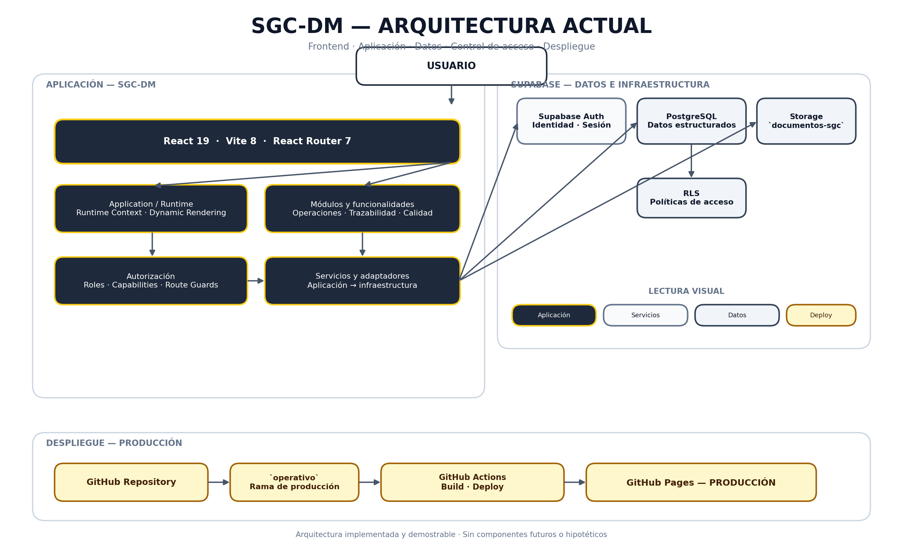

# SGC-DM — Evidencia de Portafolio

> Evidencia visual y técnica del **Sistema de Gestión de Calidad SGC-DM**, aplicación web desarrollada para digitalizar y centralizar procesos operativos y de calidad.

## Propósito

Esta carpeta reúne evidencia seleccionada para presentar SGC-DM como proyecto de portafolio técnico.

El contenido permite revisar rápidamente:

- la experiencia funcional de la aplicación;
- los principales módulos y flujos;
- la arquitectura actual;
- la relación entre aplicación, servicios, datos y despliegue;
- evidencia visual verificable del sistema.

Está orientada a **reclutadores, desarrolladores y revisores técnicos**, evitando duplicar la documentación arquitectónica formal.

## Estructura

```text
16-portfolio/
├── README.md
├── screenshots/
│   ├── 01-acceso.png
│   ├── 02-dashboard.png
│   ├── 03-configuracion.png
│   ├── 04-formularios.png
│   ├── 05-historial.png
│   ├── 06-modulos.png
│   └── 07-repositorio.png
└── architecture/
    ├── README.md
    ├── sgc-dm-architecture.mmd
    └── sgc-dm-architecture.png
```

### `screenshots/`

Capturas seleccionadas para demostrar la experiencia funcional y visual.

### `architecture/`

Diagrama de arquitectura actual, fuente editable en Mermaid y documentación de alcance.

# Evidencia visual

## 01 — Acceso

`01-acceso.png`

Punto de entrada de la aplicación y flujo inicial de autenticación.

**Evidencia:** acceso, identidad y sesión.

## 02 — Dashboard

`02-dashboard.png`

Vista principal de operación y consulta.

**Evidencia:** interfaz principal, indicadores y navegación.

## 03 — Configuración

`03-configuracion.png`

Capacidades de configuración administrativa.

**Evidencia:** parametrización y administración funcional.

## 04 — Formularios

`04-formularios.png`

Gestión y ejecución de formularios dinámicos.

**Evidencia:** campos, validaciones y comportamiento configurable.

## 05 — Historial

`05-historial.png`

Consulta histórica de registros.

**Evidencia:** consulta y trazabilidad funcional.

## 06 — Módulos

`06-modulos.png`

Organización modular de capacidades.

**Evidencia:** separación funcional y acceso por roles/capacidades.

## 07 — Repositorio

`07-repositorio.png`

Repositorio documental y gestión de archivos.

**Evidencia:** documentos, evidencia operacional y almacenamiento.

# Arquitectura

La arquitectura actual se representa mediante un diagrama de alto nivel que muestra las relaciones principales sin convertirlo en un inventario de componentes internos.



### Flujo arquitectónico

```text
Usuario
   ↓
SGC-DM Frontend
   ↓
Application / Runtime
   ↓
Servicios y adaptadores
   ├── Supabase Auth
   ├── PostgreSQL + RLS
   └── Supabase Storage
   ↓
Resultado
   ↓
Aplicación / Usuario
```

### Despliegue

```text
GitHub Repository
      ↓
   operativo
      ↓
 GitHub Actions
      ↓
     Build
      ↓
 GitHub Pages
      ↓
  Producción
```

Para el detalle:

- [`architecture/README.md`](architecture/README.md)
- [`architecture/sgc-dm-architecture.mmd`](architecture/sgc-dm-architecture.mmd)
- [`architecture/sgc-dm-architecture.png`](architecture/sgc-dm-architecture.png)

# Flujo de demostración

```text
Acceso
  ↓
Dashboard
  ↓
Configuración
  ↓
Formularios
  ↓
Historial
  ↓
Módulos
  ↓
Repositorio
  ↓
Arquitectura
```

Este recorrido conecta **experiencia de usuario → funcionalidades → organización del sistema → arquitectura técnica**.

# Criterios de selección

Las evidencias fueron seleccionadas considerando:

- funcionalidades realmente implementadas;
- variedad funcional;
- claridad visual;
- relevancia para revisión técnica;
- utilidad para reclutadores;
- correspondencia con la arquitectura documentada;
- ausencia de información innecesaria.

No pretende mostrar cada pantalla o componente del sistema.

# Relación con la documentación

| Ubicación | Propósito |
|---|---|
| `docs/15-architecture/` | Arquitectura formal, decisiones y ADR |
| `docs/16-portfolio/` | Evidencia visual y presentación de portafolio |
| `docs/16-portfolio/screenshots/` | Evidencia funcional visual |
| `docs/16-portfolio/architecture/` | Diagrama y explicación arquitectónica |

`16-portfolio/` complementa, pero no sustituye, la documentación formal del proyecto.

# Evidencia técnica

La evidencia permite contextualizar capacidades como:

- React;
- Vite;
- React Router;
- arquitectura basada en runtime y metadata;
- formularios dinámicos;
- módulos funcionales;
- roles y capabilities;
- Supabase Auth;
- PostgreSQL;
- Row Level Security;
- Supabase Storage;
- servicios y adaptadores;
- generación de documentos;
- trazabilidad funcional;
- GitHub Actions;
- GitHub Pages.

Las afirmaciones deben entenderse dentro del alcance verificable del repositorio.

# Alcance

El material representa exclusivamente capacidades **actualmente implementadas o demostrables**.

No se presentan como actuales:

- microservicios;
- backend independiente Node.js/Python;
- API Gateway;
- Redis;
- Kubernetes;
- Supabase Realtime;
- IndexedDB;
- arquitectura offline-first;
- `EngineRegistry`;
- auditoría criptográficamente inmutable.

Esto mantiene la evidencia alineada con el sistema real.

# Integración con el README principal

El README principal puede utilizar esta carpeta para presentar:

1. descripción del proyecto;
2. resultados observados;
3. funcionalidades;
4. arquitectura;
5. stack;
6. despliegue;
7. evidencia visual.

La carpeta `16-portfolio/` complementa el README principal con evidencia visual y técnica seleccionada.

# Estado

**Estado:** evidencia de portafolio preparada.

**Alcance:** presentación visual y arquitectónica del estado actual de SGC-DM.

**Uso:** README, GitHub, revisión técnica, portafolio profesional y demostración del proyecto.

---

**Proyecto:** Sistema de Gestión de Calidad — SGC-DM  
**Repositorio:** `Projects-DM/sistema-gestion-calidad-dm`  
**Sección:** `docs/16-portfolio/`
